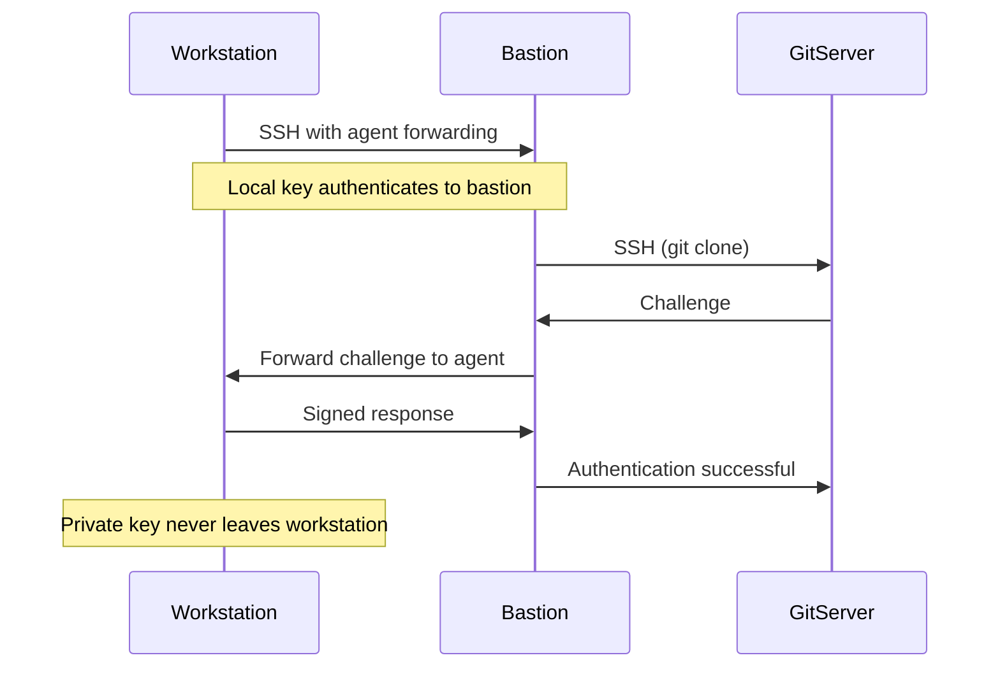

# How to Configure SSH Agent Forwarding on RHEL

Author: [nawazdhandala](https://www.github.com/nawazdhandala)

Tags: RHEL, SSH, Agent Forwarding, Linux

Description: Set up SSH agent forwarding on RHEL to use your local SSH keys on remote servers without copying private keys, including security considerations.

---

SSH agent forwarding lets you use your local SSH keys on remote servers. Instead of copying your private key to a bastion host (which you should never do), the remote server asks your local SSH agent to sign authentication requests. The private key never leaves your workstation.

## How Agent Forwarding Works



## Setting Up the SSH Agent

### Start the agent and load your key

```bash
# Start the SSH agent
eval $(ssh-agent)

# Add your key
ssh-add ~/.ssh/id_ed25519

# Verify the key is loaded
ssh-add -l
```

### Configure automatic agent startup

Add to your shell profile:

```bash
vi ~/.bashrc
```

```bash
# Start SSH agent if not already running
if [ -z "$SSH_AUTH_SOCK" ]; then
    eval $(ssh-agent -s) > /dev/null
    ssh-add ~/.ssh/id_ed25519 2>/dev/null
fi
```

## Enabling Agent Forwarding

### Per-connection

```bash
# Use -A flag to enable agent forwarding
ssh -A admin@bastion.example.com
```

### In SSH config (per host)

```bash
vi ~/.ssh/config
```

```
Host bastion
    HostName bastion.example.com
    User admin
    ForwardAgent yes

# Do NOT forward agent to untrusted hosts
Host *
    ForwardAgent no
```

## Verifying Agent Forwarding

Once connected to the remote server:

```bash
# Check if the agent socket is available
echo $SSH_AUTH_SOCK

# List keys available through the forwarded agent
ssh-add -l
```

If `ssh-add -l` shows your keys, forwarding is working.

## Server-Side Configuration

The SSH server needs to allow agent forwarding:

```bash
sudo vi /etc/ssh/sshd_config
```

```
# Allow agent forwarding (this is the default)
AllowAgentForwarding yes
```

To restrict forwarding for specific users:

```
# Disable for most users
AllowAgentForwarding no

# But allow for admins
Match Group admins
    AllowAgentForwarding yes
```

## Practical Use Case: Git Through a Bastion

The most common use case is accessing Git repositories from a server that does not have your key:

```bash
# SSH to the bastion with agent forwarding
ssh -A admin@bastion.example.com

# From the bastion, clone a private repo using your forwarded key
git clone git@github.com:your-org/private-repo.git
```

Your GitHub key is used for authentication, but it never touches the bastion's disk.

## Security Risks

Agent forwarding has a real security risk: anyone with root access on the remote server can use your forwarded agent to authenticate as you to other systems. The socket file is accessible to root.

### Mitigation strategies

1. **Only forward to trusted hosts** - Never use `-A` with untrusted servers.

2. **Use ProxyJump instead when possible** - ProxyJump does not require agent forwarding:

```
Host internal-server
    HostName 10.0.1.10
    ProxyJump bastion
```

3. **Use ssh-add with confirmation** - Require manual confirmation for each use of the key:

```bash
# Add key with confirmation prompt for each use
ssh-add -c ~/.ssh/id_ed25519
```

4. **Limit agent key lifetime**

```bash
# Key expires from agent after 1 hour
ssh-add -t 3600 ~/.ssh/id_ed25519
```

5. **Lock the agent when stepping away**

```bash
# Lock the agent with a passphrase
ssh-add -x

# Unlock it
ssh-add -X
```

## ProxyJump vs Agent Forwarding

For many cases, ProxyJump is a better alternative:

```
# This does NOT require agent forwarding
Host internal
    HostName 10.0.1.10
    ProxyJump bastion
    User admin
```

With ProxyJump, the SSH connection is tunneled through the bastion, but your key is used directly from your workstation. The bastion never has access to your agent.

Use agent forwarding only when you need to authenticate to a third service (like Git) from the remote server.

## Troubleshooting

### Agent forwarding not working

```bash
# On the remote server, check for the socket
ls -la $SSH_AUTH_SOCK

# If empty or missing, check the server config
sudo sshd -T | grep allowagentforwarding
```

### "Could not open a connection to your authentication agent"

The agent is not running on your workstation:

```bash
eval $(ssh-agent)
ssh-add ~/.ssh/id_ed25519
```

### Keys not available on the remote server

```bash
# Make sure keys are loaded locally
ssh-add -l

# Make sure you connected with -A or ForwardAgent yes
# Reconnect if needed
ssh -A admin@server
```

## Wrapping Up

SSH agent forwarding is useful when you need your local keys available on a remote server, particularly for Git operations through bastion hosts. But it comes with real security risks if the remote server is compromised. Prefer ProxyJump for simple SSH-through-bastion scenarios, and reserve agent forwarding for when you actually need to authenticate to third-party services from the remote host. Always limit forwarding to specific trusted hosts in your SSH config.
