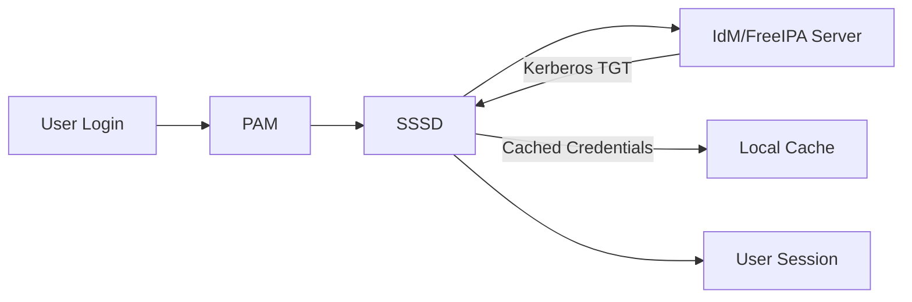

# How to Configure SSSD for IdM Client Authentication on RHEL

Author: [nawazdhandala](https://www.github.com/nawazdhandala)

Tags: RHEL, SSSD, IdM, Authentication, Linux

Description: A hands-on guide to configuring SSSD on RHEL clients for authentication against an IdM (FreeIPA) server, including caching, failover, and troubleshooting tips.

---

SSSD (System Security Services Daemon) is the glue that connects your RHEL clients to an IdM server. It handles user lookups, authentication, caching credentials for offline access, and managing Kerberos tickets. When you run `ipa-client-install`, SSSD gets configured automatically, but understanding how to tune and troubleshoot it is what separates a smooth deployment from one that generates midnight pages.

## How SSSD Fits in the Authentication Flow



When a user logs in, PAM talks to SSSD, which contacts the IdM server over LDAP and Kerberos. SSSD caches the result so subsequent lookups are fast and offline logins work when the server is unreachable.

## Step 1 - Install and Enroll the IdM Client

Start by enrolling the RHEL system as an IdM client. This configures SSSD automatically.

```bash
# Install the IdM client package
sudo dnf install ipa-client -y

# Enroll the client
sudo ipa-client-install \
  --server=idm.example.com \
  --domain=example.com \
  --realm=EXAMPLE.COM \
  --principal=admin \
  --mkhomedir
```

After enrollment, SSSD should already be running:

```bash
# Verify SSSD is active
sudo systemctl status sssd
```

## Step 2 - Understand the SSSD Configuration

The enrollment creates `/etc/sssd/sssd.conf`. Let's look at the key sections.

```bash
# View the SSSD configuration
sudo cat /etc/sssd/sssd.conf
```

A typical IdM client configuration looks like this:

```ini
[sssd]
domains = example.com
services = nss, pam, ssh, sudo
config_file_version = 2

[domain/example.com]
id_provider = ipa
auth_provider = ipa
access_provider = ipa
ipa_domain = example.com
ipa_server = idm.example.com
ipa_hostname = client.example.com
krb5_realm = EXAMPLE.COM
cache_credentials = True
ldap_tls_cacert = /etc/ipa/ca.crt
```

The important pieces: `id_provider = ipa` tells SSSD to use the IPA backend for user and group lookups. `cache_credentials = True` enables offline authentication.

## Step 3 - Configure Caching and Offline Access

SSSD caches user data so clients keep working when the IdM server is down. You can tune the cache behavior.

```bash
# Edit the SSSD config to adjust cache settings
sudo vi /etc/sssd/sssd.conf
```

Add or modify these settings in the domain section:

```ini
[domain/example.com]
# How long cached entries remain valid (seconds)
entry_cache_timeout = 5400

# How long to cache user credentials for offline login
offline_credentials_expiration = 7

# How long to cache failed login attempts
offline_failed_login_attempts = 5
offline_failed_login_delay = 60
```

After making changes, restart SSSD:

```bash
# Clear the cache and restart SSSD
sudo sss_cache -E
sudo systemctl restart sssd
```

## Step 4 - Configure Failover Servers

If you have multiple IdM replicas, configure SSSD to fail over between them.

```ini
[domain/example.com]
ipa_server = idm1.example.com, idm2.example.com, _srv_
```

The `_srv_` entry tells SSSD to also discover servers through DNS SRV records. The order matters: SSSD tries the servers in the listed order before falling back to SRV discovery.

## Step 5 - Configure Home Directory Creation

By default, IdM users may not have local home directories on the client. Configure PAM to create them automatically.

```bash
# Enable automatic home directory creation
sudo authselect enable-feature with-mkhomedir

# Make sure oddjobd is running (handles home dir creation)
sudo systemctl enable --now oddjobd
```

Verify it works:

```bash
# Test login as an IdM user
su - testuser
pwd
# Should show /home/testuser
```

## Step 6 - Enable Sudo Rules from IdM

SSSD can pull sudo rules from IdM, so you manage sudo centrally.

```ini
[sssd]
services = nss, pam, ssh, sudo

[domain/example.com]
sudo_provider = ipa
```

On the IdM server, create a sudo rule:

```bash
# Create a sudo rule on the IdM server
ipa sudorule-add allow_admins_all
ipa sudorule-add-user allow_admins_all --groups=admins
ipa sudorule-add-host allow_admins_all --hosts=client.example.com
ipa sudorule-mod allow_admins_all --cmdcat=all
```

Then flush the cache on the client:

```bash
sudo sss_cache -E
sudo systemctl restart sssd
```

## Troubleshooting SSSD

When things go wrong, these are the tools and techniques that actually help.

### Enable Debug Logging

```bash
# Increase the debug level temporarily
sudo sssctl debug-level 6

# Check the logs
sudo journalctl -u sssd -f

# Or check domain-specific logs
sudo tail -f /var/log/sssd/sssd_example.com.log
```

### Clear the Cache

When SSSD has stale data, clearing the cache is often the quickest fix.

```bash
# Remove all cached data and restart
sudo sss_cache -E
sudo systemctl restart sssd
```

For a more thorough reset:

```bash
# Stop SSSD, delete the cache database, restart
sudo systemctl stop sssd
sudo rm -rf /var/lib/sss/db/*
sudo systemctl start sssd
```

### Test User Lookups

```bash
# Look up a user
id testuser

# Look up a group
getent group admins

# Check if SSSD can reach the server
sudo sssctl domain-status example.com
```

### Common Problems and Fixes

| Problem | Cause | Fix |
|---------|-------|-----|
| `id: user: no such user` | Cache stale or SSSD not running | Clear cache, restart SSSD |
| Slow logins | DNS resolution delays | Check `/etc/resolv.conf`, add IdM server as nameserver |
| Offline auth fails | Credentials not cached | Log in once while online, check `cache_credentials = True` |
| Kerberos errors | Clock skew | Sync time with `chronyc makestep` |

## Performance Tuning

For environments with thousands of users, tweak SSSD to avoid performance problems.

```ini
[domain/example.com]
# Only resolve users from specific groups (much faster)
ldap_access_filter = memberOf=cn=allowed_users,cn=groups,cn=accounts,dc=example,dc=com

# Disable full user/group enumeration (critical for large directories)
enumerate = False

# Increase the LDAP search timeout
ldap_search_timeout = 15
```

The `enumerate = False` setting is particularly important. When set to True, SSSD periodically downloads every user and group entry, which can bring a large IdM deployment to its knees.

## Verifying the Full Setup

Run these checks to confirm everything is working properly:

```bash
# Check SSSD status
sudo sssctl domain-list
sudo sssctl domain-status example.com

# Verify Kerberos ticket
kinit testuser
klist

# Test SSH with Kerberos
ssh -o GSSAPIAuthentication=yes testuser@client.example.com

# Check sudo rules
sudo -l -U testuser
```

SSSD is reliable once configured correctly. The main things to watch are cache settings, DNS resolution, and time synchronization. Get those right and your IdM clients will be rock solid.
