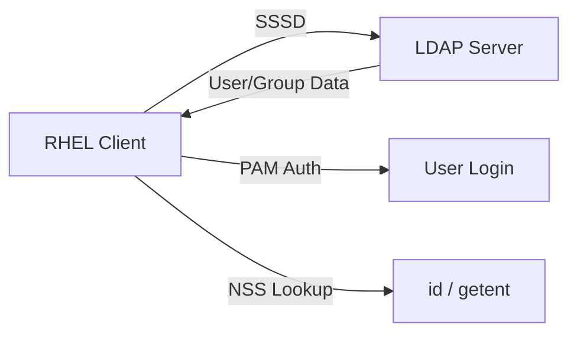

# How to Configure SSSD for LDAP Authentication on RHEL

Author: [nawazdhandala](https://www.github.com/nawazdhandala)

Tags: RHEL, SSSD, LDAP, Authentication, Linux

Description: A step-by-step guide to configuring SSSD for LDAP-based authentication on RHEL, covering connection setup, TLS encryption, user/group mapping, and troubleshooting.

---

Not every environment runs FreeIPA or Active Directory. If you have an existing LDAP directory (389 Directory Server, OpenLDAP, or another LDAPv3-compliant server), SSSD can authenticate RHEL clients against it. SSSD handles the LDAP queries, caches credentials for offline access, and integrates with PAM and NSS so Linux sees LDAP users as native accounts.

## Architecture Overview



## Step 1 - Install Required Packages

```bash
# Install SSSD with LDAP support
sudo dnf install sssd sssd-ldap sssd-tools oddjob oddjob-mkhomedir -y
```

## Step 2 - Configure SSSD

Create or edit the SSSD configuration file.

```bash
sudo vi /etc/sssd/sssd.conf
```

Here is a working configuration for a basic LDAP setup:

```ini
[sssd]
services = nss, pam
domains = ldap_example
config_file_version = 2

[domain/ldap_example]
id_provider = ldap
auth_provider = ldap
chpass_provider = ldap

# LDAP server URI (use ldaps:// for TLS)
ldap_uri = ldaps://ldap.example.com

# Search base for users and groups
ldap_search_base = dc=example,dc=com

# Bind credentials (for looking up users)
ldap_default_bind_dn = cn=sssd-bind,ou=service-accounts,dc=example,dc=com
ldap_default_authtok = BindPassword123

# TLS settings
ldap_tls_reqcert = demand
ldap_tls_cacert = /etc/pki/tls/certs/ldap-ca.crt

# User and group search bases (optional, narrows the search)
ldap_user_search_base = ou=people,dc=example,dc=com
ldap_group_search_base = ou=groups,dc=example,dc=com

# Schema mapping (adjust for your LDAP schema)
ldap_user_object_class = inetOrgPerson
ldap_user_name = uid
ldap_user_uid_number = uidNumber
ldap_user_gid_number = gidNumber
ldap_user_home_directory = homeDirectory
ldap_user_shell = loginShell

ldap_group_object_class = posixGroup
ldap_group_name = cn
ldap_group_gid_number = gidNumber
ldap_group_member = memberUid

# Cache settings
cache_credentials = True
entry_cache_timeout = 5400

# Access control (allow all authenticated users)
access_provider = ldap
ldap_access_filter = (objectClass=posixAccount)
```

Set proper permissions:

```bash
sudo chmod 600 /etc/sssd/sssd.conf
sudo chown root:root /etc/sssd/sssd.conf
```

## Step 3 - Configure TLS

LDAP traffic should always be encrypted. Copy the LDAP server's CA certificate to the client.

```bash
# Copy the CA certificate
sudo scp admin@ldap.example.com:/etc/pki/tls/certs/ca.crt /etc/pki/tls/certs/ldap-ca.crt

# Verify the certificate
openssl x509 -in /etc/pki/tls/certs/ldap-ca.crt -text -noout | head -10
```

If using StartTLS instead of LDAPS:

```ini
[domain/ldap_example]
ldap_uri = ldap://ldap.example.com
ldap_id_use_start_tls = True
ldap_tls_reqcert = demand
ldap_tls_cacert = /etc/pki/tls/certs/ldap-ca.crt
```

## Step 4 - Configure authselect

```bash
# Select the SSSD profile
sudo authselect select sssd with-mkhomedir --force

# Enable oddjobd for home directory creation
sudo systemctl enable --now oddjobd
```

## Step 5 - Start SSSD

```bash
# Enable and start SSSD
sudo systemctl enable --now sssd

# Check the status
sudo systemctl status sssd
```

## Step 6 - Test the Configuration

```bash
# Look up an LDAP user
id ldapuser

# Get full user info
getent passwd ldapuser

# Look up a group
getent group developers

# Test authentication
su - ldapuser
```

## Step 7 - Configure Password Changes

If you want users to change their LDAP passwords from the RHEL client:

```ini
[domain/ldap_example]
chpass_provider = ldap
ldap_chpass_uri = ldaps://ldap.example.com
```

Test password changes:

```bash
# Change password as the user
passwd
```

## Handling Different LDAP Schemas

### For 389 Directory Server

```ini
ldap_user_object_class = inetOrgPerson
ldap_user_name = uid
ldap_group_object_class = groupOfUniqueNames
ldap_group_member = uniqueMember
```

### For OpenLDAP with memberOf Overlay

```ini
ldap_user_object_class = inetOrgPerson
ldap_user_name = uid
ldap_group_object_class = groupOfNames
ldap_group_member = member
```

## Performance Tuning

```ini
[domain/ldap_example]
# Disable enumeration (critical for large directories)
enumerate = False

# Set cache timeouts
entry_cache_timeout = 5400
entry_cache_user_timeout = 5400
entry_cache_group_timeout = 5400

# LDAP connection timeouts
ldap_network_timeout = 3
ldap_opt_timeout = 3

# Limit search scope
ldap_search_timeout = 10
```

## Troubleshooting

### Enable Debug Logging

```bash
sudo sssctl debug-level 6
sudo tail -f /var/log/sssd/sssd_ldap_example.log
```

### Test LDAP Connectivity

```bash
# Test LDAP search directly
ldapsearch -x -H ldaps://ldap.example.com \
  -D "cn=sssd-bind,ou=service-accounts,dc=example,dc=com" \
  -W -b "ou=people,dc=example,dc=com" "(uid=ldapuser)"
```

### Clear Cache

```bash
sudo sss_cache -E
sudo systemctl restart sssd
```

### Common Errors

| Error | Cause | Fix |
|-------|-------|-----|
| `Unable to connect to server` | Network/TLS issue | Check ldap_uri, firewall, and CA certificate |
| `No such user` | Wrong search base or filter | Verify ldap_user_search_base and schema mapping |
| `Permission denied` | Bind DN cannot read entries | Check LDAP ACLs for the bind account |
| `TLS handshake failed` | Certificate issue | Check CA cert path and validity |

SSSD with LDAP gives you the same caching, offline access, and PAM integration you get with AD or IdM, just pointed at a generic LDAP directory. The key is getting the schema mapping and TLS configuration right for your specific LDAP server.
