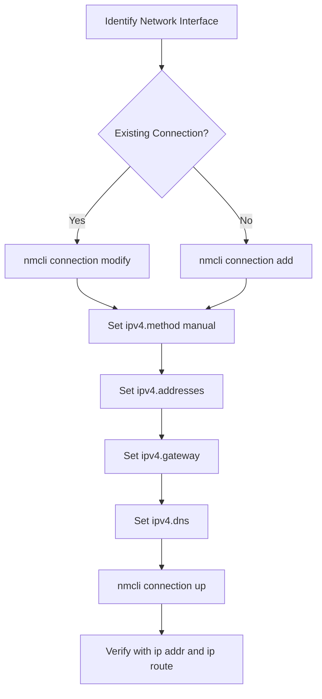

# How to Configure Static IP Addresses on RHEL Using nmcli

Author: [nawazdhandala](https://www.github.com/nawazdhandala)

Tags: RHEL, Nmcli, Static IP, Networking, Linux

Description: Learn how to set up static IP addresses on Red Hat Enterprise Linux 9 using the nmcli command-line tool, including practical examples for production servers.

---

If you have ever managed a fleet of RHEL servers, you know that DHCP is fine for development boxes, but production systems need static IPs. On RHEL, NetworkManager is the only game in town for network configuration, and nmcli is the CLI tool that lets you do everything without ever touching a GUI.

This post walks through configuring static IP addresses on RHEL using nmcli, from basic single-interface setups to more nuanced configurations.

## Why Static IPs Matter in Production

Servers that run databases, web applications, or monitoring stacks need predictable IP addresses. DNS records, firewall rules, and load balancer configurations all depend on knowing exactly where a service lives on the network. DHCP leases can expire, change, or cause race conditions during boot. Static IPs eliminate that uncertainty.

## Prerequisites

Before you start, make sure you have:

- Root or sudo access to the RHEL system
- NetworkManager running (it is by default on RHEL)
- Knowledge of your network details: IP address, subnet mask, gateway, DNS servers

Check that NetworkManager is active:

```bash
# Verify NetworkManager is running
systemctl status NetworkManager
```

## Identifying Your Network Interfaces

First, list all available network connections and devices:

```bash
# Show all network devices and their current state
nmcli device status
```

You will see output like:

```bash
DEVICE  TYPE      STATE      CONNECTION
ens192  ethernet  connected  ens192
lo      loopback  connected  lo
```

To get more detail on a specific interface:

```bash
# Show detailed information about a specific device
nmcli device show ens192
```

## Configuring a Static IP Address

There are two approaches: modifying an existing connection or creating a new one.

### Modifying an Existing Connection

If you already have a connection profile (most RHEL installs create one during setup), you can modify it directly:

```bash
# Set the IP addressing method to manual (static)
nmcli connection modify ens192 ipv4.method manual

# Assign the static IP address with CIDR notation
nmcli connection modify ens192 ipv4.addresses 192.168.1.100/24

# Set the default gateway
nmcli connection modify ens192 ipv4.gateway 192.168.1.1

# Configure DNS servers (comma-separated for multiple)
nmcli connection modify ens192 ipv4.dns "8.8.8.8,8.8.4.4"

# Optionally set a DNS search domain
nmcli connection modify ens192 ipv4.dns-search "example.com"
```

After making changes, bring the connection back up to apply them:

```bash
# Reactivate the connection to apply changes
nmcli connection up ens192
```

### Creating a New Connection Profile

If you prefer starting fresh or need to set up a brand new interface:

```bash
# Create a new static connection profile
nmcli connection add \
  con-name "static-ens192" \
  ifname ens192 \
  type ethernet \
  ipv4.method manual \
  ipv4.addresses 192.168.1.100/24 \
  ipv4.gateway 192.168.1.1 \
  ipv4.dns "8.8.8.8,8.8.4.4" \
  ipv4.dns-search "example.com"
```

Then activate it:

```bash
# Activate the new connection profile
nmcli connection up static-ens192
```

## Doing It All in One Command

You can combine everything into a single nmcli invocation if you want a one-liner for your provisioning scripts:

```bash
# Single command to modify all static IP settings at once
nmcli connection modify ens192 \
  ipv4.method manual \
  ipv4.addresses 192.168.1.100/24 \
  ipv4.gateway 192.168.1.1 \
  ipv4.dns "8.8.8.8,8.8.4.4" \
  ipv4.dns-search "example.com" \
  connection.autoconnect yes
```

## Verifying the Configuration

After applying changes, always verify:

```bash
# Check the IP address assigned to the interface
ip addr show ens192

# Verify the default route
ip route show default

# Check DNS configuration
cat /etc/resolv.conf

# Test connectivity to the gateway
ping -c 3 192.168.1.1

# Test external DNS resolution
nslookup google.com
```

You can also use nmcli itself to verify:

```bash
# Show the active connection details
nmcli connection show ens192 | grep ipv4
```

## Understanding the Keyfile Backend

On RHEL, NetworkManager stores connection profiles as keyfiles in `/etc/NetworkManager/system-connections/`. After setting a static IP, you can inspect the generated file:

```bash
# View the connection profile file
cat /etc/NetworkManager/system-connections/ens192.nmconnection
```

The file will look something like:

```ini
[connection]
id=ens192
type=ethernet
interface-name=ens192
autoconnect=true

[ipv4]
method=manual
address1=192.168.1.100/24,192.168.1.1
dns=8.8.8.8;8.8.4.4;
dns-search=example.com;

[ipv6]
method=auto
```

## Configuring IPv6 Static Addresses

The process for IPv6 is almost identical:

```bash
# Set a static IPv6 address
nmcli connection modify ens192 \
  ipv6.method manual \
  ipv6.addresses "2001:db8::100/64" \
  ipv6.gateway "2001:db8::1" \
  ipv6.dns "2001:4860:4860::8888"

# Apply the changes
nmcli connection up ens192
```

## Configuration Flow

Here is how the static IP configuration process works:



## Common Pitfalls

**Forgetting to set the method to manual.** If you set an IP address but leave the method as "auto", NetworkManager will still try DHCP and you might end up with two addresses on the interface.

**Not reactivating the connection.** Changes made with `nmcli connection modify` do not take effect until you run `nmcli connection up` or reboot.

**Wrong CIDR notation.** Using `/24` when your subnet is actually `/22` will cause routing problems. Double-check with your network team.

**Firewall blocking traffic.** After changing IPs, make sure your firewalld rules still match. A new IP might not be in an allowed zone.

## Wrapping Up

Configuring static IPs on RHEL with nmcli is straightforward once you understand the pattern: modify the connection properties, then bring the connection up. The keyfile format makes it easy to review and version-control your network configurations, and nmcli's scriptable interface fits naturally into automation workflows. For anything beyond a handful of servers, consider wrapping these commands into Ansible playbooks or shell scripts that your team can reuse consistently.
