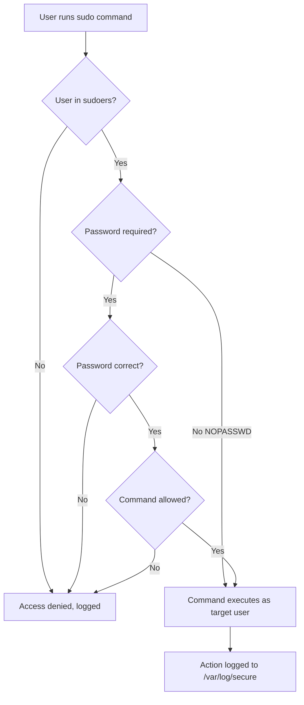

# How to Configure sudo Access and Privilege Escalation on RHEL

Author: [nawazdhandala](https://www.github.com/nawazdhandala)

Tags: RHEL, sudo, Security, Privilege Escalation, Linux

Description: Learn how to configure sudo access on RHEL, including visudo, the sudoers file, drop-in configurations, NOPASSWD rules, and command restrictions for secure privilege escalation.

---

Running everything as root is a recipe for disaster. One typo in an `rm` command and you're restoring from backups. sudo gives you granular control over who can run what commands with elevated privileges, and it logs everything. On RHEL, configuring sudo properly is one of the most important security tasks you'll handle.

## How sudo Works

When a user runs `sudo somecommand`, here's what happens:



sudo checks `/etc/sudoers` and files in `/etc/sudoers.d/` to determine whether the user is authorized. Every sudo attempt, successful or not, gets logged.

## The wheel Group

On RHEL, the simplest way to grant a user full sudo access is to add them to the `wheel` group. This group is preconfigured in the default sudoers file.

```bash
# Add a user to the wheel group for full sudo access
sudo usermod -aG wheel jsmith

# Verify group membership
groups jsmith
```

The default `/etc/sudoers` file on RHEL includes this line:

```bash
%wheel  ALL=(ALL)       ALL
```

This means any member of the `wheel` group can run any command as any user on any host, after entering their password.

## Editing sudoers with visudo

Never edit `/etc/sudoers` directly with a text editor. Always use `visudo`, which validates the syntax before saving. A syntax error in sudoers can lock you out of sudo entirely.

```bash
# Open the sudoers file for editing (uses vi by default)
sudo visudo

# Use a different editor if you prefer
sudo EDITOR=nano visudo
```

### Sudoers Syntax

The basic format of a sudoers rule is:

```bash
who   where=(as_whom)   what
```

Some examples:

```bash
# Allow jsmith to run any command as any user on any host
jsmith    ALL=(ALL)    ALL

# Allow the devops group to run any command
%devops   ALL=(ALL)    ALL

# Allow jsmith to run only specific commands
jsmith    ALL=(ALL)    /usr/bin/systemctl restart httpd, /usr/bin/systemctl status httpd

# Allow jsmith to run commands as the "appuser" user only
jsmith    ALL=(appuser)    ALL
```

## Using /etc/sudoers.d/ for Drop-in Files

Instead of cramming everything into `/etc/sudoers`, use drop-in files in `/etc/sudoers.d/`. This keeps things organized and avoids merge conflicts when system updates touch the main sudoers file.

First, make sure the include directive exists in `/etc/sudoers` (it's there by default on RHEL):

```bash
# Check that the include directive is present
sudo grep -r "includedir" /etc/sudoers
```

You should see:

```bash
@includedir /etc/sudoers.d
```

Now create drop-in files for specific access rules:

```bash
# Create a sudo rule for the devops team
sudo visudo -f /etc/sudoers.d/devops
```

Add the content:

```bash
# Allow devops group members to manage services and view logs
%devops ALL=(ALL) /usr/bin/systemctl, /usr/bin/journalctl
```

A few rules for drop-in files:
- Always use `visudo -f` to create them (syntax checking)
- File names should not contain dots (`.`) or end in tilde (`~`)
- Keep file permissions at 0440

```bash
# Verify the file permissions are correct
ls -la /etc/sudoers.d/devops
# Should show: -r--r----- 1 root root
```

## Configuring NOPASSWD Access

Sometimes you need sudo to work without a password prompt, for example in automation scripts, CI/CD pipelines, or for specific low-risk commands.

```bash
# Edit a drop-in file for passwordless sudo rules
sudo visudo -f /etc/sudoers.d/automation
```

```bash
# Allow the deploy user to restart services without a password
deploy    ALL=(ALL)    NOPASSWD: /usr/bin/systemctl restart httpd, /usr/bin/systemctl restart nginx

# Allow the monitoring user to run check commands without a password
monitoring    ALL=(ALL)    NOPASSWD: /usr/bin/systemctl is-active *, /usr/bin/journalctl -u *

# Give full NOPASSWD sudo to a specific user (use sparingly)
ansible   ALL=(ALL)    NOPASSWD: ALL
```

Be careful with `NOPASSWD: ALL`. It should only be used for service accounts in controlled environments, not for interactive human accounts.

## Restricting Commands

The real power of sudo is restricting what users can do. Instead of giving blanket `ALL` access, limit users to the specific commands they need.

```bash
sudo visudo -f /etc/sudoers.d/webteam
```

```bash
# Web team can manage web server services only
%webteam    ALL=(ALL)    /usr/bin/systemctl start httpd, \
                         /usr/bin/systemctl stop httpd, \
                         /usr/bin/systemctl restart httpd, \
                         /usr/bin/systemctl reload httpd, \
                         /usr/bin/systemctl status httpd

# Database team can manage PostgreSQL only
%dbteam     ALL=(ALL)    /usr/bin/systemctl start postgresql, \
                         /usr/bin/systemctl stop postgresql, \
                         /usr/bin/systemctl restart postgresql, \
                         /usr/bin/psql
```

### Denying Specific Commands

You can also explicitly deny certain dangerous commands:

```bash
# Allow all commands except dangerous ones
jsmith    ALL=(ALL)    ALL, !/usr/bin/su, !/usr/bin/bash, !/usr/bin/sh
```

Note that command denylists can be bypassed by creative users (copying the binary, using scripts, etc.). Allowlists are always more secure than denylists.

## Using Aliases for Cleaner Rules

For complex setups, sudoers supports aliases to group users, hosts, and commands:

```bash
# Define command aliases
Cmnd_Alias WEB_CMDS = /usr/bin/systemctl start httpd, \
                       /usr/bin/systemctl stop httpd, \
                       /usr/bin/systemctl restart httpd, \
                       /usr/bin/systemctl reload httpd

Cmnd_Alias DB_CMDS = /usr/bin/systemctl start postgresql, \
                      /usr/bin/systemctl stop postgresql, \
                      /usr/bin/systemctl restart postgresql

# Define user aliases
User_Alias WEB_ADMINS = jsmith, ajones, bwilson
User_Alias DB_ADMINS = dba1, dba2

# Apply the rules using aliases
WEB_ADMINS    ALL=(ALL)    WEB_CMDS
DB_ADMINS     ALL=(ALL)    DB_CMDS
```

## Viewing and Testing sudo Rules

```bash
# List what the current user can run with sudo
sudo -l

# List what a specific user can run (requires root)
sudo -l -U jsmith

# Test a command without running it (checks if it would be allowed)
sudo -v
```

## sudo Logging

Every sudo invocation gets logged. On RHEL, sudo logs to `/var/log/secure` by default.

```bash
# View recent sudo activity
sudo grep sudo /var/log/secure | tail -20

# Or use journalctl
sudo journalctl -t sudo --no-pager -n 20
```

Each log entry shows who ran the command, what they ran, and whether it succeeded or was denied. This audit trail is invaluable for security investigations.

## Security Best Practices

**Use the wheel group for full admins only.** Don't add everyone to wheel. Give most users specific command access through custom drop-in files.

**Prefer allowlists over denylists.** Specify exactly which commands a user can run. Trying to block dangerous commands while allowing everything else is a losing battle.

**Limit NOPASSWD.** Passwordless sudo is convenient but reduces security. Use it only for service accounts and automation, and restrict it to specific commands when possible.

**Keep drop-in files organized.** Name files by team or role: `webteam`, `dbadmins`, `monitoring`. This makes it easy to review and audit who has access to what.

**Require reauthentication for sensitive commands.** The default sudo password timeout is 5 minutes. You can adjust this:

```bash
# Require password every time (no caching)
Defaults    timestamp_timeout=0

# Or set a custom timeout in minutes
Defaults    timestamp_timeout=15
```

**Test changes before logging out.** After modifying sudoers, always open a second terminal and verify that sudo still works. If you break the syntax, you can fix it from your existing session.

## Wrapping Up

sudo is your primary tool for controlled privilege escalation on RHEL. The combination of the wheel group for full admins and targeted drop-in files for everyone else gives you a clean, auditable access control system. Take the time to set it up properly, and you'll avoid both the security risks of shared root access and the operational friction of overly restrictive permissions.
