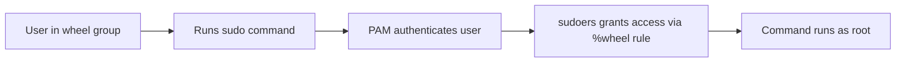

# How to Configure Sudo Access on RHEL Using the Wheel Group

Author: [nawazdhandala](https://www.github.com/nawazdhandala)

Tags: RHEL, Sudo, Wheel Group, Security, Linux

Description: Learn how to grant and manage sudo privileges on RHEL using the wheel group, the standard approach for delegating administrative access.

---

On RHEL, the wheel group is the default mechanism for granting sudo access. If a user is in the wheel group, they can run commands as root using sudo. It is a simple and effective way to control who gets administrative privileges.

## How It Works

The connection between the wheel group and sudo is configured in `/etc/sudoers`:

```bash
# View the relevant sudoers line (never edit this file directly)
sudo grep wheel /etc/sudoers
```

You will see:

```bash
%wheel  ALL=(ALL)       ALL
```

This means: any member of the wheel group can run any command as any user on any host.



## Adding a User to the Wheel Group

### Add an existing user

```bash
# Add user jsmith to the wheel group
sudo usermod -aG wheel jsmith

# Verify the membership
id jsmith
```

The `-aG` flag is important: `-a` means append (do not remove existing groups), and `-G` specifies the supplementary group.

### Create a new user with wheel access

```bash
# Create a user and add to wheel in one command
sudo useradd -G wheel newadmin
sudo passwd newadmin
```

### Verify sudo works

```bash
# Switch to the user and test sudo
su - jsmith
sudo whoami
# Output should be: root
```

## Removing Sudo Access

```bash
# Remove a user from the wheel group
sudo gpasswd -d jsmith wheel

# Verify they are no longer in the group
id jsmith
```

The user's current sessions will still have the old group membership until they log out and back in.

## Requiring a Password vs Passwordless Sudo

### Default: Require password

The default configuration requires users to enter their own password when using sudo:

```bash
%wheel  ALL=(ALL)       ALL
```

### Passwordless sudo (use sparingly)

There is a commented-out line in the default sudoers for passwordless access:

```bash
# %wheel  ALL=(ALL)       NOPASSWD: ALL
```

To enable passwordless sudo, create a file in `/etc/sudoers.d/` rather than editing the main sudoers file:

```bash
sudo visudo -f /etc/sudoers.d/wheel-nopasswd
```

```bash
%wheel  ALL=(ALL)       NOPASSWD: ALL
```

Only do this for environments where it is necessary (like automated build servers). For production systems, always require a password.

## Restricting What Wheel Members Can Do

Giving wheel members full root access is often more than needed. You can limit their commands:

```bash
sudo visudo -f /etc/sudoers.d/wheel-limited
```

```bash
# Allow wheel members to only restart services and view logs
%wheel  ALL=(ALL)       /usr/bin/systemctl restart *, /usr/bin/systemctl status *, /usr/bin/journalctl
```

However, once you start restricting wheel, it is usually better to create separate groups for different roles:

```bash
sudo visudo -f /etc/sudoers.d/custom-roles
```

```bash
# Web admins can manage httpd
%webadmins  ALL=(ALL)   /usr/bin/systemctl restart httpd, /usr/bin/systemctl reload httpd

# DB admins can manage PostgreSQL
%dbadmins   ALL=(ALL)   /usr/bin/systemctl restart postgresql, /usr/bin/systemctl status postgresql
```

## PAM Integration with the Wheel Group

RHEL also has a PAM module that can restrict `su` access to wheel group members:

```bash
# Check if pam_wheel is configured for su
grep pam_wheel /etc/pam.d/su
```

You may see:

```bash
#auth       required    pam_wheel.so use_uid
```

Uncomment this line to restrict `su` to wheel members only:

```bash
sudo vi /etc/pam.d/su
```

```bash
auth        required    pam_wheel.so use_uid
```

With this enabled, only wheel group members can use `su` to switch to root, even if they know the root password.

## Auditing Wheel Group Changes

Track who gets added or removed from the wheel group:

```bash
# Set up an audit rule for group changes
sudo auditctl -w /etc/group -p wa -k group_changes
sudo auditctl -w /etc/gshadow -p wa -k group_changes

# Search for recent group changes
sudo ausearch -k group_changes --interpret
```

## Listing Current Wheel Members

```bash
# Show all members of the wheel group
getent group wheel
```

Or for a more detailed view:

```bash
# List wheel members with their full names
for user in $(getent group wheel | cut -d: -f4 | tr ',' ' '); do
    fullname=$(getent passwd "$user" | cut -d: -f5)
    echo "$user - $fullname"
done
```

## Best Practices

1. **Use the wheel group for general admin access.** It is the standard RHEL approach and integrates with PAM, sudo, and auditing.

2. **Create specific groups for specific roles.** If someone only needs to restart web services, do not give them full root.

3. **Always require a password.** NOPASSWD is convenient but removes the authentication checkpoint.

4. **Review wheel membership regularly.** People change roles. Run a monthly check of who is in the wheel group.

5. **Enable pam_wheel for su.** This adds a second layer by preventing non-wheel users from using `su`, even with the root password.

6. **Log and audit.** Track who uses sudo and who gets added to wheel.

## Wrapping Up

The wheel group is the simplest and most standard way to manage sudo access on RHEL. Add users to the group, and they get sudo access. Remove them, and they lose it. For most environments, this is all you need. When you need finer control, create additional groups with specific command restrictions. Just make sure you audit membership regularly and require password authentication for sudo.
