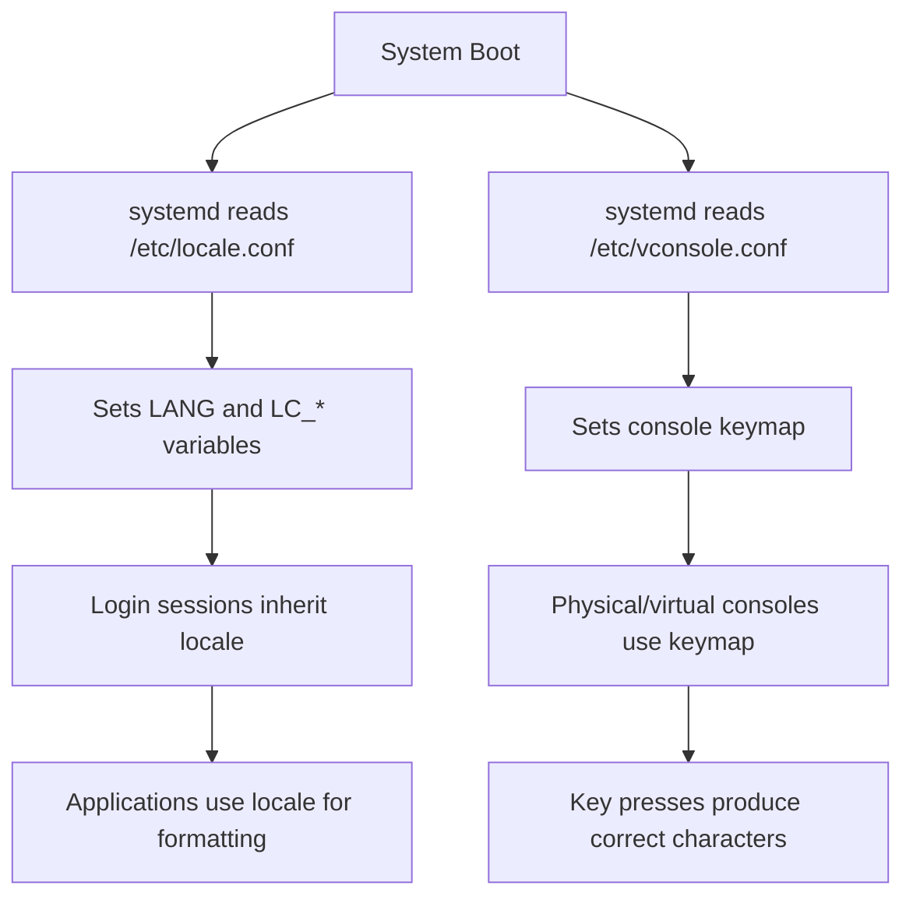

# How to Configure the System Locale and Keyboard Layout on RHEL 9

Author: [nawazdhandala](https://www.github.com/nawazdhandala)

Tags: RHEL, Locale, Keyboard, Linux, System Administration

Description: Learn how to view, set, and manage the system locale and keyboard layout on Red Hat Enterprise Linux 9 using localectl and related configuration files.

---

## Why Locale and Keyboard Settings Matter

If you have ever SSH'd into a server and found garbled characters in log files or misinterpreted special characters in scripts, you have probably been bitten by a misconfigured locale. On RHEL 9, the locale determines how the system handles language, character encoding, date formats, currency symbols, and more. The keyboard layout, meanwhile, controls what characters are produced when keys are pressed, which matters if you are working on a physical console or through a KVM.

Getting these settings right from the start saves a lot of headaches, especially on multi-language environments or when you are deploying servers across different regions.

## Checking the Current Locale

The simplest way to see your current locale settings is with `localectl`.

```bash
# Display current locale and keyboard configuration
localectl status
```

You will get output similar to:

```
   System Locale: LANG=en_US.UTF-8
       VC Keymap: us
      X11 Layout: us
```

You can also check the environment variables directly.

```bash
# Show all locale-related environment variables
locale
```

This outputs every locale category individually, such as `LC_TIME`, `LC_NUMERIC`, `LC_MESSAGES`, and so on. If `LANG` is set and none of the individual `LC_*` variables are overridden, everything follows `LANG`.

## Understanding Locale Configuration

On RHEL 9, the system locale is stored in `/etc/locale.conf`. This file is read at boot and sets the default locale for all users unless they override it in their own shell profiles.

```bash
# View the current locale configuration file
cat /etc/locale.conf
```

A typical file looks like this:

```
LANG=en_US.UTF-8
```

You can override individual categories if needed. For example, you might want English messages but German date formats:

```
LANG=en_US.UTF-8
LC_TIME=de_DE.UTF-8
```

## Listing Available Locales

Before changing the locale, check what is available on the system.

```bash
# List all installed locales
localectl list-locales
```

This can produce a long list. Filter it down if you are looking for something specific.

```bash
# Find all French locales
localectl list-locales | grep fr_
```

If the locale you need is not listed, you may need to install the appropriate langpack. RHEL 9 uses glibc-langpack packages.

```bash
# Install the German langpack
sudo dnf install glibc-langpack-de
```

After installation, the new locales should appear in the list.

## Setting the System Locale

Use `localectl` to change the system-wide locale. This writes to `/etc/locale.conf` and updates the running session.

```bash
# Set the system locale to British English with UTF-8 encoding
sudo localectl set-locale LANG=en_GB.UTF-8
```

You can set multiple locale categories at once.

```bash
# Set the main locale and override the time format
sudo localectl set-locale LANG=en_US.UTF-8 LC_TIME=en_GB.UTF-8
```

To verify the change took effect:

```bash
# Confirm the new settings
localectl status
```

Keep in mind that changing the system locale affects new login sessions. Your current shell session will not pick up the change until you log out and back in, or source the file manually.

```bash
# Apply locale changes to the current session without logging out
source /etc/locale.conf
```

## Configuring the Keyboard Layout

Keyboard configuration matters most when you are working at a physical console, a virtual machine console, or through a serial connection. For SSH sessions, the keyboard layout is usually handled by the client machine.

### Listing Available Keymaps

```bash
# List all available console keymaps
localectl list-keymaps
```

Filter for a specific region:

```bash
# Find all German keyboard layouts
localectl list-keymaps | grep de
```

### Setting the Console Keymap

```bash
# Set the keyboard layout to German
sudo localectl set-keymap de
```

This updates the virtual console keymap. The setting is stored in `/etc/vconsole.conf`.

```bash
# Check the virtual console configuration
cat /etc/vconsole.conf
```

You should see something like:

```
KEYMAP=de
```

### Setting the X11 Keyboard Layout

If you are running a graphical environment, you can set the X11 layout separately.

```bash
# Set the X11 keyboard layout to French with the AZERTY variant
sudo localectl set-x11-keymap fr "" "" ""
```

The full syntax for `set-x11-keymap` is:

```bash
# Format: localectl set-x11-keymap LAYOUT [MODEL [VARIANT [OPTIONS]]]
sudo localectl set-x11-keymap us pc105 intl ""
```

Verify everything:

```bash
# Check that both console and X11 layouts are set
localectl status
```

## Workflow Overview

Here is how the locale and keyboard configuration fits together on RHEL 9:



## Handling Common Scenarios

### Deploying Servers in Multiple Regions

When you manage servers across different countries, you often want the system messages in English for consistency but locale-specific formatting for dates and numbers. Here is a practical approach:

```bash
# English messages, but Japanese date and number formatting
sudo localectl set-locale LANG=en_US.UTF-8 LC_TIME=ja_JP.UTF-8 LC_NUMERIC=ja_JP.UTF-8
```

### Fixing "locale: Cannot set LC_*" Warnings

If you see warnings like `locale: Cannot set LC_CTYPE` when connecting via SSH, it usually means your local machine is sending a locale that is not installed on the remote server. Fix it by installing the missing langpack:

```bash
# Install the missing langpack on the remote server
sudo dnf install glibc-langpack-en
```

Or, prevent your SSH client from forwarding locale settings by editing your local `~/.ssh/config`:

```
Host myserver
    SendEnv -LC_* -LANG
```

### Resetting to Default

If things go sideways, you can always reset to the RHEL 9 default:

```bash
# Reset to default US English locale and US keyboard
sudo localectl set-locale LANG=en_US.UTF-8
sudo localectl set-keymap us
```

## Verifying Settings After a Reboot

After making changes, it is a good idea to reboot and verify that everything persists.

```bash
# Reboot the system
sudo systemctl reboot
```

After logging back in:

```bash
# Verify locale
localectl status

# Double-check with locale command
locale

# Verify keyboard
cat /etc/vconsole.conf
```

## Tips from the Field

- Always use UTF-8 encoding. There is almost never a reason to use legacy encodings like ISO-8859-1 on modern RHEL systems.
- If you are automating server deployments with Kickstart, set the locale in the Kickstart file using the `lang` and `keyboard` directives so you do not have to fix it post-install.
- The `loadkeys` command can temporarily change the console keymap for testing, but it does not persist across reboots. Always use `localectl` for permanent changes.
- When running containers on RHEL 9, the container inherits the host locale unless you explicitly set one inside the container. Keep this in mind for applications that are locale-sensitive.

## Summary

Managing locale and keyboard settings on RHEL 9 is straightforward with `localectl`. The key files are `/etc/locale.conf` for locale settings and `/etc/vconsole.conf` for the console keymap. Install missing langpacks with `dnf install glibc-langpack-*`, and always verify your changes with `localectl status`. Getting these basics right early in your server setup process prevents encoding issues and input problems down the road.
