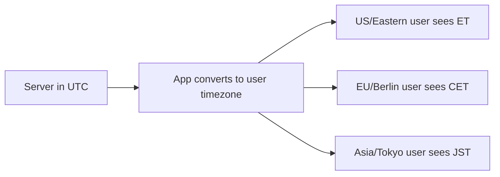

# How to Configure the System Timezone with timedatectl on RHEL

Author: [nawazdhandala](https://www.github.com/nawazdhandala)

Tags: RHEL, Timedatectl, Timezone, Linux

Description: A practical guide to viewing, setting, and managing system timezone configuration on RHEL using timedatectl and related tools.

---

Setting the timezone on a server seems trivial until you get it wrong. Then your log timestamps are off by hours, cron jobs fire at the wrong time, and database records have confusing timestamps. RHEL provides `timedatectl` as the standard way to manage timezone settings, and it handles both the system clock and the RTC (hardware clock) cleanly.

## Checking the Current Timezone

Start by seeing what your system is set to:

```bash
# Display current time and timezone settings
timedatectl
```

This shows:

- Local time in the configured timezone
- Universal time (UTC)
- RTC (hardware clock) time
- Timezone name and offset
- NTP synchronization status

If you just want the timezone name:

```bash
# Show only the timezone
timedatectl show --property=Timezone --value
```

Or check the symlink directly:

```bash
# View the timezone symlink
ls -la /etc/localtime
```

The `/etc/localtime` file is a symlink to the appropriate timezone data file in `/usr/share/zoneinfo/`.

## Listing Available Timezones

RHEL includes timezone data for the entire world:

```bash
# List all available timezones
timedatectl list-timezones
```

This produces a long list. Filter it:

```bash
# Find timezones in the US
timedatectl list-timezones | grep America

# Find a specific city
timedatectl list-timezones | grep -i chicago
```

Timezones follow the `Region/City` naming convention (e.g., `America/New_York`, `Europe/London`, `Asia/Tokyo`).

## Setting the Timezone

```bash
# Set the timezone to US Eastern
sudo timedatectl set-timezone America/New_York
```

Verify:

```bash
# Confirm the change
timedatectl
```

The change takes effect immediately. Running applications may need to be restarted to pick up the new timezone, since many cache the timezone at startup.

### Common Timezone Examples

```bash
# UTC (recommended for servers)
sudo timedatectl set-timezone UTC

# US Pacific
sudo timedatectl set-timezone America/Los_Angeles

# US Central
sudo timedatectl set-timezone America/Chicago

# UK
sudo timedatectl set-timezone Europe/London

# Central Europe
sudo timedatectl set-timezone Europe/Berlin

# India
sudo timedatectl set-timezone Asia/Kolkata

# Japan
sudo timedatectl set-timezone Asia/Tokyo
```

## Should Servers Use UTC?

Short answer: yes, almost always. Here is why:

- Log correlation across servers in different locations is trivial
- No daylight saving time surprises
- Database timestamps are unambiguous
- Cron jobs do not shift by an hour twice a year

```bash
# Set servers to UTC
sudo timedatectl set-timezone UTC
```

Applications can convert UTC to local time for display. Let the server keep everything in UTC.



## The RTC (Hardware Clock)

The hardware clock (RTC) runs independently of the OS. It keeps time when the system is powered off. RHEL can keep the RTC in either UTC or local time:

```bash
# Check if the RTC is set to UTC
timedatectl | grep "RTC in local TZ"
```

Best practice is to keep the RTC in UTC:

```bash
# Set the RTC to UTC (recommended)
sudo timedatectl set-local-rtc 0
```

If you are dual-booting with Windows (which expects local time in the RTC):

```bash
# Set the RTC to local time (for Windows dual-boot scenarios)
sudo timedatectl set-local-rtc 1
```

On servers, always use UTC for the RTC. The dual-boot scenario is really only relevant for workstations.

## Setting Time Manually

If NTP is disabled or not available:

```bash
# Disable NTP first
sudo timedatectl set-ntp false

# Set the date and time manually
sudo timedatectl set-time "2026-03-04 12:00:00"
```

You can also set just the date or just the time:

```bash
# Set only the date
sudo timedatectl set-time "2026-03-04"

# Set only the time
sudo timedatectl set-time "12:00:00"
```

After setting the time manually, re-enable NTP if you have connectivity:

```bash
# Re-enable NTP
sudo timedatectl set-ntp true
```

## Timezone Data Updates

Timezone rules change. Countries move their DST boundaries, some countries abandon DST entirely, and new timezones get created. RHEL ships timezone data in the `tzdata` package:

```bash
# Check the current tzdata version
rpm -q tzdata

# Update timezone data
sudo dnf update tzdata
```

Keep this package updated, especially if you run services that deal with scheduling or appointments.

## How Applications Read the Timezone

Applications determine the timezone through this hierarchy:

1. The `TZ` environment variable (per-process override)
2. `/etc/localtime` (system default)
3. `/etc/timezone` (fallback on some systems, not standard on RHEL)

To override the timezone for a single command:

```bash
# Run a command in a different timezone
TZ="America/New_York" date
```

To set a timezone for a specific service via systemd:

```bash
# Override the timezone for a specific systemd service
sudo systemctl edit myservice
```

Add:

```ini
[Service]
Environment="TZ=America/New_York"
```

## Dealing with DST Transitions

Daylight saving time transitions can cause issues with scheduled tasks. Here is how to check upcoming transitions for your timezone:

```bash
# Show the DST transition rules for a timezone
zdump -v /usr/share/zoneinfo/America/New_York | grep 2026
```

This shows when DST starts and ends, along with the UTC offset change.

For cron jobs that must run at a specific local time, be aware that:

- When clocks "spring forward," times during the skip (e.g., 2:00 AM to 3:00 AM) do not exist
- When clocks "fall back," times during the overlap (e.g., 1:00 AM to 2:00 AM) occur twice

This is another reason to run servers in UTC and handle timezone conversion in your application.

## Timezone Configuration in Containers

Containers inherit the host's timezone by default on some runtimes, but not all. To set a timezone in a Podman container:

```bash
# Run a container with a specific timezone
podman run -e TZ=America/New_York myimage

# Or mount the host's localtime
podman run -v /etc/localtime:/etc/localtime:ro myimage
```

## Automating Timezone Configuration

For fleet management with Ansible:

```yaml
# Set the timezone across all servers
- name: Set timezone to UTC
  community.general.timezone:
    name: UTC
```

Or with a shell command:

```yaml
- name: Set timezone
  ansible.builtin.command:
    cmd: timedatectl set-timezone UTC
```

## Checking Timezone Consistency Across Servers

When managing many servers, verify they are all set correctly:

```bash
# Check timezone on multiple hosts
#!/bin/bash
for host in server1 server2 server3; do
    tz=$(ssh "$host" "timedatectl show --property=Timezone --value" 2>/dev/null)
    echo "$host: $tz"
done
```

## Wrapping Up

Timezone configuration is one of those "set it once and forget it" tasks, but setting it wrong causes subtle problems that can take hours to diagnose. Use `timedatectl` on RHEL, set your servers to UTC, keep your RTC in UTC, and update the `tzdata` package regularly. If applications need local time, let them handle the conversion at the display layer.
