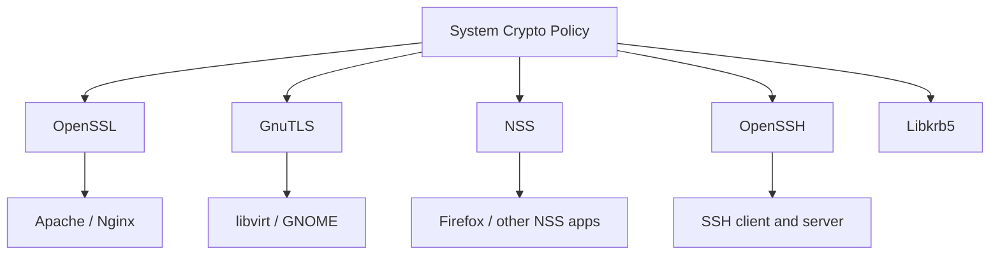

# How to Configure the System-Wide Crypto Policy for TLS on RHEL

Author: [nawazdhandala](https://www.github.com/nawazdhandala)

Tags: RHEL, Crypto Policy, TLS, Security, Linux

Description: Learn how to use RHEL's system-wide cryptographic policies to control TLS versions, cipher suites, and key lengths across all applications.

---

One of the best features Red Hat introduced in recent RHEL releases is the system-wide crypto policy. Instead of configuring TLS settings in every single application, you set a policy once and everything on the system follows it. Apache, Nginx, OpenSSH, GnuTLS, OpenSSL, NSS-based apps - they all pick up the same baseline.

This post explains how these policies work, how to switch between them, and how to create custom sub-policies for your specific requirements.

## How Crypto Policies Work

RHEL ships with a framework managed by the `crypto-policies` package. When you set a policy, it generates configuration files that various cryptographic libraries read. This means you do not need to manually edit cipher lists in httpd.conf, sshd_config, and every other service config file.



## Checking the Current Policy

```bash
# Display the current system-wide crypto policy
update-crypto-policies --show
```

On a fresh RHEL install, this returns `DEFAULT`.

## Available Built-in Policies

RHEL ships with four standard policies:

| Policy | TLS Minimum | Key Sizes | Use Case |
|--------|-------------|-----------|----------|
| LEGACY | TLS 1.0 | 1024-bit RSA | Compatibility with old systems |
| DEFAULT | TLS 1.2 | 2048-bit RSA | General purpose, balanced |
| FUTURE | TLS 1.2 | 3072-bit RSA | Forward-looking, stricter |
| FIPS | TLS 1.2 | 2048-bit RSA | FIPS 140-2/140-3 compliance |

View the details of any policy:

```bash
# Show what a specific policy enables
update-crypto-policies --show --show-modules
```

## Switching Policies

Changing the system-wide policy is a single command:

```bash
# Switch to the FUTURE policy for stricter security
sudo update-crypto-policies --set FUTURE
```

This takes effect immediately for new connections. Running services need to be restarted to pick up the change:

```bash
# Restart services to apply the new crypto policy
sudo systemctl restart httpd
sudo systemctl restart sshd
sudo systemctl restart nginx
```

Or just reboot if you want everything to pick it up cleanly:

```bash
# Reboot to ensure all services use the new policy
sudo systemctl reboot
```

## Setting the LEGACY Policy

If you need to connect to old systems that only support TLS 1.0 or weak ciphers:

```bash
# Switch to LEGACY for backward compatibility
sudo update-crypto-policies --set LEGACY
```

Only do this if you absolutely must. LEGACY enables protocols and ciphers that have known weaknesses.

## Setting the FIPS Policy

For environments that require FIPS compliance:

```bash
# Enable FIPS crypto policy
sudo update-crypto-policies --set FIPS

# Also enable FIPS mode at the kernel level
sudo fips-mode-setup --enable
```

FIPS mode requires a reboot:

```bash
# Reboot to activate FIPS mode
sudo systemctl reboot
```

Verify FIPS mode is active:

```bash
# Check if FIPS mode is enabled
fips-mode-setup --check
```

## Creating Custom Sub-Policies

The built-in policies are a starting point. Sub-policies let you tweak specific settings without writing a full policy from scratch.

### Disabling a Specific Cipher

Create a sub-policy file:

```bash
# Create a sub-policy that disables CBC mode ciphers
sudo tee /etc/crypto-policies/policies/modules/NO-CBC.pmod << 'EOF'
cipher = -AES-256-CBC -AES-128-CBC -CAMELLIA-256-CBC -CAMELLIA-128-CBC
EOF
```

Apply it on top of the DEFAULT policy:

```bash
# Apply DEFAULT policy with the NO-CBC sub-policy
sudo update-crypto-policies --set DEFAULT:NO-CBC
```

### Enforcing TLS 1.3 Only

```bash
# Create a sub-policy that requires TLS 1.3 minimum
sudo tee /etc/crypto-policies/policies/modules/TLS13-ONLY.pmod << 'EOF'
min_tls_version = TLS1.3
EOF
```

```bash
# Apply it
sudo update-crypto-policies --set DEFAULT:TLS13-ONLY
```

### Disabling SHA-1

```bash
# Create a sub-policy that disables SHA-1 everywhere
sudo tee /etc/crypto-policies/policies/modules/NO-SHA1.pmod << 'EOF'
hash = -SHA1
sign = -RSA-PSS-SHA1 -RSA-SHA1 -ECDSA-SHA1
EOF
```

```bash
sudo update-crypto-policies --set DEFAULT:NO-SHA1
```

### Combining Multiple Sub-Policies

You can stack sub-policies:

```bash
# Apply DEFAULT with both NO-SHA1 and NO-CBC sub-policies
sudo update-crypto-policies --set DEFAULT:NO-SHA1:NO-CBC
```

## Verifying the Applied Policy

After changing the policy, verify that applications respect it.

### Check OpenSSL

```bash
# Show the OpenSSL cipher list under the current policy
openssl ciphers -v | head -20
```

### Check GnuTLS

```bash
# Show enabled protocols and ciphers in GnuTLS
gnutls-cli --priority @SYSTEM --list 2>/dev/null | head -30
```

### Check SSH

```bash
# Show the key exchange algorithms sshd will offer
sudo sshd -T | grep -i kex
```

### Test Against a Live Server

```bash
# Test what TLS version and cipher a server negotiates
openssl s_client -connect localhost:443 </dev/null 2>/dev/null | grep -E "Protocol|Cipher"
```

## Per-Application Overrides

Sometimes one application needs different settings than the system default. Most applications let you override the policy in their own config.

For Apache, you can explicitly set ciphers in `/etc/httpd/conf.d/ssl.conf`:

```apache
# Override the system policy for this virtual host only
SSLProtocol all -SSLv3 -TLSv1 -TLSv1.1
SSLCipherSuite ECDHE-ECDSA-AES256-GCM-SHA384:ECDHE-RSA-AES256-GCM-SHA384
```

For OpenSSH, in `/etc/ssh/sshd_config`:

```
# Override crypto policy for SSH only
Ciphers aes256-gcm@openssh.com,aes128-gcm@openssh.com
```

Keep in mind that per-application overrides can be tricky to maintain. The system-wide policy is generally the better approach unless you have a specific reason.

## Listing Available Sub-Policies

See what sub-policy modules are already available:

```bash
# List available crypto policy modules
ls /usr/share/crypto-policies/policies/modules/
```

RHEL ships with several useful ones like `NO-SHA1`, `OSPP`, `NO-CAMELLIA`, and others.

## Auditing Crypto Policy Compliance

To check if any services are deviating from the system policy:

```bash
# Check for any local overrides in common config files
grep -r "SSLProtocol\|SSLCipherSuite" /etc/httpd/ 2>/dev/null
grep -r "Ciphers\|MACs\|KexAlgorithms" /etc/ssh/sshd_config 2>/dev/null
```

## Reverting to the Default Policy

If you need to undo any changes:

```bash
# Revert to the stock DEFAULT policy
sudo update-crypto-policies --set DEFAULT
```

## Wrapping Up

RHEL's system-wide crypto policy is one of those features that saves you from yourself. Instead of playing whack-a-mole with cipher configurations across dozens of services, you set it once and it propagates everywhere. Use sub-policies for fine-tuning, test thoroughly after changes, and keep your policy as strict as your environment allows.
