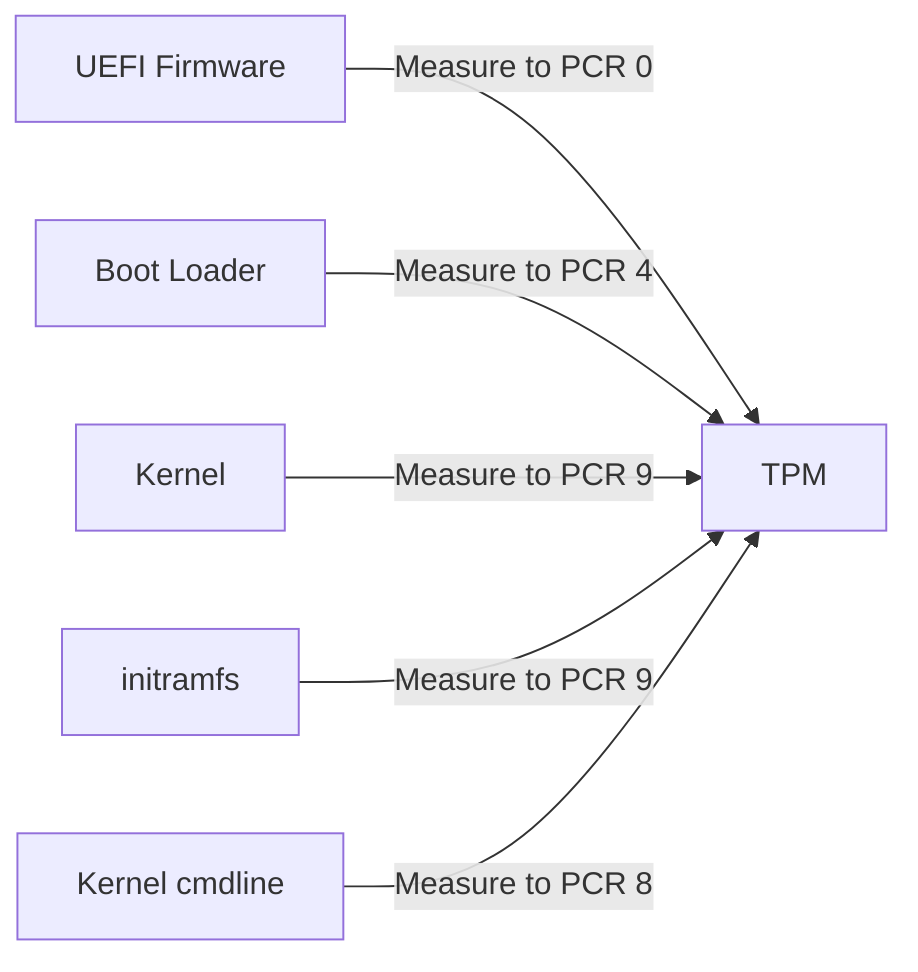

# How to Configure TPM 2.0 for Measured Boot on RHEL 9

Author: [nawazdhandala](https://www.github.com/nawazdhandala)

Tags: RHEL, TPM, Measured Boot, Security, Linux

Description: Configure TPM 2.0 measured boot on RHEL 9 to create a cryptographic record of the boot process that can detect tampering with boot components.

---

Measured boot uses the TPM (Trusted Platform Module) to create a tamper-evident record of every component that loads during boot. Unlike Secure Boot, which blocks unsigned code, measured boot records what loaded and lets you verify it later. If an attacker modifies the bootloader, kernel, or initramfs, the TPM measurements will differ from the expected values, and you will know something changed.

## Understanding Measured Boot

During measured boot, each component in the boot chain is hashed and the result is "extended" into TPM Platform Configuration Registers (PCRs). Each PCR corresponds to a specific boot phase:

| PCR | Measures |
|-----|----------|
| 0 | UEFI firmware |
| 1 | UEFI firmware configuration |
| 2 | Option ROMs |
| 3 | Option ROM configuration |
| 4 | Boot loader (GRUB) |
| 5 | Boot loader configuration |
| 7 | Secure Boot state |
| 8 | Kernel command line (GRUB) |
| 9 | Kernel and initramfs (GRUB) |



## Checking for TPM 2.0

First, verify your system has a TPM 2.0:

```bash
# Check if TPM device exists
ls -la /dev/tpm0

# Check TPM version
cat /sys/class/tpm/tpm0/tpm_version_major

# Get detailed TPM info
sudo tpm2_getcap properties-fixed | head -20
```

If the TPM device does not exist, check your UEFI firmware settings to make sure TPM is enabled.

## Installing TPM Tools

Install the TPM 2.0 software stack:

```bash
# Install TPM2 tools and the resource manager
sudo dnf install tpm2-tools tpm2-tss tpm2-abrmd -y

# Enable and start the TPM resource manager
sudo systemctl enable --now tpm2-abrmd
```

## Reading PCR Values

View the current PCR measurements:

```bash
# Read all SHA-256 PCR banks
sudo tpm2_pcrread sha256

# Read specific PCRs
sudo tpm2_pcrread sha256:0,4,7,8,9
```

The values you see reflect the current boot. If nothing has changed since the last boot, the same boot process will produce the same PCR values.

## Creating a PCR Baseline

Record the expected PCR values for your known-good boot:

```bash
# Save current PCR values as baseline
sudo tpm2_pcrread sha256 -o /root/pcr-baseline-$(date +%Y%m%d).bin

# Also save as human-readable text
sudo tpm2_pcrread sha256 > /root/pcr-baseline-$(date +%Y%m%d).txt
```

Store this baseline securely. You will compare future measurements against it.

## Verifying Boot Integrity

Compare current PCR values against your baseline:

```bash
# Read current values
sudo tpm2_pcrread sha256 > /tmp/pcr-current.txt

# Compare with baseline
diff /root/pcr-baseline-*.txt /tmp/pcr-current.txt
```

If the values match, the boot chain has not been modified. Differences indicate that something changed, which could be a legitimate update or a tampering attempt.

## Using the Event Log

The firmware and bootloader write an event log that shows what was measured at each step:

```bash
# Read the TPM event log
sudo tpm2_eventlog /sys/kernel/security/tpm0/binary_bios_measurements
```

This log is detailed and shows every measurement along with a description of what was measured. It is useful for understanding why a PCR value changed.

## Automating Integrity Verification

Create a script that checks boot integrity:

```bash
# Create a boot integrity check script
sudo tee /usr/local/sbin/check-boot-integrity.sh << 'SCRIPT'
#!/bin/bash
# Compare current PCR values against baseline

BASELINE="/root/pcr-baseline.txt"
CURRENT=$(mktemp)

tpm2_pcrread sha256 > "${CURRENT}"

if diff -q "${BASELINE}" "${CURRENT}" > /dev/null 2>&1; then
    echo "PASS: Boot integrity verified - PCR values match baseline"
    rm -f "${CURRENT}"
    exit 0
else
    echo "FAIL: Boot integrity check failed - PCR values differ from baseline"
    echo "--- Differences ---"
    diff "${BASELINE}" "${CURRENT}"
    rm -f "${CURRENT}"
    exit 1
fi
SCRIPT

sudo chmod 700 /usr/local/sbin/check-boot-integrity.sh
```

## When PCR Values Change

PCR values will legitimately change when:

- The kernel is updated
- GRUB configuration changes
- initramfs is rebuilt
- UEFI firmware is updated
- Secure Boot keys are modified
- Kernel command line parameters change

After any of these changes, update your baseline:

```bash
# Update baseline after known-good changes
sudo tpm2_pcrread sha256 > /root/pcr-baseline.txt
```

## TPM and Remote Attestation

For advanced setups, TPM measurements can be used for remote attestation, where a remote server verifies the boot integrity of your system:

```bash
# Create an attestation key
sudo tpm2_createak -C 0x81010001 -G rsa -g sha256 -s rsassa

# Quote PCR values (signed by the TPM)
sudo tpm2_quote -c ak.ctx -l sha256:0,4,7,8,9 -m quote.msg -s quote.sig
```

Remote attestation is complex but provides strong guarantees that a remote system booted with the expected configuration.

## Integration with IMA

The Integrity Measurement Architecture (IMA) extends TPM measurement beyond boot into the running system:

```bash
# Check if IMA is active
cat /sys/kernel/security/ima/ascii_runtime_measurements | head -5

# IMA measurements are extended into PCR 10
sudo tpm2_pcrread sha256:10
```

IMA can measure every executable, library, and script that runs, providing a comprehensive runtime integrity record.

## Best Practices

- Create baselines immediately after a clean, verified installation
- Update baselines as part of your patching process
- Store baselines securely, ideally off-system
- Monitor PCR values regularly with automated checks
- Investigate any unexpected PCR changes immediately
- Combine measured boot with Secure Boot for defense in depth

Measured boot with TPM 2.0 gives you visibility into the boot process that you cannot get any other way. It will not prevent attacks, but it will detect them, and detection is the first step in response.
