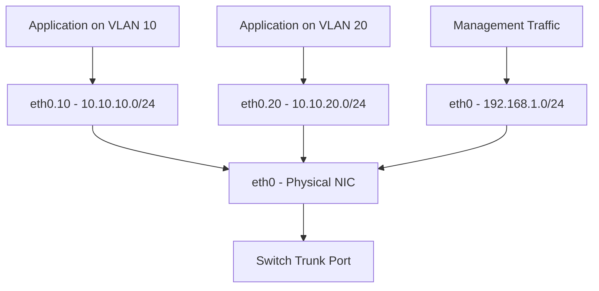

# How to Configure VLAN Interfaces with nmcli on RHEL

Author: [nawazdhandala](https://www.github.com/nawazdhandala)

Tags: RHEL, VLAN, nmcli, Networking, Linux

Description: Learn how to create, configure, and manage VLAN interfaces on RHEL using nmcli, with practical examples for network segmentation in production environments.

---

VLANs let you segment your network at Layer 2 without adding physical switches or cabling. On RHEL, nmcli makes it simple to create VLAN interfaces on top of physical NICs, bonds, or bridges. If you have ever managed a server that needs to sit on multiple networks, VLANs are how you do it cleanly.

## Prerequisites

- RHEL with NetworkManager running
- A physical interface connected to a switch trunk port
- The switch port must be configured to carry the VLAN IDs you plan to use
- Root or sudo access

## How VLANs Work on Linux



The Linux kernel uses the 802.1Q standard to tag outgoing frames with a VLAN ID and strip tags from incoming frames. Each VLAN interface appears as a separate network device with its own IP configuration.

## Step 1: Verify the 8021q Module

The kernel module should load automatically, but verify:

```bash
# Check if the 8021q module is loaded
lsmod | grep 8021q

# Load it if not present
modprobe 8021q
```

## Step 2: Create a VLAN Interface

Create a VLAN with ID 10 on top of eth0:

```bash
# Create VLAN 10 on eth0
nmcli connection add type vlan con-name vlan10 ifname eth0.10 vlan.parent eth0 vlan.id 10
```

This creates a new interface called `eth0.10`. The naming convention `parent.vlanid` is the default, but you can name it whatever you want using the `ifname` parameter.

## Step 3: Configure IP Addressing

```bash
# Set a static IP on VLAN 10
nmcli connection modify vlan10 ipv4.addresses 10.10.10.50/24
nmcli connection modify vlan10 ipv4.method manual

# Optionally set a gateway (only set this on one interface to avoid routing issues)
nmcli connection modify vlan10 ipv4.gateway 10.10.10.1
nmcli connection modify vlan10 ipv4.dns "10.10.10.1"
```

## Step 4: Activate the VLAN

```bash
# Bring up the VLAN interface
nmcli connection up vlan10

# Verify it is active
ip addr show eth0.10
```

## Creating Multiple VLANs

You can stack multiple VLANs on the same physical interface:

```bash
# Create VLAN 20 for a different network segment
nmcli connection add type vlan con-name vlan20 ifname eth0.20 vlan.parent eth0 vlan.id 20
nmcli connection modify vlan20 ipv4.addresses 10.10.20.50/24
nmcli connection modify vlan20 ipv4.method manual
nmcli connection up vlan20

# Create VLAN 30 for yet another segment
nmcli connection add type vlan con-name vlan30 ifname eth0.30 vlan.parent eth0 vlan.id 30
nmcli connection modify vlan30 ipv4.addresses 10.10.30.50/24
nmcli connection modify vlan30 ipv4.method manual
nmcli connection up vlan30
```

## VLAN with DHCP

If the VLAN network has a DHCP server:

```bash
# Create a VLAN that uses DHCP
nmcli connection add type vlan con-name vlan40 ifname eth0.40 vlan.parent eth0 vlan.id 40
nmcli connection modify vlan40 ipv4.method auto
nmcli connection up vlan40
```

## Setting Custom MTU

If your network supports jumbo frames on the VLAN:

```bash
# Set MTU on the parent interface first
nmcli connection modify eth0 802-3-ethernet.mtu 9000

# Set MTU on the VLAN (must be <= parent MTU)
nmcli connection modify vlan10 802-3-ethernet.mtu 9000

# Restart to apply
nmcli connection down eth0 && nmcli connection up eth0
nmcli connection up vlan10
```

## VLAN Priority (QoS)

You can set VLAN priority bits (802.1p) for QoS:

```bash
# Map socket priority to VLAN priority
# Format: from:to where 'from' is socket priority and 'to' is VLAN priority (0-7)
nmcli connection modify vlan10 vlan.ingress-priority-map "0:0,1:1,2:2,3:3"
nmcli connection modify vlan10 vlan.egress-priority-map "0:0,1:1,2:2,3:3"
```

## Verifying VLAN Configuration

```bash
# List all connections and their types
nmcli connection show

# Show detailed VLAN config
nmcli -f VLAN connection show vlan10

# Check VLAN details from the kernel
cat /proc/net/vlan/eth0.10

# View all VLAN interfaces
ls /proc/net/vlan/
```

## Routing with Multiple VLANs

When you have multiple VLANs, be careful with routing. Only one interface should have a default gateway, or you need policy-based routing.

```bash
# Check the routing table
ip route show

# Add a specific route for a subnet through VLAN 20
nmcli connection modify vlan20 ipv4.routes "172.16.0.0/16 10.10.20.1"
nmcli connection up vlan20
```

For more complex routing where you need different default gateways per VLAN, use routing tables:

```bash
# Add a routing rule and table for VLAN 20 traffic
nmcli connection modify vlan20 ipv4.routing-rules "priority 100 from 10.10.20.50 table 200"
nmcli connection modify vlan20 ipv4.routes "0.0.0.0/0 10.10.20.1 table=200"
nmcli connection up vlan20
```

## Troubleshooting

**VLAN traffic not reaching the server**:

```bash
# Verify VLAN-tagged frames arrive on the parent interface
tcpdump -i eth0 -e -nn vlan 10

# Verify traffic on the VLAN interface itself
tcpdump -i eth0.10 -nn
```

**Cannot ping the gateway**:

```bash
# Check the ARP table
ip neigh show dev eth0.10

# Manually send an ARP request
arping -I eth0.10 10.10.10.1
```

**VLAN interface not coming up**: Make sure the parent interface is active:

```bash
# Check parent interface status
nmcli device status | grep eth0
```

## Removing a VLAN

```bash
# Deactivate and remove a VLAN
nmcli connection down vlan10
nmcli connection delete vlan10
```

## Summary

VLAN interfaces on RHEL are straightforward with nmcli. Create them with a parent interface and VLAN ID, assign IPs, and bring them up. The key things to get right are: the switch must trunk the VLANs to your port, only set one default gateway (or use policy routing), and make sure MTU settings are consistent between the parent and VLAN interfaces. VLANs are persistent through reboots since NetworkManager saves them as connection profiles.
