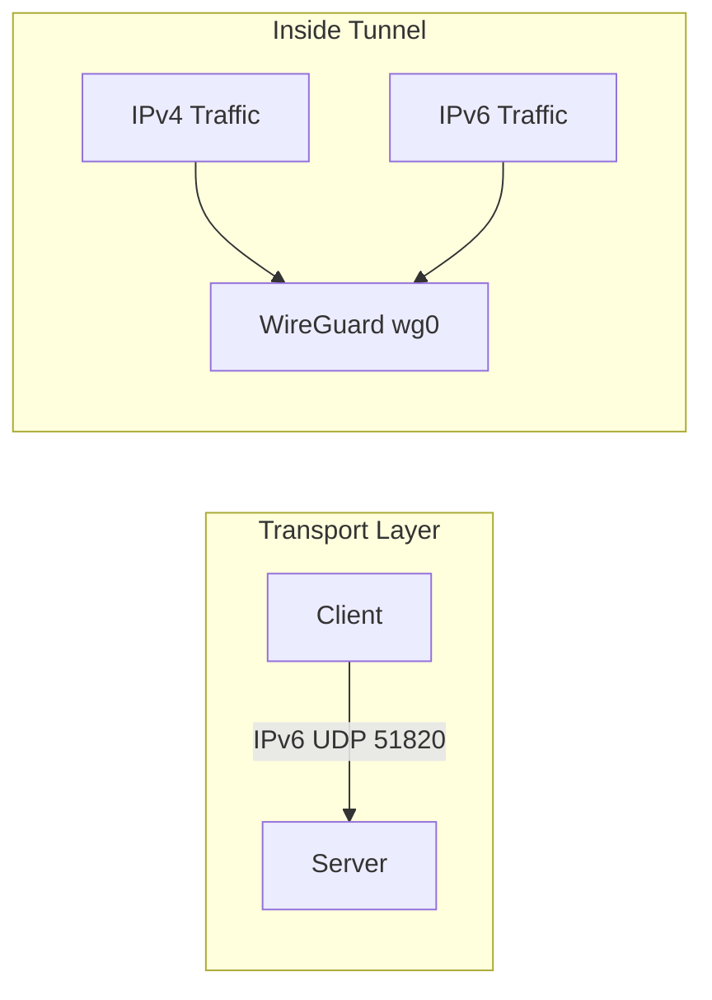

# How to Configure WireGuard VPN with IPv6 on RHEL

Author: [nawazdhandala](https://www.github.com/nawazdhandala)

Tags: RHEL, WireGuard, IPv6, VPN, Linux

Description: Learn how to set up WireGuard VPN with full IPv6 support on RHEL, including dual-stack tunnel configuration, IPv6 endpoint connectivity, and routing both protocols through the tunnel.

---

WireGuard handles IPv6 natively. You can use IPv6 for the tunnel endpoints, carry IPv6 traffic inside the tunnel, or both. This is a real advantage when you're deploying in environments where IPv6 is the primary or even the only protocol available.

## IPv6 Options with WireGuard

There are three ways to use IPv6 with WireGuard:

1. **IPv6 transport** - The tunnel endpoints communicate over IPv6
2. **IPv6 inside the tunnel** - IPv6 traffic is carried through the tunnel
3. **Dual-stack tunnel** - Both IPv4 and IPv6 flow through the tunnel



## Prerequisites

- RHEL systems with WireGuard tools installed
- IPv6 connectivity on both sides (for IPv6 transport)
- An IPv6 /64 prefix for tunnel addresses

## Setting Up a Dual-Stack WireGuard Server

This configuration gives the server both IPv4 and IPv6 addresses on the tunnel interface and uses an IPv6 endpoint.

```bash
# Install WireGuard tools
sudo dnf install -y epel-release wireguard-tools

# Generate keys
sudo mkdir -p /etc/wireguard && sudo chmod 700 /etc/wireguard
wg genkey | sudo tee /etc/wireguard/private.key | wg pubkey | sudo tee /etc/wireguard/public.key
sudo chmod 600 /etc/wireguard/private.key

SERVER_PRIVKEY=$(sudo cat /etc/wireguard/private.key)
```

Create the server configuration with both IPv4 and IPv6 tunnel addresses:

```bash
# Server config with dual-stack tunnel
sudo tee /etc/wireguard/wg0.conf > /dev/null << EOF
[Interface]
PrivateKey = ${SERVER_PRIVKEY}
# Dual-stack: assign both IPv4 and IPv6 addresses to the tunnel
Address = 10.0.0.1/24, fd00:vpn::1/64
ListenPort = 51820

# Enable forwarding for both protocols
PostUp = sysctl -w net.ipv4.ip_forward=1; sysctl -w net.ipv6.conf.all.forwarding=1
PostUp = firewall-cmd --add-port=51820/udp; firewall-cmd --add-masquerade
PostDown = firewall-cmd --remove-port=51820/udp; firewall-cmd --remove-masquerade

[Peer]
# Client 1
PublicKey = CLIENT_PUBLIC_KEY_HERE
# Allow both IPv4 and IPv6 from this peer
AllowedIPs = 10.0.0.2/32, fd00:vpn::2/128
EOF

sudo chmod 600 /etc/wireguard/wg0.conf
```

Note: `fd00:vpn::1` uses a Unique Local Address (ULA) prefix, which is the IPv6 equivalent of RFC 1918 private addresses. For production, use a properly generated ULA prefix from your `fd00::/8` allocation.

## Setting Up the Dual-Stack Client

```bash
# Client config with dual-stack
sudo tee /etc/wireguard/wg0.conf > /dev/null << 'EOF'
[Interface]
PrivateKey = CLIENT_PRIVATE_KEY_HERE
Address = 10.0.0.2/24, fd00:vpn::2/64
DNS = 1.1.1.1, 2606:4700:4700::1111

[Peer]
PublicKey = SERVER_PUBLIC_KEY_HERE
# Use an IPv6 endpoint if the server has one
Endpoint = [2001:db8::1]:51820
# Route both IPv4 and IPv6 through the tunnel
AllowedIPs = 0.0.0.0/0, ::/0
PersistentKeepalive = 25
EOF
```

The `AllowedIPs = 0.0.0.0/0, ::/0` routes all IPv4 and all IPv6 traffic through the tunnel.

## Using IPv6 Endpoints

When the WireGuard server has an IPv6 address, use bracket notation for the endpoint:

```ini
# IPv6 endpoint format
Endpoint = [2001:db8::1]:51820
```

This works the same as IPv4 endpoints. WireGuard doesn't care which IP version carries the encrypted packets.

## Enabling IPv6 Forwarding on the Server

```bash
# Enable IPv6 forwarding
sudo sysctl -w net.ipv6.conf.all.forwarding=1

# Make it persistent
echo "net.ipv6.conf.all.forwarding = 1" | sudo tee -a /etc/sysctl.d/99-wireguard-ipv6.conf
```

## IPv6 NAT (When Needed)

Unlike IPv4, IPv6 NAT is rarely needed because addresses are plentiful. But if your server only has one IPv6 address and you need to share it:

```bash
# IPv6 masquerading with nftables (firewalld backend)
sudo firewall-cmd --permanent --zone=public --add-masquerade

# Note: firewalld masquerade handles both IPv4 and IPv6
sudo firewall-cmd --reload
```

A better approach is to route a proper IPv6 prefix to your WireGuard clients. Ask your hosting provider or ISP for a routed /48 or /64.

## Bringing Up and Verifying

```bash
# Start WireGuard
sudo wg-quick up wg0

# Enable on boot
sudo systemctl enable wg-quick@wg0

# Verify both addresses are assigned
ip addr show wg0

# Test IPv4 through the tunnel
ping -c 4 10.0.0.1

# Test IPv6 through the tunnel
ping6 -c 4 fd00:vpn::1

# Test external IPv6
ping6 -c 4 2001:4860:4860::8888

# Check your public IPv6
curl -6 ifconfig.me
```

## IPv6-Only WireGuard

If you want an IPv6-only tunnel (no IPv4 inside), just omit the IPv4 addresses:

```ini
[Interface]
PrivateKey = YOUR_PRIVATE_KEY
Address = fd00:vpn::2/64

[Peer]
PublicKey = SERVER_PUBLIC_KEY
Endpoint = [2001:db8::1]:51820
AllowedIPs = ::/0
PersistentKeepalive = 25
```

The transport layer (the actual UDP packets between peers) can still use IPv4 or IPv6 independently of what flows inside the tunnel.

## Firewall Rules for IPv6 WireGuard

```bash
# Allow WireGuard port on both protocols
sudo firewall-cmd --permanent --add-port=51820/udp

# Add wg0 to trusted zone
sudo firewall-cmd --permanent --zone=trusted --add-interface=wg0

# Allow ICMPv6 (essential for IPv6 to work)
# firewalld allows it by default, but verify:
sudo firewall-cmd --list-icmp-blocks

# Reload
sudo firewall-cmd --reload
```

## Troubleshooting IPv6 WireGuard

**No IPv6 connectivity through the tunnel:**

```bash
# Check IPv6 forwarding is enabled
sysctl net.ipv6.conf.all.forwarding

# Verify IPv6 addresses on wg0
ip -6 addr show dev wg0

# Check IPv6 routes
ip -6 route show | grep wg0

# Test with ping6
ping6 -c 4 fd00:vpn::1
```

**Endpoint resolution issues:**

```bash
# If using a hostname as endpoint, make sure it has an AAAA record
dig AAAA vpn.example.com

# WireGuard resolves endpoints at startup only
# Restart to pick up DNS changes
sudo wg-quick down wg0 && sudo wg-quick up wg0
```

## Wrapping Up

WireGuard's IPv6 support on RHEL is first-class. Whether you're using IPv6 for transport, carrying IPv6 through the tunnel, or running a full dual-stack setup, the configuration stays clean and readable. The main things to remember are: use bracket notation for IPv6 endpoints, include `::/0` in AllowedIPs if you want all IPv6 traffic tunneled, and enable IPv6 forwarding on the server if you're routing traffic.
