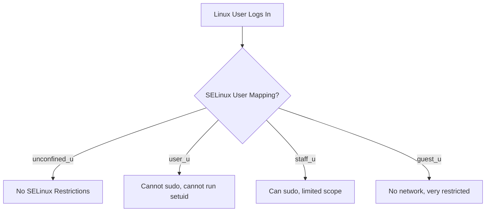

# How to Confine Linux Users with SELinux User Mappings on RHEL 9

Author: [nawazdhandala](https://www.github.com/nawazdhandala)

Tags: RHEL, SELinux, User Mappings, Security, Linux

Description: Map Linux users to SELinux user identities on RHEL 9 to restrict what they can do on the system, even if they have shell access.

---

## Why Confine Users?

Standard Linux permissions control which files a user can access. SELinux user mappings go further by controlling what actions a user can perform. A confined user might have shell access but be unable to run `sudo`, change network settings, or execute programs from their home directory. This is especially useful for shared systems, jump boxes, and any environment where users should not have free rein.

## SELinux Users

RHEL 9 comes with several predefined SELinux users:

| SELinux User | Purpose | Capabilities |
|---|---|---|
| unconfined_u | Default for regular users | No SELinux restrictions |
| user_u | Basic confined user | Cannot become root, cannot run setuid programs |
| staff_u | Staff user | Can use sudo to transition to sysadm_r |
| sysadm_u | System administrator | Full admin access under SELinux |
| guest_u | Guest user | No networking, no setuid, no su/sudo |
| xguest_u | X Window guest | Only Firefox for web access, no networking |



## Viewing Current Mappings

```bash
# Show all SELinux user mappings
sudo semanage login -l
```

Default output:

```
Login Name           SELinux User         MLS/MCS Range        Service

__default__          unconfined_u         s0-s0:c0.c1023       *
root                 unconfined_u         s0-s0:c0.c1023       *
```

The `__default__` entry controls what happens for any Linux user that does not have an explicit mapping. By default, everyone gets `unconfined_u`.

## Mapping a User to a Confined SELinux User

### Confine a Regular User

```bash
# Map 'johndoe' to the confined 'user_u' SELinux user
sudo semanage login -a -s user_u johndoe
```

Now when `johndoe` logs in:
- They cannot run `su` or `sudo`
- They cannot execute setuid programs
- They cannot change SELinux contexts
- They are confined to `user_t` domain

### Confine a Staff User

```bash
# Map 'admin1' to 'staff_u' - can use sudo
sudo semanage login -a -s staff_u admin1
```

`staff_u` users can use `sudo` to perform administrative tasks but are still confined when running normal commands.

### Confine a Guest User

```bash
# Map 'visitor' to 'guest_u' - very restricted
sudo semanage login -a -s guest_u visitor
```

`guest_u` users:
- Cannot use the network
- Cannot run setuid programs
- Cannot use `su` or `sudo`
- Cannot execute programs from home or temp directories

## Changing the Default Mapping

To confine all new users by default:

```bash
# Change the default mapping from unconfined_u to user_u
sudo semanage login -m -s user_u __default__
```

Now any user without an explicit mapping gets confined as `user_u`. This is a significant security improvement for multi-user systems.

## Verifying User Confinement

```bash
# Check the SELinux context of a logged-in user
id -Z

# Check what context a specific user would get
sudo semanage login -l | grep johndoe
```

When the user logs in, their context looks like:

```
user_u:user_r:user_t:s0
```

## Removing a Mapping

```bash
# Remove a custom user mapping (reverts to default)
sudo semanage login -d johndoe
```

## Modifying a Mapping

```bash
# Change a user's SELinux user
sudo semanage login -m -s staff_u johndoe
```

## Practical Example: Securing a Shared Server

On a shared development server, confine regular developers and give team leads admin access:

```bash
# Confine all users by default
sudo semanage login -m -s user_u __default__

# Give team leads staff access
sudo semanage login -a -s staff_u teamlead1
sudo semanage login -a -s staff_u teamlead2

# Keep root unconfined
# (root stays mapped to unconfined_u by default)

# Verify all mappings
sudo semanage login -l
```

## Enabling Booleans for Confined Users

Some useful booleans for confined user environments:

```bash
# Allow confined users to execute programs in their home directory
sudo setsebool -P user_exec_content on

# Allow confined users to run commands via cron
sudo setsebool -P user_cron_spool_job on

# Prevent confined users from running executables from /tmp
sudo setsebool -P user_exec_content off
```

## User Home Directory Labels

Confined users need their home directories properly labeled:

```bash
# Relabel a user's home directory after mapping
sudo restorecon -RvF /home/johndoe/
```

## Testing Confinement

Log in as the confined user and test:

```bash
# Check your SELinux context
id -Z

# Try sudo (should fail for user_u)
sudo ls /root

# Try running a script from /tmp
chmod +x /tmp/test.sh
/tmp/test.sh

# Try changing your SELinux context
newrole -r sysadm_r
```

Each of these should be blocked for a `user_u` confined user.

## Troubleshooting

**User cannot log in after mapping:**

Check for SELinux denials:

```bash
sudo ausearch -m avc -ts recent | grep user_u
```

The user's home directory might need relabeling:

```bash
sudo restorecon -RvF /home/username/
```

**User mapped but context does not change:**

SELinux user mappings apply at login time. The user must log out and back in.

**Staff user cannot use sudo:**

Make sure the `staff_u` to `sysadm_r` transition is enabled:

```bash
sudo setsebool -P staff_exec_content on
```

## Wrapping Up

SELinux user mappings are one of the most overlooked features of SELinux. By changing the default mapping from `unconfined_u` to `user_u`, you instantly reduce the blast radius if any user account is compromised. Add specific mappings for admins and staff, and you have a proper multi-tier access control system that goes well beyond traditional Unix permissions.
