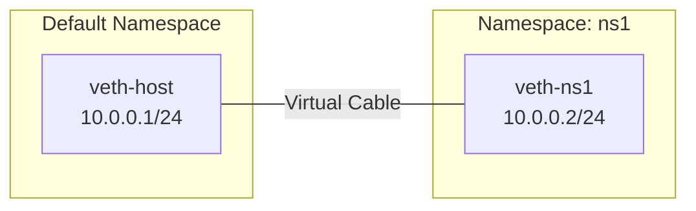
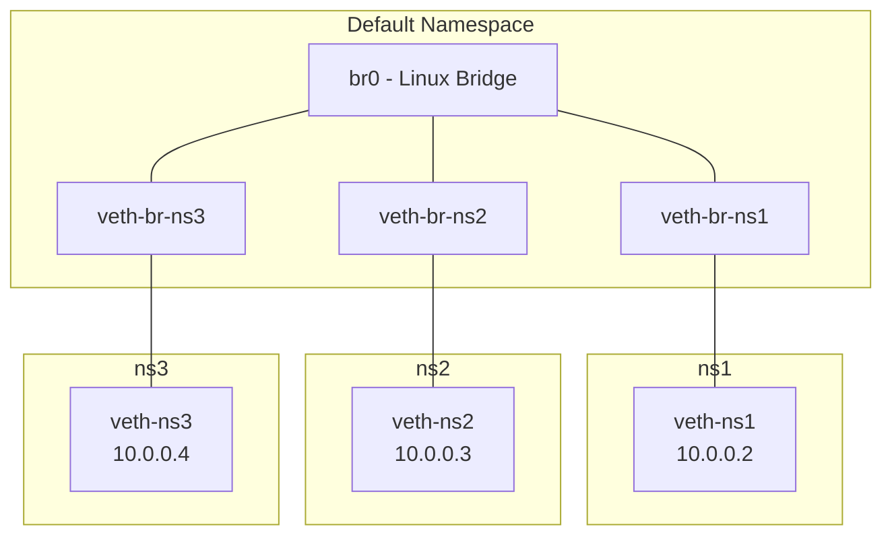

# How to Connect Network Namespaces Using veth Pairs on RHEL 9

Author: [nawazdhandala](https://www.github.com/nawazdhandala)

Tags: RHEL, veth, Network Namespaces, Linux

Description: Learn how to use virtual Ethernet (veth) pairs to connect network namespaces on RHEL 9, including direct connections, bridge-based topologies, and multi-namespace networks.

---

Virtual Ethernet (veth) pairs are the standard mechanism for connecting network namespaces. They work like a virtual cable - packets sent into one end come out the other. This is how containers communicate with each other and with the host. Understanding veth pairs is essential for anyone working with container networking or network isolation on RHEL 9.

## How veth Pairs Work



A veth pair is always created as two interfaces. When you send a packet into one, it appears on the other. You can then place each end in a different namespace.

## Creating a Simple veth Connection

```bash
# Create namespace
sudo ip netns add ns1

# Create the veth pair
sudo ip link add veth-host type veth peer name veth-ns1

# Move one end into the namespace
sudo ip link set veth-ns1 netns ns1

# Configure the host side
sudo ip addr add 10.0.0.1/24 dev veth-host
sudo ip link set veth-host up

# Configure the namespace side
sudo ip netns exec ns1 ip addr add 10.0.0.2/24 dev veth-ns1
sudo ip netns exec ns1 ip link set veth-ns1 up
sudo ip netns exec ns1 ip link set lo up

# Test
ping -c 2 10.0.0.2
sudo ip netns exec ns1 ping -c 2 10.0.0.1
```

## Connecting Two Namespaces Directly

You can connect two namespaces without involving the default namespace.

```bash
# Create two namespaces
sudo ip netns add red
sudo ip netns add green

# Create a veth pair connecting them
sudo ip link add veth-red type veth peer name veth-green

# Place each end in its namespace
sudo ip link set veth-red netns red
sudo ip link set veth-green netns green

# Configure red side
sudo ip netns exec red ip addr add 10.0.0.1/24 dev veth-red
sudo ip netns exec red ip link set veth-red up
sudo ip netns exec red ip link set lo up

# Configure green side
sudo ip netns exec green ip addr add 10.0.0.2/24 dev veth-green
sudo ip netns exec green ip link set veth-green up
sudo ip netns exec green ip link set lo up

# Test connectivity
sudo ip netns exec red ping -c 2 10.0.0.2
sudo ip netns exec green ping -c 2 10.0.0.1
```

## Connecting Multiple Namespaces with a Bridge

When you need more than two namespaces to communicate, use a Linux bridge. This mimics a physical switch.



```bash
# Create three namespaces
sudo ip netns add ns1
sudo ip netns add ns2
sudo ip netns add ns3

# Create the bridge
sudo ip link add br0 type bridge
sudo ip link set br0 up
sudo ip addr add 10.0.0.1/24 dev br0

# Create veth pairs and connect to the bridge
for i in 1 2 3; do
    # Create veth pair
    sudo ip link add veth-br-ns${i} type veth peer name veth-ns${i}

    # Attach one end to the bridge
    sudo ip link set veth-br-ns${i} master br0
    sudo ip link set veth-br-ns${i} up

    # Move the other end to the namespace
    sudo ip link set veth-ns${i} netns ns${i}

    # Configure inside the namespace
    sudo ip netns exec ns${i} ip addr add 10.0.0.$((i+1))/24 dev veth-ns${i}
    sudo ip netns exec ns${i} ip link set veth-ns${i} up
    sudo ip netns exec ns${i} ip link set lo up
    sudo ip netns exec ns${i} ip route add default via 10.0.0.1
done
```

Test connectivity between all namespaces:

```bash
# ns1 to ns2
sudo ip netns exec ns1 ping -c 2 10.0.0.3

# ns2 to ns3
sudo ip netns exec ns2 ping -c 2 10.0.0.4

# ns3 to ns1
sudo ip netns exec ns3 ping -c 2 10.0.0.2

# Any namespace to the host
sudo ip netns exec ns1 ping -c 2 10.0.0.1
```

## Providing Internet Access Through the Bridge

```bash
# Enable IP forwarding
sudo sysctl -w net.ipv4.ip_forward=1

# Add NAT for the bridge subnet
sudo iptables -t nat -A POSTROUTING -s 10.0.0.0/24 ! -o br0 -j MASQUERADE

# Allow forwarding
sudo iptables -A FORWARD -i br0 -j ACCEPT
sudo iptables -A FORWARD -o br0 -m state --state RELATED,ESTABLISHED -j ACCEPT

# Test internet from a namespace
sudo ip netns exec ns1 ping -c 2 8.8.8.8
```

## Setting MTU on veth Pairs

```bash
# Set MTU on both sides of a veth pair
sudo ip link set veth-host mtu 9000
sudo ip netns exec ns1 ip link set veth-ns1 mtu 9000

# Verify
ip link show veth-host | grep mtu
sudo ip netns exec ns1 ip link show veth-ns1 | grep mtu
```

## Inspecting veth Pairs

```bash
# Find the peer of a veth interface
ethtool -S veth-host
# The peer_ifindex tells you the interface index of the other end

# Or use ip link
ip -d link show veth-host
```

## Monitoring Traffic on veth Pairs

```bash
# Capture traffic on the host side of a veth pair
sudo tcpdump -i veth-host -nn

# Capture traffic inside a namespace
sudo ip netns exec ns1 tcpdump -i veth-ns1 -nn
```

## Cleaning Up

```bash
# Delete namespaces (also removes their veth endpoints)
sudo ip netns del ns1
sudo ip netns del ns2
sudo ip netns del ns3

# Delete the bridge
sudo ip link del br0

# Remaining veth endpoints in the default namespace are automatically removed
# when their peer is deleted with the namespace
```

## Troubleshooting veth Pairs

**Packets sent but not received:**

```bash
# Check both ends are UP
ip link show veth-host
sudo ip netns exec ns1 ip link show veth-ns1

# Check addresses are in the same subnet
ip addr show veth-host
sudo ip netns exec ns1 ip addr show veth-ns1
```

**Bridge not forwarding:**

```bash
# Check bridge state
bridge link show

# Verify STP isn't blocking
bridge link show dev veth-br-ns1
```

## Wrapping Up

veth pairs are the pipes that connect network namespaces on RHEL 9. For two namespaces, a direct veth pair is sufficient. For three or more, use a bridge. This is exactly how container runtimes like Podman and Docker set up networking, so understanding veth pairs gives you deep insight into container networking behavior.
