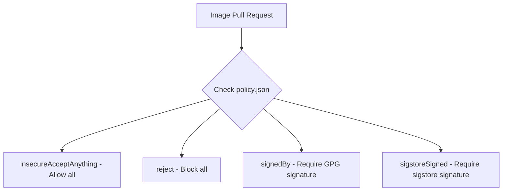

# How to Configure Container Image Trust Policies on RHEL

Author: [nawazdhandala](https://www.github.com/nawazdhandala)

Tags: RHEL, Container, Trust Policies, Security, Linux

Description: Learn how to configure container image trust policies on RHEL to control which registries and images are trusted, rejected, or require signature verification.

---

Container image trust policies are your first line of defense against running unauthorized or tampered images in production. On RHEL, the trust policy system lets you define rules per registry, requiring signatures from specific GPG keys, allowing unsigned images from trusted sources, or blocking entire registries altogether.

## Understanding the Trust Policy File

The trust policy lives at `/etc/containers/policy.json`. It tells Podman and other container tools what to do when pulling an image.

# View the current policy
```bash
cat /etc/containers/policy.json
```

The default RHEL policy is permissive:

```json
{
    "default": [
        {
            "type": "insecureAcceptAnything"
        }
    ],
    "transports": {
        "docker-daemon": {
            "": [
                {
                    "type": "insecureAcceptAnything"
                }
            ]
        }
    }
}
```

This accepts any image from any source. For production, you want something tighter.

## Trust Policy Types



- **insecureAcceptAnything** - Accept any image, no verification
- **reject** - Refuse to pull the image
- **signedBy** - Require a valid GPG signature
- **sigstoreSigned** - Require a valid sigstore/cosign signature

## Building a Restrictive Trust Policy

Here is a production-appropriate policy:

```bash
sudo cat > /etc/containers/policy.json << 'EOF'
{
    "default": [
        {
            "type": "reject"
        }
    ],
    "transports": {
        "docker": {
            "registry.access.redhat.com": [
                {
                    "type": "signedBy",
                    "keyType": "GPGKeys",
                    "keyPath": "/etc/pki/rpm-gpg/RPM-GPG-KEY-redhat-release"
                }
            ],
            "registry.redhat.io": [
                {
                    "type": "signedBy",
                    "keyType": "GPGKeys",
                    "keyPath": "/etc/pki/rpm-gpg/RPM-GPG-KEY-redhat-release"
                }
            ],
            "registry.example.com": [
                {
                    "type": "signedBy",
                    "keyType": "GPGKeys",
                    "keyPath": "/etc/pki/containers/company-signing-key.pub"
                }
            ],
            "docker.io/library": [
                {
                    "type": "insecureAcceptAnything"
                }
            ]
        },
        "atomic": {
            "": [
                {
                    "type": "reject"
                }
            ]
        }
    }
}
EOF
```

This policy:
- Rejects all images by default
- Requires Red Hat GPG signatures for Red Hat registry images
- Requires your company GPG signature for internal registry images
- Allows official Docker Hub library images without signatures
- Rejects everything else

## Managing Trust with podman image trust

The `podman image trust` command provides a friendlier interface:

# View current trust settings
```bash
podman image trust show
```

# Set trust for a registry to require signatures
```bash
sudo podman image trust set --type signedBy --pubkeysfile /etc/pki/containers/mykey.pub registry.example.com
```

# Set a registry as trusted (accept anything)
```bash
sudo podman image trust set --type accept docker.io
```

# Block a registry entirely
```bash
sudo podman image trust set --type reject untrusted-registry.com
```

## Configuring Signature Storage

Tell Podman where to find and store signatures:

```bash
sudo cat > /etc/containers/registries.d/default.yaml << 'EOF'
default-docker:
  sigstore: file:///var/lib/containers/sigstore

docker:
  registry.example.com:
    sigstore: https://sigstore.example.com/signatures/
    sigstore-staging: file:///var/lib/containers/sigstore
  registry.access.redhat.com:
    sigstore: https://access.redhat.com/webassets/docker/content/sigstore
EOF
```

The `sigstore` URL is where Podman looks for signatures when pulling images. The `sigstore-staging` is where it stores signatures when pushing.

## Setting Up GPG Keys for Trust

# Import a GPG public key for signature verification
```bash
sudo mkdir -p /etc/pki/containers/
sudo gpg --armor --export signing@example.com | sudo tee /etc/pki/containers/company-signing-key.pub
```

# Verify the key was installed correctly
```bash
sudo gpg --show-keys /etc/pki/containers/company-signing-key.pub
```

## Testing Trust Policies

After configuring policies, test them:

# This should succeed (Red Hat signed images)
```bash
podman pull registry.access.redhat.com/ubi9/ubi-minimal
```

# This should be rejected (blocked registry)
```bash
podman pull untrusted-registry.com/some-image:latest
# Error: Source image rejected: Running image ...rejected by policy
```

# This should be rejected (unsigned image from signed-required registry)
```bash
podman pull registry.example.com/unsigned-image:latest
# Error: Source image rejected: A]signature was required but no signature exists
```

## Per-User Trust Policies

Users can have their own policy files:

```bash
mkdir -p ~/.config/containers/
cp /etc/containers/policy.json ~/.config/containers/policy.json
```

Edit the user-level policy file. User policies can only be more restrictive than the system policy, not more permissive.

## Sigstore (Cosign) Trust Policies

For modern sigstore-based verification:

```json
{
    "default": [
        {
            "type": "reject"
        }
    ],
    "transports": {
        "docker": {
            "registry.example.com": [
                {
                    "type": "sigstoreSigned",
                    "keyPath": "/etc/pki/containers/cosign.pub"
                }
            ]
        }
    }
}
```

## Auditing Image Pulls

Track what images are being pulled on your system:

# Check podman events for pull operations
```bash
podman events --filter event=pull --since 24h
```

# Log all container operations through auditd
```bash
sudo auditctl -w /usr/bin/podman -p x -k container-ops
```

## Combining Trust with Registry Configuration

Trust policies work best alongside registry configuration:

```toml
# /etc/containers/registries.conf
unqualified-search-registries = ["registry.redhat.io", "registry.example.com"]

# Block specific registries at the network level
[[registry]]
location = "docker.io"
blocked = true
```

This prevents even attempting to pull from blocked registries, while trust policies handle verification for allowed registries.

## Common Policy Patterns

**Development environment:** Allow most registries, require signatures only for internal images.

**Staging environment:** Require signatures for all internal images, allow select public images.

**Production environment:** Reject by default, require signatures for everything, allow only specific registries.

## Summary

Container image trust policies on RHEL give you control over what runs on your systems. Start with a default-reject policy and explicitly allow the registries and signing keys you trust. This, combined with registry configuration and image signing, creates a defense-in-depth approach to container security. It takes some effort to set up, but it prevents unauthorized or tampered images from ever running in your environment.
