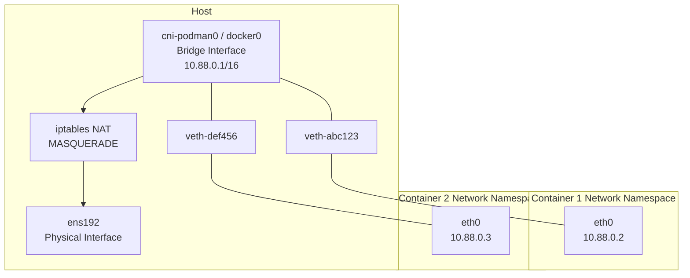

# How to Understand Container Networking Through Network Namespaces on RHEL 9

Author: [nawazdhandala](https://www.github.com/nawazdhandala)

Tags: RHEL, Containers, Network Namespaces, Linux

Description: Demystify container networking on RHEL 9 by understanding the network namespace fundamentals that Podman and Docker use under the hood, with hands-on examples building container-style networking from scratch.

---

Container networking isn't magic. When Podman or Docker creates a container with its own network, it's using the same network namespaces, veth pairs, and bridges that you can create with `ip` commands. Understanding these building blocks makes troubleshooting container networking far easier. Let's build container-style networking from scratch on RHEL 9.

## How Container Networking Actually Works



When you run `podman run`, here's what happens behind the scenes:

1. A new network namespace is created
2. A veth pair is created
3. One end goes into the namespace (becomes `eth0`)
4. The other end attaches to a bridge on the host
5. NAT rules are added for outbound connectivity
6. Port forwarding rules are added for published ports

## Building Container Networking by Hand

Let's replicate what a container runtime does.

### Step 1: Create the Bridge

```bash
# Create a bridge (like docker0 or cni-podman0)
sudo ip link add container-br0 type bridge
sudo ip addr add 172.20.0.1/24 dev container-br0
sudo ip link set container-br0 up
```

### Step 2: Create a "Container" Namespace

```bash
# Create a namespace (this is what the container runtime does)
sudo ip netns add container1

# Create a veth pair
sudo ip link add veth-host1 type veth peer name eth0

# Move one end into the "container"
sudo ip link set eth0 netns container1

# Attach the other end to the bridge
sudo ip link set veth-host1 master container-br0
sudo ip link set veth-host1 up

# Configure the "container" side
sudo ip netns exec container1 ip addr add 172.20.0.2/24 dev eth0
sudo ip netns exec container1 ip link set eth0 up
sudo ip netns exec container1 ip link set lo up
sudo ip netns exec container1 ip route add default via 172.20.0.1
```

### Step 3: Enable Outbound Connectivity

```bash
# Enable forwarding
sudo sysctl -w net.ipv4.ip_forward=1

# Add NAT for the container subnet
sudo iptables -t nat -A POSTROUTING -s 172.20.0.0/24 ! -o container-br0 -j MASQUERADE
sudo iptables -A FORWARD -i container-br0 -j ACCEPT
sudo iptables -A FORWARD -o container-br0 -m state --state RELATED,ESTABLISHED -j ACCEPT

# Set up DNS
sudo mkdir -p /etc/netns/container1
echo "nameserver 8.8.8.8" | sudo tee /etc/netns/container1/resolv.conf
```

### Step 4: Test It

```bash
# The "container" can reach the internet
sudo ip netns exec container1 ping -c 2 8.8.8.8
sudo ip netns exec container1 curl -s ifconfig.me
```

### Step 5: Add Port Forwarding

To expose a service from the "container" on the host:

```bash
# Forward host port 8080 to container port 80
sudo iptables -t nat -A PREROUTING -p tcp --dport 8080 -j DNAT --to-destination 172.20.0.2:80
sudo iptables -A FORWARD -p tcp -d 172.20.0.2 --dport 80 -j ACCEPT

# Start a web server in the "container"
sudo ip netns exec container1 python3 -m http.server 80 &

# Access it from outside
curl http://localhost:8080
```

This is exactly what `podman run -p 8080:80` does.

## Adding a Second Container

```bash
# Create second container
sudo ip netns add container2
sudo ip link add veth-host2 type veth peer name eth0
sudo ip link set eth0 netns container2
sudo ip link set veth-host2 master container-br0
sudo ip link set veth-host2 up

sudo ip netns exec container2 ip addr add 172.20.0.3/24 dev eth0
sudo ip netns exec container2 ip link set eth0 up
sudo ip netns exec container2 ip link set lo up
sudo ip netns exec container2 ip route add default via 172.20.0.1

# Containers can communicate via the bridge
sudo ip netns exec container1 ping -c 2 172.20.0.3
sudo ip netns exec container2 ping -c 2 172.20.0.2
```

## Inspecting Real Podman Container Networking

Now let's look at what Podman actually creates:

```bash
# Run a container
podman run -d --name test-web -p 8888:80 nginx

# Find the container's network namespace PID
CPID=$(podman inspect test-web --format '{{.State.Pid}}')

# Enter the container's network namespace
sudo nsenter -t $CPID -n ip addr show
sudo nsenter -t $CPID -n ip route show

# See the veth pair on the host
ip link show type veth

# See the bridge
ip link show type bridge
bridge link show
```

## Inspecting the NAT Rules Podman Creates

```bash
# See the NAT rules added by Podman
sudo iptables -t nat -L -n -v | grep -A 5 "PODMAN\|CNI"

# See the port forwarding
sudo iptables -t nat -L PREROUTING -n -v
```

## Troubleshooting Container Networking

**Container can't reach the internet:**

```bash
# Check the container has an IP
podman exec test-web ip addr show

# Check default route exists
podman exec test-web ip route show

# Check the bridge on the host
ip addr show cni-podman0

# Check NAT rules
sudo iptables -t nat -L POSTROUTING -v -n

# Check IP forwarding
sysctl net.ipv4.ip_forward
```

**Containers can't reach each other:**

```bash
# Check they're on the same bridge/network
podman network inspect podman

# Check bridge forwarding
bridge link show
```

**Published ports not accessible:**

```bash
# Check the port forwarding rules
sudo iptables -t nat -L -n | grep DNAT

# Check the container is actually listening
podman exec test-web ss -tlnp
```

## Cleaning Up

```bash
# Remove our hand-built containers
sudo ip netns del container1
sudo ip netns del container2
sudo ip link del container-br0

# Clean up iptables rules
sudo iptables -t nat -F
sudo iptables -F FORWARD
```

## Wrapping Up

Container networking on RHEL 9 is built on network namespaces, veth pairs, bridges, and iptables NAT. There's nothing proprietary or mysterious about it. Building it by hand helps you understand exactly what Podman or Docker does when you run a container, and that understanding makes troubleshooting container networking issues much more straightforward. When a container can't connect, you now know exactly which layer to check.
