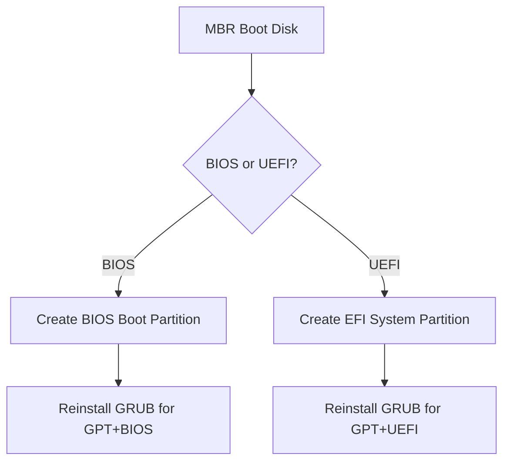

# How to Convert an MBR Partition Table to GPT on RHEL

Author: [nawazdhandala](https://www.github.com/nawazdhandala)

Tags: RHEL, MBR, GPT, Partitioning, Linux

Description: Step-by-step instructions for converting an MBR partition table to GPT on RHEL using gdisk, with considerations for data preservation and boot compatibility.

---

## Why Convert to GPT?

MBR has been around since 1983 and carries hard limitations: 2 TB maximum disk size and only four primary partitions. If you are upgrading to larger disks, migrating to UEFI boot, or just want a more robust partition table, GPT is the way forward.

The good news is that you can convert MBR to GPT without destroying your data, as long as you use the right tool and take precautions.

## Prerequisites

- RHEL with root access
- A disk currently using an MBR partition table
- A full backup of the disk (non-negotiable)
- gdisk package installed

## Step 1 - Install gdisk

gdisk (GPT fdisk) handles the conversion cleanly.

```bash
# Install gdisk
sudo dnf install -y gdisk
```

## Step 2 - Back Up Everything

Before converting, back up the partition table and all data.

```bash
# Back up the MBR (first 512 bytes)
sudo dd if=/dev/sdb of=/root/sdb-mbr-backup.bin bs=512 count=1

# Back up the partition table with sfdisk
sudo sfdisk -d /dev/sdb > /root/sdb-partition-backup.txt

# Back up critical data on the disk
# Use rsync, tar, or your backup tool of choice
```

## Step 3 - Examine the Current Layout

```bash
# View the current MBR partition table
sudo fdisk -l /dev/sdb

# Check for any issues gdisk might flag
sudo gdisk -l /dev/sdb
```

gdisk will note that it found an MBR and report whether conversion looks safe.

## Step 4 - Convert with gdisk

```bash
# Launch gdisk on the target disk
sudo gdisk /dev/sdb
```

gdisk will detect the MBR and offer to convert it. At the gdisk prompt:

```bash
# At the gdisk prompt:
w     # Write the GPT partition table
y     # Confirm
```

When gdisk writes a GPT, it preserves all existing partition boundaries and data. It creates a protective MBR for backward compatibility and writes the GPT header and entries.

## Step 5 - Verify the Conversion

```bash
# Confirm the disk now uses GPT
sudo parted /dev/sdb print

# Also check with gdisk
sudo gdisk -l /dev/sdb

# Verify partitions are intact
lsblk /dev/sdb
```

All partitions should appear with the same start/end positions and sizes.

## Step 6 - Verify Data Integrity

```bash
# Mount each partition and check that files are intact
sudo mount /dev/sdb1 /mnt/test
ls /mnt/test
sudo umount /mnt/test
```

## Important Considerations

### Boot Disk Conversion

Converting a boot disk from MBR to GPT is more complex:



For BIOS systems booting from GPT, you need a small (1 MB) BIOS Boot Partition:

```bash
# In gdisk, create a BIOS boot partition
sudo gdisk /dev/sdb
# n     (new partition)
# Use a small size like +1M
# Set type to ef02 (BIOS boot partition)
# w     (write)
```

For UEFI, you need an EFI System Partition (ESP):

```bash
# In gdisk, create an EFI System Partition
sudo gdisk /dev/sdb
# n     (new partition)
# +512M size
# Set type to ef00 (EFI System)
# w     (write)

# Format the ESP
sudo mkfs.vfat -F 32 /dev/sdb1
```

### Non-Boot Disks

For data disks that are not used for booting, the conversion is straightforward and the steps above are all you need.

### Extended/Logical Partitions

If your MBR table uses extended and logical partitions, gdisk handles them correctly. Each logical partition becomes a standard GPT partition.

## Alternative: sgdisk for Scripting

sgdisk is the scriptable version of gdisk:

```bash
# Convert MBR to GPT non-interactively
sudo sgdisk -g /dev/sdb

# Verify
sudo sgdisk -p /dev/sdb
```

The `-g` flag performs the conversion.

## Reverting to MBR (If Needed)

If something goes wrong and you need to revert:

```bash
# Restore the MBR backup
sudo dd if=/root/sdb-mbr-backup.bin of=/dev/sdb bs=512 count=1

# Or use gdisk to convert back
sudo gdisk /dev/sdb
# r     (recovery menu)
# g     (convert GPT to MBR)
# w     (write)
```

## Post-Conversion Cleanup

After conversion, update any references:

```bash
# Regenerate fstab entries if device names changed
sudo blkid /dev/sdb*

# If this is a boot disk, reinstall GRUB
sudo grub2-install /dev/sdb
sudo grub2-mkconfig -o /boot/grub2/grub.cfg
```

## Wrap-Up

Converting from MBR to GPT on RHEL is a well-supported operation when you use gdisk. The key is having a solid backup before you start. For data disks, the conversion is nearly risk-free. For boot disks, you need to account for the boot partition requirements of your firmware type. Once converted, you get all the benefits of GPT: large disk support, more partitions, and a more resilient partition table format.
