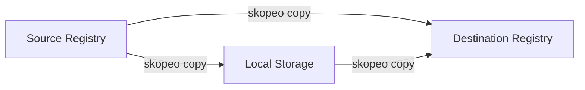

# How to Copy and Inspect Container Images with Skopeo on RHEL

Author: [nawazdhandala](https://www.github.com/nawazdhandala)

Tags: RHEL, Skopeo, Container Images, Linux

Description: Learn how to use Skopeo on RHEL to inspect, copy, and manage container images across registries without requiring a local container runtime.

---

Skopeo is the third tool in Red Hat's container toolkit alongside Podman and Buildah. While Podman runs containers and Buildah builds images, Skopeo handles image operations - inspecting, copying, and managing images across registries. The best part is it does not need a daemon or even a local image store to work.

I use Skopeo constantly for CI/CD pipelines where I need to move images between registries or check image details before deploying.

## Installing Skopeo

Skopeo comes with the container-tools module:

# Install skopeo (or install container-tools for the full suite)
```bash
sudo dnf install -y skopeo
```

# Verify installation
```bash
skopeo --version
```

## Inspecting Remote Images

You can inspect an image on a remote registry without pulling it locally:

# Inspect an image on Docker Hub
```bash
skopeo inspect docker://docker.io/library/nginx:latest
```

# Inspect a Red Hat UBI image
```bash
skopeo inspect docker://registry.access.redhat.com/ubi9/ubi-minimal:latest
```

This returns JSON with the image's labels, architecture, OS, layers, and environment variables.

# Get just specific fields using jq
```bash
skopeo inspect docker://docker.io/library/nginx:latest | jq '.Digest'
skopeo inspect docker://docker.io/library/nginx:latest | jq '.Layers | length'
```

## Inspecting Raw Image Manifests

For deeper inspection, get the raw manifest:

# Get the image manifest (OCI format)
```bash
skopeo inspect --raw docker://docker.io/library/nginx:latest | jq .
```

# Get the configuration blob
```bash
skopeo inspect --config docker://docker.io/library/nginx:latest | jq .
```

This is useful for debugging multi-architecture images or checking the exact layer digests.

## Copying Images Between Registries

This is Skopeo's most powerful feature. Copy images directly between registries without pulling them locally:



# Copy an image from Docker Hub to a private registry
```bash
skopeo copy docker://docker.io/library/nginx:latest docker://registry.example.com/myteam/nginx:latest
```

# Copy from one private registry to another
```bash
skopeo copy docker://registry1.example.com/app:v1 docker://registry2.example.com/app:v1
```

## Copying Images to and from Local Storage

Skopeo supports several transport types for local operations:

# Copy a remote image to a local directory (OCI format)
```bash
skopeo copy docker://docker.io/library/nginx:latest oci:/tmp/nginx-oci:latest
```

# Copy a remote image to a local directory (Docker format)
```bash
skopeo copy docker://docker.io/library/nginx:latest dir:/tmp/nginx-dir
```

# Copy to a Docker archive (tar file)
```bash
skopeo copy docker://docker.io/library/nginx:latest docker-archive:/tmp/nginx.tar:nginx:latest
```

# Load the archive into Podman
```bash
podman load < /tmp/nginx.tar
```

# Copy from local Podman storage to a registry
```bash
skopeo copy containers-storage:localhost/my-app:latest docker://registry.example.com/my-app:latest
```

## Listing Image Tags

Check what tags are available for an image:

# List all tags for an image on a registry
```bash
skopeo list-tags docker://docker.io/library/nginx
```

# List tags for a Red Hat image
```bash
skopeo list-tags docker://registry.access.redhat.com/ubi9/ubi-minimal
```

## Authenticating with Registries

Skopeo uses the same credential store as Podman:

# Log in to a registry (credentials shared with Podman)
```bash
skopeo login registry.example.com
```

# Log in with credentials on the command line
```bash
skopeo login --username myuser --password mypass registry.example.com
```

# Use a specific auth file
```bash
skopeo copy --authfile /path/to/auth.json docker://source/image:tag docker://dest/image:tag
```

# Log out from a registry
```bash
skopeo logout registry.example.com
```

## Copying Multi-Architecture Images

When copying multi-arch images, preserve all architectures:

# Copy all architectures of an image
```bash
skopeo copy --all docker://docker.io/library/nginx:latest docker://registry.example.com/nginx:latest
```

Without `--all`, Skopeo only copies the architecture matching your current system.

## Syncing Repositories

Mirror entire repositories between registries:

# Sync all tags of an image to a local directory
```bash
skopeo sync --src docker --dest dir docker.io/library/nginx /tmp/nginx-mirror
```

# Sync from a local directory to a registry
```bash
skopeo sync --src dir --dest docker /tmp/nginx-mirror registry.example.com/mirror/
```

# Sync specific tags using a YAML config
```bash
cat > sync-config.yaml << 'EOF'
docker.io:
  images:
    nginx:
      - "1.24"
      - "1.25"
      - "latest"
    redis:
      - "7.0"
      - "latest"
EOF

skopeo sync --src yaml --dest docker sync-config.yaml registry.example.com/mirror/
```

## Deleting Images from Registries

Remove images from a registry (if the registry supports the deletion API):

# Delete a specific tag from a registry
```bash
skopeo delete docker://registry.example.com/my-app:old-tag
```

Note that most public registries disable the deletion API. This works mainly with self-hosted registries.

## Using Skopeo in CI/CD Pipelines

Skopeo is perfect for CI/CD because it does not need a daemon:

```bash
#!/bin/bash
# Example: Promote an image from staging to production registry

SOURCE="registry.staging.example.com/my-app:${BUILD_TAG}"
DEST="registry.prod.example.com/my-app:${BUILD_TAG}"

# Verify the source image exists and is valid
skopeo inspect docker://${SOURCE} > /dev/null 2>&1
if [ $? -ne 0 ]; then
    echo "Source image not found: ${SOURCE}"
    exit 1
fi

# Copy the image to production
skopeo copy --all docker://${SOURCE} docker://${DEST}

echo "Image promoted to production: ${DEST}"
```

## Comparing Images

Use Skopeo to compare image digests across registries:

# Get the digest of an image on two registries
```bash
DIGEST_A=$(skopeo inspect docker://registry1.example.com/app:v1 | jq -r '.Digest')
DIGEST_B=$(skopeo inspect docker://registry2.example.com/app:v1 | jq -r '.Digest')

if [ "$DIGEST_A" = "$DIGEST_B" ]; then
    echo "Images are identical"
else
    echo "Images differ"
fi
```

## Transport Reference

| Transport | Example | Description |
|-----------|---------|-------------|
| docker:// | docker://registry.example.com/img:tag | Remote registry |
| containers-storage: | containers-storage:localhost/img:tag | Local Podman/Buildah storage |
| dir: | dir:/tmp/myimage | Local directory |
| docker-archive: | docker-archive:/tmp/img.tar | Docker-format tar archive |
| oci: | oci:/tmp/myimage:tag | OCI-format directory |

## Summary

Skopeo fills a gap that neither Podman nor Docker addresses well - operating on images without needing to pull them into local storage. For registry mirroring, CI/CD image promotion, and remote image inspection, Skopeo is the right tool. Combined with Podman and Buildah, you have a complete, daemonless container workflow on RHEL.
