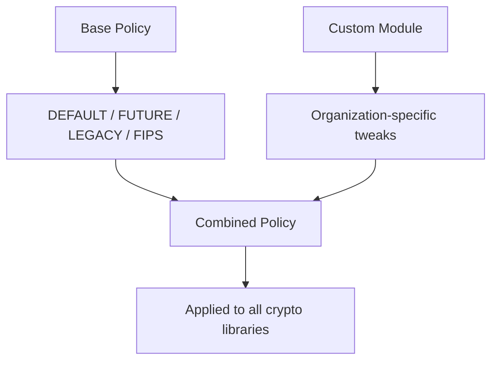

# How to Create Custom Crypto Policy Modules on RHEL 9

Author: [nawazdhandala](https://www.github.com/nawazdhandala)

Tags: RHEL, Crypto Policies, Custom Modules, TLS, Security, Linux

Description: Create custom crypto policy modules on RHEL 9 to define organization-specific cryptographic requirements that go beyond the built-in policy levels.

---

While RHEL 9 provides four built-in crypto policies (DEFAULT, LEGACY, FUTURE, FIPS), your organization may have specific cryptographic requirements that do not exactly match any of these. Custom crypto policy modules let you define your own restrictions and apply them on top of any base policy. This guide shows you how to create and deploy them.

## Understanding Policy Modules



A custom module modifies a base policy by enabling or disabling specific algorithms, setting minimum key sizes, or restricting protocol versions.

## Policy Module Location

Custom policy modules are stored in:

```bash
# System-provided modules
ls /usr/share/crypto-policies/policies/modules/

# Custom modules (create this directory if needed)
ls /etc/crypto-policies/policies/modules/
```

## Policy Module Syntax

A policy module file uses directives to modify the base policy:

```bash
# Disable specific algorithms
cipher = -CAMELLIA-256-GCM -CAMELLIA-128-GCM

# Set minimum key sizes
min_rsa_size = 3072
min_dh_size = 3072

# Disable specific TLS versions
protocol = -TLS1.0 -TLS1.1 -SSL3.0

# Disable specific hash algorithms
hash = -SHA1

# Disable specific MACs
mac = -HMAC-SHA1

# Disable specific key exchange methods
key_exchange = -DHE-RSA -DHE-DSS

# Disable specific signature algorithms
sign = -RSA-PSS-SHA1 -RSA-SHA1
```

The `-` prefix means "remove this algorithm from the allowed list."

## Example 1: Disable SHA-1 Everywhere

```bash
# Create the custom module
sudo mkdir -p /etc/crypto-policies/policies/modules/

sudo tee /etc/crypto-policies/policies/modules/NO-SHA1.pmod << 'EOF'
# Disable SHA-1 in all contexts
hash = -SHA1
sign = -RSA-SHA1 -ECDSA-SHA1
mac = -HMAC-SHA1
EOF

# Apply with a base policy
sudo update-crypto-policies --set DEFAULT:NO-SHA1
```

## Example 2: TLS 1.3 Only

```bash
sudo tee /etc/crypto-policies/policies/modules/TLS13-ONLY.pmod << 'EOF'
# Only allow TLS 1.3
protocol = -TLS1.0 -TLS1.1 -TLS1.2 -DTLS1.0 -DTLS1.2

# Only AES-256 and ChaCha20
cipher = -AES-128-GCM -AES-128-CCM -AES-128-CBC -AES-128-CTR
EOF

# Apply
sudo update-crypto-policies --set DEFAULT:TLS13-ONLY
```

## Example 3: Strong Enterprise Policy

```bash
sudo tee /etc/crypto-policies/policies/modules/ENTERPRISE.pmod << 'EOF'
# Enterprise crypto policy module
# Enforces strong cryptographic standards

# Minimum key sizes
min_rsa_size = 3072
min_dh_size = 3072

# Disable weak hashes
hash = -SHA1 -MD5

# Disable weak signatures
sign = -RSA-SHA1 -ECDSA-SHA1 -RSA-PSS-SHA1

# Disable weak MACs
mac = -HMAC-SHA1 -HMAC-MD5 -UMAC-64

# Only TLS 1.2 and 1.3
protocol = -TLS1.0 -TLS1.1 -SSL3.0 -DTLS1.0

# Disable CBC mode ciphers (prefer GCM and ChaCha20)
cipher = -AES-128-CBC -AES-256-CBC -CAMELLIA-128-CBC -CAMELLIA-256-CBC

# Disable weak key exchange
key_exchange = -DHE-DSS
EOF

# Apply
sudo update-crypto-policies --set DEFAULT:ENTERPRISE
```

## Example 4: SSH-Specific Restrictions

```bash
sudo tee /etc/crypto-policies/policies/modules/SSH-HARDENED.pmod << 'EOF'
# Hardened SSH configuration
# Only affects SSH algorithms

# Restrict SSH ciphers to AES-256 GCM and ChaCha20
cipher@SSH = -AES-128-GCM -AES-128-CTR -AES-128-CBC -AES-256-CBC -AES-256-CTR

# Restrict SSH MACs
mac@SSH = -HMAC-SHA1 -UMAC-64 -UMAC-128 -HMAC-SHA2-256

# Only allow Ed25519 and ECDSA for SSH keys
key@SSH = -RSA
EOF

# Apply
sudo update-crypto-policies --set DEFAULT:SSH-HARDENED
```

The `@SSH` suffix limits the directive to only the SSH back-end.

## Creating a Complete Custom Policy

Instead of a module that modifies a base policy, you can create an entirely new policy:

```bash
sudo tee /etc/crypto-policies/policies/MYORG.pol << 'EOF'
# Custom organization policy
# This is a standalone policy, not a module

# Protocol versions
protocol = TLS1.2+ DTLS1.2+

# Ciphers
cipher = AES-256-GCM AES-256-CCM CHACHA20-POLY1305 AES-128-GCM

# Key exchange
key_exchange = ECDHE DHE

# Signature algorithms
sign = ECDSA-SHA2-256 ECDSA-SHA2-384 ECDSA-SHA2-512 RSA-PSS-SHA2-256 RSA-PSS-SHA2-384 RSA-PSS-SHA2-512 RSA-SHA2-256 RSA-SHA2-384 RSA-SHA2-512

# Hash algorithms
hash = SHA2-256 SHA2-384 SHA2-512

# MAC algorithms
mac = HMAC-SHA2-256 HMAC-SHA2-384 HMAC-SHA2-512 AEAD

# Minimum key sizes
min_rsa_size = 3072
min_dh_size = 3072
min_dsa_size = 3072
min_ec_size = 256

# Elliptic curves
group = SECP384R1 SECP521R1 X25519 X448 FFDHE-3072 FFDHE-4096
EOF

# Apply the custom policy
sudo update-crypto-policies --set MYORG
```

## Validating Custom Policies

```bash
# Check the policy for errors
sudo update-crypto-policies --check

# Test with a dry run
sudo update-crypto-policies --set DEFAULT:ENTERPRISE --show

# After applying, verify the back-end configurations
cat /etc/crypto-policies/back-ends/opensslcnf.config
cat /etc/crypto-policies/back-ends/openssh.config
```

## Testing the Effects

```bash
# Test SSH ciphers
ssh -Q cipher

# Test TLS with OpenSSL
openssl ciphers -v | column -t

# Test a connection
openssl s_client -connect example.com:443 < /dev/null 2>/dev/null | \
    grep -E "Protocol|Cipher"

# Verify SSH server configuration
sudo sshd -T | grep -E "ciphers|macs|kexalgorithms"
```

## Reverting to Default

```bash
# Switch back to the default policy
sudo update-crypto-policies --set DEFAULT

# Restart services
sudo systemctl restart sshd
```

## Distributing Custom Policies

For deployment across multiple systems:

```bash
# Package your policy module
sudo cp /etc/crypto-policies/policies/modules/ENTERPRISE.pmod /tmp/

# Copy to other systems
scp /tmp/ENTERPRISE.pmod root@target:/etc/crypto-policies/policies/modules/

# Apply on the target
ssh root@target "update-crypto-policies --set DEFAULT:ENTERPRISE"
```

Or include it in your configuration management (Ansible, Puppet, etc.).

## Summary

Custom crypto policy modules on RHEL 9 let you define organization-specific cryptographic requirements. Create a `.pmod` file in `/etc/crypto-policies/policies/modules/` with directives to enable or disable specific algorithms, then apply it with `update-crypto-policies --set BASE:MODULE`. You can also create complete standalone policies for full control. Always validate and test your custom policies before deploying them to production.
