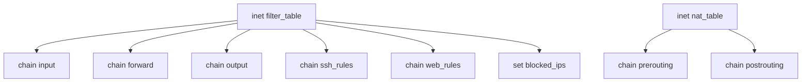
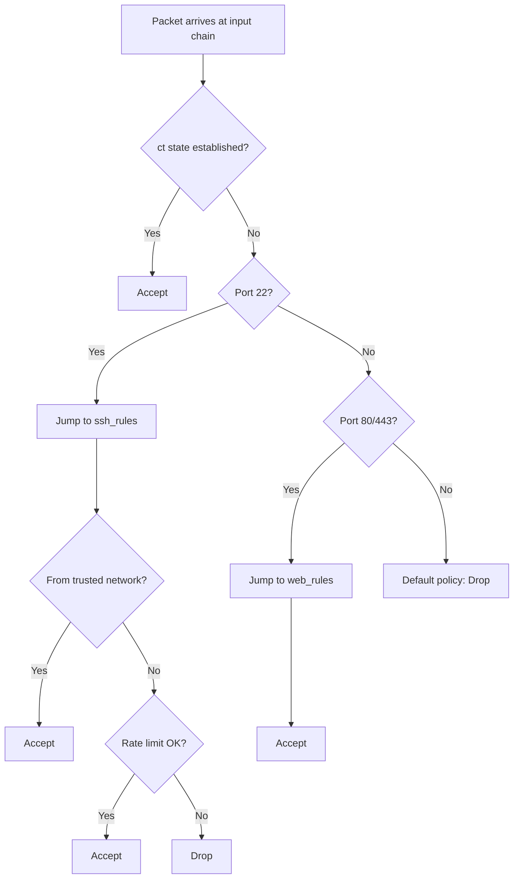

# How to Create Custom nftables Tables and Chains on RHEL

Author: [nawazdhandala](https://www.github.com/nawazdhandala)

Tags: RHEL, Nftables, Tables, Chains, Linux

Description: A guide to creating and organizing custom nftables tables and chains on RHEL for clean, maintainable firewall configurations.

---

The default nftables setup on RHEL gives you a basic structure, but real-world firewall configurations need more organization. Custom tables and chains let you separate concerns, reuse logic, and keep your ruleset manageable as it grows. This post covers how to build a well-structured nftables configuration from scratch.

## Tables: The Top-Level Containers

Tables are the top-level organizational unit in nftables. Each table belongs to a specific address family and contains chains, sets, and maps.



Create a table:

```bash
nft add table inet my_filter
```

List existing tables:

```bash
nft list tables
```

Delete a table and everything in it:

```bash
nft delete table inet my_filter
```

## Address Families

When creating a table, you choose an address family:

| Family | Description |
|--------|-------------|
| `ip` | IPv4 only |
| `ip6` | IPv6 only |
| `inet` | Both IPv4 and IPv6 |
| `arp` | ARP protocol |
| `bridge` | Bridge-level filtering |
| `netdev` | Ingress/egress on a device |

For most server configurations, `inet` is what you want. It handles both IPv4 and IPv6 in one table.

## Base Chains vs Regular Chains

There are two types of chains, and understanding the difference is critical.

**Base chains** attach to a netfilter hook. They're the entry points for packet processing:

```bash
nft add chain inet my_filter input { type filter hook input priority 0 \; policy drop \; }
```

**Regular chains** don't attach to any hook. They only execute when another chain jumps to them:

```bash
nft add chain inet my_filter ssh_rules
```

Regular chains are how you organize complex rulesets. You can jump to them from base chains.

## Chain Types and Hooks

Base chains need three properties: type, hook, and priority.

Types:
- `filter` - for filtering packets
- `nat` - for network address translation
- `route` - for rerouting packets

Hooks for the inet/ip/ip6 families:
- `prerouting` - before routing decision
- `input` - for locally destined traffic
- `forward` - for forwarded traffic
- `output` - for locally generated traffic
- `postrouting` - after routing decision

Priority determines the order chains execute. Lower numbers run first.

## Building a Structured Firewall

Here's how I typically organize a production firewall with multiple chains:

```bash
cat > /etc/nftables/structured.nft << 'EOF'
flush ruleset

table inet server_firewall {
    # -- Sets --
    set trusted_networks {
        type ipv4_addr
        flags interval
        elements = { 10.0.0.0/8, 192.168.0.0/16 }
    }

    set blocked_countries {
        type ipv4_addr
        flags interval
    }

    # -- Regular chains for organization --

    # SSH access rules
    chain ssh_rules {
        # Only allow SSH from trusted networks
        ip saddr @trusted_networks accept

        # Rate limit SSH from everywhere else
        ct state new limit rate 3/minute accept

        drop
    }

    # Web server rules
    chain web_rules {
        # Allow HTTP and HTTPS from anywhere
        tcp dport { 80, 443 } accept
    }

    # Database rules
    chain db_rules {
        # Only from trusted networks
        ip saddr @trusted_networks tcp dport { 3306, 5432, 6379 } accept
        drop
    }

    # ICMP handling
    chain icmp_rules {
        ip protocol icmp icmp type { echo-request, echo-reply, destination-unreachable, time-exceeded } accept
        ip6 nexthdr icmpv6 icmpv6 type { echo-request, echo-reply, nd-neighbor-solicit, nd-neighbor-advert, nd-router-solicit, nd-router-advert } accept
    }

    # -- Base chains --

    chain input {
        type filter hook input priority 0; policy drop;

        # Connection tracking
        ct state established,related accept
        ct state invalid drop

        # Loopback
        iifname "lo" accept

        # Jump to organized sub-chains
        jump icmp_rules
        tcp dport 22 jump ssh_rules
        tcp dport { 80, 443 } jump web_rules
        tcp dport { 3306, 5432, 6379 } jump db_rules

        # Block known bad sources
        ip saddr @blocked_countries drop

        # Log everything else before dropping
        limit rate 5/minute log prefix "input-drop: "
    }

    chain forward {
        type filter hook forward priority 0; policy drop;
    }

    chain output {
        type filter hook output priority 0; policy accept;
    }
}
EOF
```

Apply the configuration:

```bash
nft -f /etc/nftables/structured.nft
```

## Understanding Chain Traversal

When a packet hits a `jump` statement, processing moves to the target chain. If the target chain doesn't reach a terminal verdict (accept or drop), processing returns to the calling chain at the next rule after the jump.



The `goto` statement works like `jump`, but processing does NOT return to the calling chain if the target chain doesn't match. The packet just falls through to the base chain's default policy.

## Managing Chain Priorities

When you have multiple base chains on the same hook, priority determines which runs first:

```bash
# This runs first (priority -10)
nft add chain inet my_filter early_input { type filter hook input priority -10 \; policy accept \; }

# This runs second (priority 0)
nft add chain inet my_filter main_input { type filter hook input priority 0 \; policy drop \; }

# This runs last (priority 10)
nft add chain inet my_filter late_input { type filter hook input priority 10 \; policy accept \; }
```

This is useful when you want to separate concerns across different tables. For example, a monitoring table can log all traffic at a low priority while your main table handles filtering.

## Listing and Inspecting

List all chains in a table:

```bash
nft list chains inet server_firewall
```

List a specific chain with rules:

```bash
nft list chain inet server_firewall input
```

List everything with rule handles for management:

```bash
nft -a list table inet server_firewall
```

## Deleting and Flushing

Flush all rules from a chain (keeps the chain):

```bash
nft flush chain inet server_firewall input
```

Delete an empty chain:

```bash
nft delete chain inet server_firewall ssh_rules
```

Delete an entire table:

```bash
nft delete table inet server_firewall
```

Clean, well-organized tables and chains make your firewall easier to audit, debug, and extend. Invest the time upfront in a good structure and it pays off every time you need to make changes.
