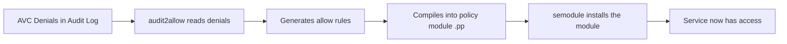

# How to Create Custom SELinux Policy Modules Using audit2allow on RHEL

Author: [nawazdhandala](https://www.github.com/nawazdhandala)

Tags: RHEL, SELinux, Audit2allow, Custom Policy, Linux

Description: Generate and install custom SELinux policy modules using audit2allow on RHEL when booleans and file contexts are not enough.

---

## When You Need audit2allow

Most SELinux issues are fixed with booleans, file contexts, or port labels. But sometimes a service needs access that the default policy does not cover and no boolean exists for it. That is when you use `audit2allow` to generate a custom policy module based on the actual denials in your audit log.

Think of it as the last resort in the SELinux troubleshooting toolkit. Booleans and contexts first, custom modules when nothing else works.

## Prerequisites

```bash
# Install the tools
sudo dnf install -y policycoreutils-python-utils setools-console
```

## How audit2allow Works



## Step-by-Step Process

### Step 1: Reproduce the Denial

First, make sure the denial is in the audit log. Trigger the action that fails:

```bash
# Example: restart a service that is being denied
sudo systemctl restart myapp
```

### Step 2: Find the Denials

```bash
# View recent denials
sudo ausearch -m avc -ts recent

# Filter for your specific service
sudo ausearch -m avc -c myapp -ts recent
```

### Step 3: Generate the Policy Module

```bash
# Generate a human-readable policy from recent denials
sudo ausearch -m avc -ts recent | audit2allow -m myapp_custom
```

This outputs the policy in Type Enforcement (TE) format:

```bash
module myapp_custom 1.0;

require {
    type myapp_t;
    type var_log_t;
    class file { open read write };
}

#============= myapp_t ==============
allow myapp_t var_log_t:file { open read write };
```

Review this carefully before applying it. Make sure you are not granting more access than needed.

### Step 4: Compile the Policy Module

```bash
# Generate and compile the module in one step
sudo ausearch -m avc -ts recent | audit2allow -M myapp_custom
```

This creates two files:
- `myapp_custom.te` - The Type Enforcement source
- `myapp_custom.pp` - The compiled policy package

### Step 5: Install the Policy Module

```bash
# Install the compiled module
sudo semodule -i myapp_custom.pp
```

### Step 6: Verify

```bash
# Check that the module is loaded
sudo semodule -l | grep myapp_custom

# Test the service
sudo systemctl restart myapp
```

## Best Practices

### Review Before Installing

Never blindly pipe audit2allow output into semodule. Always review what you are allowing:

```bash
# Generate the TE file first
sudo ausearch -m avc -c myapp -ts recent | audit2allow -m myapp_custom > myapp_custom.te

# Read and review it
cat myapp_custom.te

# If it looks reasonable, compile it
checkmodule -M -m -o myapp_custom.mod myapp_custom.te
semodule_package -o myapp_custom.pp -m myapp_custom.mod

# Install it
sudo semodule -i myapp_custom.pp
```

### Be Specific with Time Filters

```bash
# Only use denials from the last 5 minutes (after you triggered the issue)
sudo ausearch -m avc -ts "5 minutes ago" | audit2allow -M myapp_custom
```

This avoids including unrelated denials in your custom module.

### Use Permissive Mode for Complete Coverage

If a service has multiple denials, SELinux stops at the first one. Put the service domain in permissive mode to collect all denials at once:

```bash
# Set the service to permissive mode
sudo semanage permissive -a myapp_t

# Exercise all the service functionality
sudo systemctl restart myapp
# ... run through all the features ...

# Collect all denials
sudo ausearch -m avc -c myapp -ts recent | audit2allow -M myapp_custom

# Install the module
sudo semodule -i myapp_custom.pp

# Remove permissive mode
sudo semanage permissive -d myapp_t

# Test in enforcing mode
sudo systemctl restart myapp
```

## Iterative Approach

Sometimes you need multiple rounds:

```bash
# Round 1: Fix initial denials
sudo ausearch -m avc -c myapp -ts recent | audit2allow -M myapp_round1
sudo semodule -i myapp_round1.pp

# Test again - there might be more denials
sudo systemctl restart myapp

# Round 2: Fix additional denials
sudo ausearch -m avc -c myapp -ts recent | audit2allow -M myapp_round2
sudo semodule -i myapp_round2.pp
```

Or better, use permissive mode to catch everything in one pass.

## Managing Custom Modules

### List Installed Modules

```bash
# List all loaded modules
sudo semodule -l

# Find custom modules
sudo semodule -l | grep -v "^[a-z]"
```

### Remove a Custom Module

```bash
# Remove a custom module
sudo semodule -r myapp_custom
```

### Disable a Module Temporarily

```bash
# Disable without removing
sudo semodule -d myapp_custom

# Re-enable
sudo semodule -e myapp_custom
```

## Understanding the Generated Rules

A generated rule like:

```bash
allow httpd_t user_home_t:file { read open getattr };
```

Means: Allow processes running as `httpd_t` (Apache) to read, open, and get attributes of files labeled `user_home_t` (user home directory files).

Before accepting this, ask yourself: Is there a better way? Maybe the files should be relabeled to `httpd_sys_content_t` instead of granting Apache access to `user_home_t`.

## Common Pitfalls

### Do Not Use audit2allow for dontaudit Rules

Some denials are silently ignored by `dontaudit` rules in the base policy. If you are seeing unexpected behavior without AVC denials, disable dontaudit rules temporarily:

```bash
# Disable dontaudit rules to see hidden denials
sudo semodule -DB

# Reproduce the issue and check for denials
sudo ausearch -m avc -ts recent

# Re-enable dontaudit rules
sudo semodule -B
```

### Avoid Overly Broad Rules

If audit2allow generates a rule like `allow myapp_t file_type:file *;`, that is too broad. It grants your service access to ALL file types. Investigate further and create more specific rules.

### Version Your Modules

Keep your `.te` files in version control. When you need to update a policy, increment the version number in the module declaration:

```bash
module myapp_custom 1.1;
```

## Wrapping Up

`audit2allow` is a powerful tool but use it judiciously. Always try booleans and file context fixes first. When you do need a custom module, review the generated rules, be specific with your audit log filters, and keep the modules in version control. A well-crafted custom module is fine - the risk comes from blindly accepting whatever audit2allow generates without understanding what access you are granting.
