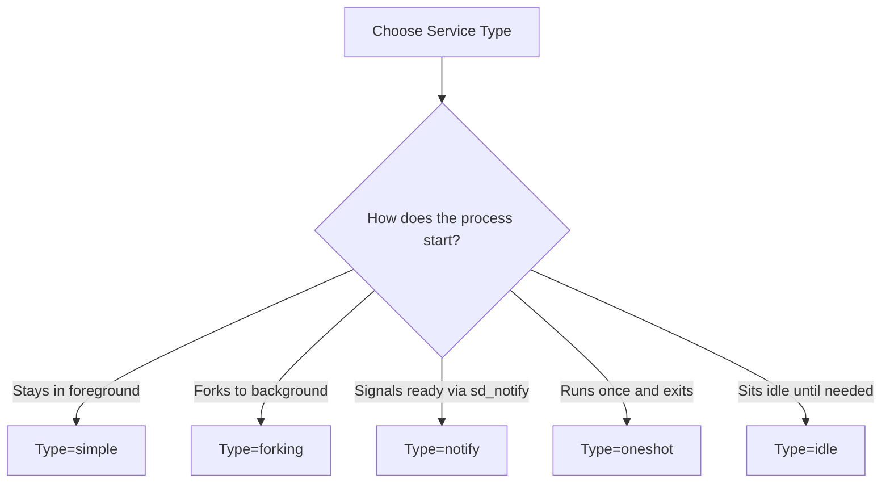

# How to Create a Custom systemd Service Unit File on RHEL 9

Author: [nawazdhandala](https://www.github.com/nawazdhandala)

Tags: RHEL, systemd, Unit Files, Custom Service, Linux

Description: Step-by-step guide to writing custom systemd service unit files on RHEL 9, covering all the essential sections, directives, and best practices.

---

Every sysadmin eventually needs to run something that did not come from a package. Maybe it is a Go binary your dev team built, a Python script that needs to run as a daemon, or a Java application that needs proper process management. On RHEL 9, the right way to do this is with a custom systemd unit file.

I have written dozens of these over the years, and the process is straightforward once you understand the structure. This guide walks you through creating a unit file from scratch, explains every important directive, and covers the gotchas that waste people's time.

---

## Where Unit Files Live

Before writing anything, you need to know where to put it:

- `/usr/lib/systemd/system/` - Package-installed unit files. Do not put your custom files here because package updates can overwrite them.
- `/etc/systemd/system/` - This is where your custom unit files go. Files here override anything in `/usr/lib/systemd/system/` with the same name.
- `/run/systemd/system/` - Runtime unit files, created dynamically. These do not survive a reboot.

Always put your custom services in `/etc/systemd/system/`.

---

## Anatomy of a Unit File

A unit file has three main sections: `[Unit]`, `[Service]`, and `[Install]`. Let's build one for a hypothetical Go web application:

```ini
# /etc/systemd/system/mywebapp.service
# Custom service for the internal web application

[Unit]
Description=My Internal Web Application
Documentation=https://wiki.internal.example.com/mywebapp
After=network-online.target postgresql.service
Wants=network-online.target
Requires=postgresql.service

[Service]
Type=simple
User=webapp
Group=webapp
WorkingDirectory=/opt/mywebapp
ExecStart=/opt/mywebapp/bin/mywebapp --config /etc/mywebapp/config.yaml
ExecReload=/bin/kill -HUP $MAINPID
Restart=on-failure
RestartSec=5
StandardOutput=journal
StandardError=journal
SyslogIdentifier=mywebapp

# Security hardening
NoNewPrivileges=true
ProtectSystem=strict
ProtectHome=true
ReadWritePaths=/var/lib/mywebapp

# Resource limits
LimitNOFILE=65536
MemoryMax=512M

# Environment
Environment=GIN_MODE=release
EnvironmentFile=-/etc/mywebapp/env

[Install]
WantedBy=multi-user.target
```

Let's break down each section.

---

## The [Unit] Section

This section describes the service and its relationships with other units.

```ini
[Unit]
# Human-readable description shown in systemctl status
Description=My Internal Web Application

# Link to documentation
Documentation=https://wiki.internal.example.com/mywebapp

# Start this service after these units are started
After=network-online.target postgresql.service

# Soft dependency - try to start these, but do not fail if they are unavailable
Wants=network-online.target

# Hard dependency - if postgresql fails, this service fails too
Requires=postgresql.service
```

**After vs. Requires** - This confuses a lot of people. `After` controls ordering (when to start). `Requires` controls dependency (whether to start). You usually want both together. If you say `Requires=postgresql.service` without `After=postgresql.service`, systemd might try to start both at the same time, which is probably not what you want.

---

## The [Service] Section

This is where the real configuration lives.

### Service Types

The `Type` directive tells systemd how the service behaves:



- **simple** - The most common type. The process started by `ExecStart` IS the main process. It stays in the foreground.
- **forking** - The process forks and the parent exits. systemd tracks the child. You usually need to set `PIDFile` with this type.
- **notify** - Like simple, but the process sends a notification to systemd when it is ready. This gives more accurate status tracking.
- **oneshot** - The process runs, does its job, and exits. Good for initialization scripts.

For most modern applications, use `simple`. If the application uses systemd's notification protocol (like some versions of PostgreSQL and nginx), use `notify`.

### ExecStart and Related Directives

```ini
# The command that starts the service
ExecStart=/opt/mywebapp/bin/mywebapp --config /etc/mywebapp/config.yaml

# Command to reload configuration (optional)
ExecReload=/bin/kill -HUP $MAINPID

# Commands to run before starting (optional)
ExecStartPre=/opt/mywebapp/bin/check-config --config /etc/mywebapp/config.yaml

# Commands to run after stopping (optional)
ExecStopPost=/opt/mywebapp/bin/cleanup.sh
```

Important rules for `ExecStart`:
- You must use absolute paths. No relative paths allowed.
- For `Type=simple` and `Type=notify`, you can only have one `ExecStart` line.
- For `Type=oneshot`, you can have multiple `ExecStart` lines and they run in order.

### Restart Policies

```ini
# When to restart the service
Restart=on-failure

# How long to wait between restarts
RestartSec=5
```

The restart options are:

| Value | Restarts On |
|-------|------------|
| `no` | Never restarts (default) |
| `on-success` | Clean exit only (exit code 0) |
| `on-failure` | Non-zero exit, signal, timeout, watchdog |
| `on-abnormal` | Signal, timeout, watchdog |
| `always` | Always restarts, no matter what |

For production services, `on-failure` is usually the right choice. Use `always` for critical services that must never stay down.

### User and Security

```ini
# Run as a non-root user
User=webapp
Group=webapp

# Prevent the service from gaining new privileges
NoNewPrivileges=true

# Make the filesystem read-only except for specific paths
ProtectSystem=strict
ReadWritePaths=/var/lib/mywebapp /var/log/mywebapp

# Prevent access to /home
ProtectHome=true
```

Always run services as a non-root user when possible. The security directives like `ProtectSystem` and `NoNewPrivileges` add defense in depth with minimal effort.

### Environment Variables

There are two ways to set environment variables:

```ini
# Set individual variables directly
Environment=GIN_MODE=release
Environment=DB_HOST=localhost

# Load variables from a file (the dash means do not fail if the file is missing)
EnvironmentFile=-/etc/mywebapp/env
```

The environment file format is simple:

```bash
# /etc/mywebapp/env
DB_HOST=db.example.com
DB_PORT=5432
DB_NAME=mywebapp
```

---

## The [Install] Section

This section controls what happens when you run `systemctl enable`:

```ini
[Install]
# Create a symlink in multi-user.target.wants
WantedBy=multi-user.target
```

`multi-user.target` is the standard target for a system that is fully booted with networking. For services that only make sense in a graphical environment, use `graphical.target`.

---

## Deploying and Activating the Service

Once your unit file is written, here is the deployment workflow:

```bash
# Create the service user
sudo useradd --system --shell /sbin/nologin --home-dir /opt/mywebapp webapp

# Create required directories
sudo mkdir -p /opt/mywebapp/bin /etc/mywebapp /var/lib/mywebapp

# Copy your unit file into place
sudo cp mywebapp.service /etc/systemd/system/

# Set proper permissions on the unit file
sudo chmod 644 /etc/systemd/system/mywebapp.service

# Tell systemd to re-read unit files
sudo systemctl daemon-reload

# Enable and start the service
sudo systemctl enable --now mywebapp

# Verify it is running
sudo systemctl status mywebapp
```

The `daemon-reload` step is critical. If you forget it, systemd will use the old version of the unit file (or not see it at all).

---

## Overriding Existing Unit Files

Sometimes you need to tweak a unit file that came from a package. Do not edit the file in `/usr/lib/systemd/system/` directly because a package update will overwrite your changes. Instead, use a drop-in override:

```bash
# Create an override for httpd
sudo systemctl edit httpd
```

This opens an editor and creates a file at `/etc/systemd/system/httpd.service.d/override.conf`. You only need to include the directives you want to change:

```ini
# Override to increase the file descriptor limit for httpd
[Service]
LimitNOFILE=65536
```

After saving, the override is applied automatically on the next `daemon-reload` or service restart.

To see the effective configuration including overrides:

```bash
# Show the full unit file with all overrides applied
systemctl cat httpd
```

---

## Wrapping Up

Writing a systemd unit file is not complicated, but getting the details right matters. Use `Type=simple` for most modern apps, always run as a non-root user, set a sensible restart policy, and use the security hardening directives. Once you have a solid template, creating new services takes five minutes. Keep your unit files in version control alongside your application code, and you will never have to guess how a service is configured.
