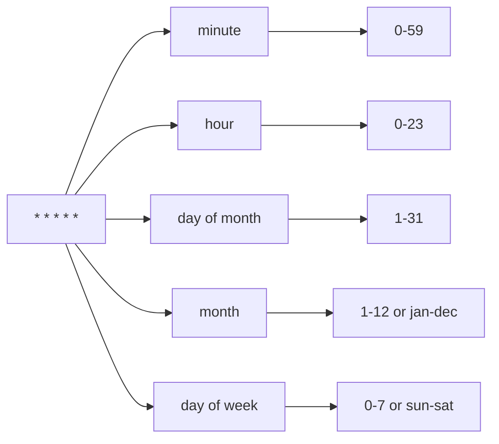

# How to Create and Edit Cron Jobs with crontab on RHEL 9

Author: [nawazdhandala](https://www.github.com/nawazdhandala)

Tags: RHEL, cron, crontab, Scheduling, Linux, Automation

Description: A hands-on guide to creating, editing, and managing cron jobs on RHEL 9, covering crontab syntax, special scheduling strings, user vs root crontabs, and common pitfalls.

---

## What cron Does

cron is the standard job scheduler on Linux. It runs commands at specified times, dates, or intervals. On RHEL 9, the crond daemon handles this, and you interact with it through the `crontab` command. If you need to run a backup every night, rotate logs every week, or check disk space every hour, cron is the tool.

## Making Sure crond is Running

Before setting up jobs, confirm the cron daemon is active:

```bash
# Check if crond is running
systemctl status crond
```

If it is not running:

```bash
# Start and enable crond
sudo systemctl enable --now crond
```

## Working with crontab

### Viewing Your Crontab

```bash
# List your current cron jobs
crontab -l
```

If you have no jobs, you will see "no crontab for username."

### Editing Your Crontab

```bash
# Open the crontab editor
crontab -e
```

This opens your crontab in the editor specified by the `EDITOR` or `VISUAL` environment variable (usually vi). When you save and exit, cron validates the syntax and installs the new crontab.

### Removing Your Crontab

```bash
# Remove all your cron jobs (be careful)
crontab -r
```

This deletes your entire crontab without confirmation. There is no undo. I always run `crontab -l` first and save the output somewhere before doing this.

### Editing Another User's Crontab

As root, you can manage any user's crontab:

```bash
# Edit another user's crontab
sudo crontab -u jsmith -e

# List another user's crontab
sudo crontab -u jsmith -l
```

## Cron Syntax

Each line in a crontab has six fields:

```
# ┌───────────── minute (0-59)
# │ ┌───────────── hour (0-23)
# │ │ ┌───────────── day of month (1-31)
# │ │ │ ┌───────────── month (1-12)
# │ │ │ │ ┌───────────── day of week (0-7, 0 and 7 are Sunday)
# │ │ │ │ │
# * * * * * command to execute
```



### Examples

```bash
# Run at 2:30 AM every day
30 2 * * * /usr/local/bin/backup.sh

# Run every 15 minutes
*/15 * * * * /usr/local/bin/check-disk.sh

# Run at 9 AM on weekdays (Monday through Friday)
0 9 * * 1-5 /usr/local/bin/morning-report.sh

# Run on the 1st and 15th of every month at midnight
0 0 1,15 * * /usr/local/bin/semi-monthly-task.sh

# Run every hour from 8 AM to 6 PM
0 8-18 * * * /usr/local/bin/hourly-check.sh

# Run at 3 AM on Sundays
0 3 * * 0 /usr/local/bin/weekly-maintenance.sh
```

### Field Syntax

| Symbol | Meaning | Example |
|--------|---------|---------|
| `*` | Every value | `* * * * *` (every minute) |
| `,` | List of values | `1,15` (1st and 15th) |
| `-` | Range | `1-5` (Monday to Friday) |
| `/` | Step | `*/10` (every 10 units) |

## Special Scheduling Strings

cron supports shorthand strings for common schedules:

```bash
# Run once a year (January 1st at midnight)
@yearly /usr/local/bin/annual-report.sh

# Run once a month (1st at midnight)
@monthly /usr/local/bin/monthly-cleanup.sh

# Run once a week (Sunday at midnight)
@weekly /usr/local/bin/weekly-backup.sh

# Run once a day (at midnight)
@daily /usr/local/bin/daily-backup.sh

# Run once an hour (at the start of every hour)
@hourly /usr/local/bin/hourly-check.sh

# Run at startup
@reboot /usr/local/bin/startup-task.sh
```

The `@reboot` entry is particularly useful for services or tasks that need to start when the system boots but you do not want to create a systemd service for them.

## Environment Variables in Crontab

cron runs with a minimal environment, which catches people off guard. Your `PATH` is likely different from what you have in an interactive shell.

```bash
# Set environment variables at the top of your crontab
SHELL=/bin/bash
PATH=/usr/local/sbin:/usr/local/bin:/usr/sbin:/usr/bin:/sbin:/bin
MAILTO=admin@example.com

# Now your jobs can find binaries without full paths
0 2 * * * backup.sh
```

Key variables:
- `SHELL` - The shell cron uses to run commands (default is `/bin/sh`)
- `PATH` - Search path for commands
- `MAILTO` - Where to email output (set to `""` to suppress emails)
- `HOME` - Working directory for jobs

## User Crontab vs System Crontab

### User Crontab

Managed with `crontab -e`. Stored in `/var/spool/cron/username`. Each user can have their own crontab. Jobs run as that user.

### System Crontab - /etc/crontab

The system-wide crontab has an extra field for the username:

```bash
# View the system crontab
cat /etc/crontab
```

```
# System crontab - note the extra 'user' field
SHELL=/bin/bash
PATH=/sbin:/bin:/usr/sbin:/usr/bin
MAILTO=root

# minute hour day month weekday user command
*/15 * * * * root /usr/local/bin/system-check.sh
0 2 * * * backup /usr/local/bin/run-backup.sh
```

The sixth field specifies which user runs the command. This is different from user crontabs where the user is implicit.

### Drop-in Directories

RHEL 9 also supports cron drop-in directories:

```bash
# System cron directories
ls /etc/cron.d/        # Drop-in files (same format as /etc/crontab)
ls /etc/cron.daily/    # Scripts run daily
ls /etc/cron.hourly/   # Scripts run hourly
ls /etc/cron.weekly/   # Scripts run weekly
ls /etc/cron.monthly/  # Scripts run monthly
```

Scripts in `cron.daily`, `cron.hourly`, etc. are just executable scripts. No cron syntax needed - they are run by `anacron` or `run-parts`.

```bash
# Create a daily job as a drop-in script
sudo vi /etc/cron.daily/cleanup-tmp
```

```bash
#!/bin/bash
# Clean up files older than 7 days from /tmp
find /tmp -type f -mtime +7 -delete
```

```bash
# Make it executable
sudo chmod 755 /etc/cron.daily/cleanup-tmp
```

## Controlling Access

You can restrict which users are allowed to use crontab:

```bash
# Allow only specific users (create this file)
sudo vi /etc/cron.allow
```

Add one username per line. If `/etc/cron.allow` exists, only listed users can use `crontab`. Everyone else is denied.

```bash
# Deny specific users (only used if cron.allow does not exist)
sudo vi /etc/cron.deny
```

The logic is:
1. If `/etc/cron.allow` exists, only users listed in it can use crontab
2. If `/etc/cron.allow` does not exist but `/etc/cron.deny` does, everyone except listed users can use crontab
3. If neither file exists, only root can use crontab (on RHEL 9)

## Handling Output

By default, cron emails the output of each job to the user. On a server without a local MTA, these emails pile up or get lost.

```bash
# Redirect stdout and stderr to a log file
0 2 * * * /usr/local/bin/backup.sh >> /var/log/backup.log 2>&1

# Discard all output
0 2 * * * /usr/local/bin/backup.sh > /dev/null 2>&1

# Send only errors via email (discard stdout, let stderr go to MAILTO)
0 2 * * * /usr/local/bin/backup.sh > /dev/null
```

I recommend always logging output to a file. When a cron job fails at 2 AM, you need the logs.

## Common Pitfalls

### Forgetting the PATH

The most common problem. A command works in your shell but fails in cron because cron has a minimal PATH.

```bash
# Bad - relies on PATH
0 2 * * * backup.sh

# Good - full path to the command
0 2 * * * /usr/local/bin/backup.sh
```

### Percentage Signs

In crontab, the `%` character is special. It is treated as a newline, and everything after the first `%` is sent as stdin to the command.

```bash
# This WILL NOT work as expected
0 2 * * * echo "Today is $(date +%Y-%m-%d)" >> /var/log/daily.log

# Escape the percent signs
0 2 * * * echo "Today is $(date +\%Y-\%m-\%d)" >> /var/log/daily.log
```

### Scripts Not Executable

```bash
# Make sure your script is executable
chmod +x /usr/local/bin/backup.sh
```

### Wrong Shell

cron defaults to `/bin/sh`, not `/bin/bash`. If your script uses bash features (arrays, `[[`, etc.), specify bash:

```bash
# In the crontab
SHELL=/bin/bash
0 2 * * * /usr/local/bin/backup.sh

# Or in the script itself with the shebang line
#!/bin/bash
```

## Debugging Failed Cron Jobs

```bash
# Check the cron log
sudo journalctl -u crond --since "1 hour ago"

# Check for cron entries in syslog
sudo grep CRON /var/log/cron
```

The cron log shows when jobs start but not their output. That is why logging output to a file is so important.

## Wrapping Up

cron has been around for decades and it is still the go-to tool for scheduled tasks on RHEL 9. The syntax is a little quirky, but once you have the five-field pattern memorized, it becomes second nature. Use `crontab -e` for personal jobs, `/etc/cron.d/` for system jobs that need to be managed by configuration management, and the `cron.daily/weekly/monthly` directories for simple scripts. Always use full paths, always log output, and always escape your percent signs.
