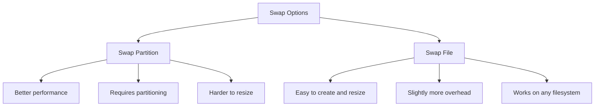

# How to Create and Enable a Swap Partition on RHEL 9

Author: [nawazdhandala](https://www.github.com/nawazdhandala)

Tags: RHEL, Swap, Partition, Memory, Linux

Description: Step-by-step guide to creating and enabling a dedicated swap partition on RHEL 9, including partitioning, formatting, and making it persistent across reboots.

---

Swap space is your safety net when physical RAM runs out. Without it, the OOM killer starts terminating processes, and that is never a good day. A dedicated swap partition is the most common and performant way to add swap on RHEL 9.

## When You Need Swap

Even with plenty of RAM, swap serves important purposes:

- Hibernation support requires swap at least equal to RAM size
- The kernel can move inactive pages to swap, freeing RAM for active workloads
- It prevents the OOM killer from stepping in during unexpected memory spikes
- Some applications expect swap to exist and behave unpredictably without it

## Check Current Swap Status

Before creating new swap, see what you already have:

```bash
# Show current swap configuration
swapon --show
```

```bash
# Check memory and swap totals
free -h
```

```bash
# View swap entries in fstab
grep swap /etc/fstab
```

## Method 1: Create Swap on a New Disk Partition

If you have unpartitioned disk space, create a swap partition with `fdisk` or `parted`.

### Using fdisk

```bash
# List available disks and partitions
lsblk
```

```bash
# Start fdisk on the target disk
fdisk /dev/sdb
```

Inside fdisk:
1. Press `n` to create a new partition
2. Choose partition number and accept default start/end for desired size
3. Press `t` to change the partition type
4. Enter `82` for Linux swap (or `19` for GPT swap GUID)
5. Press `w` to write and exit

### Using parted (for GPT disks)

```bash
# Create a 4 GB swap partition on a GPT disk
parted /dev/sdb mkpart swap linux-swap 0% 4GiB
```

## Method 2: Create Swap on an LVM Logical Volume

This is the more flexible approach and what I recommend for most setups:

```bash
# Create a 4 GB logical volume for swap
lvcreate -L 4G -n lv_swap vg_system
```

## Format as Swap

Regardless of how you created the partition or volume, format it:

```bash
# Format the partition as swap space
mkswap /dev/sdb1
```

Or for LVM:

```bash
# Format the logical volume as swap
mkswap /dev/vg_system/lv_swap
```

The output shows the UUID, which you will need for fstab.

## Enable the Swap

Activate the swap space immediately:

```bash
# Enable the swap partition
swapon /dev/vg_system/lv_swap
```

Verify it is active:

```bash
# Confirm swap is active
swapon --show
free -h
```

## Make It Persistent Across Reboots

Add an entry to `/etc/fstab` so swap activates at boot:

```bash
# Get the UUID of the swap partition
blkid /dev/vg_system/lv_swap
```

Add to fstab:

```bash
# Add swap entry to fstab using UUID
echo "UUID=<your-uuid-here>  none  swap  defaults  0 0" >> /etc/fstab
```

Or using the device path (for LVM, this is reliable):

```bash
# Add swap entry using device path
echo "/dev/vg_system/lv_swap  none  swap  defaults  0 0" >> /etc/fstab
```

Verify the fstab entry is correct:

```bash
# Test that fstab entries are valid
mount -a
swapon -a
```

## Set Swap Priority

If you have multiple swap devices, set priorities to control which gets used first. Higher numbers mean higher priority:

```bash
# Enable swap with a specific priority
swapon -p 10 /dev/vg_system/lv_swap
```

In fstab, use the `pri` option:

```
/dev/vg_system/lv_swap  none  swap  defaults,pri=10  0 0
```

This is useful when you have swap on both SSD and HDD - give the SSD-backed swap a higher priority.

## Verify Everything Works

Run through these checks to confirm your setup:

```bash
# Check swap is active and shows correct size
swapon --show

# Check total memory including swap
free -h

# Verify fstab entry
grep swap /etc/fstab

# Test that swap activates from fstab
swapoff -a
swapon -a
swapon --show
```

## Swap Partition vs. Swap File



For most production RHEL systems, a swap partition (especially on LVM) is the preferred choice. It is slightly faster and integrates well with LVM management workflows.

## Summary

Creating a swap partition on RHEL 9 is straightforward: create the partition or LVM volume, format it with `mkswap`, activate it with `swapon`, and add it to `/etc/fstab` for persistence. Use LVM when possible for flexibility, and set priorities if you have multiple swap devices. Always verify with `swapon --show` and `free -h` after setup.
