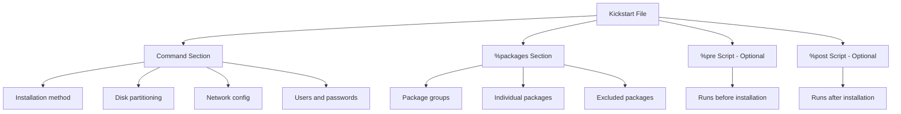

# How to Create a Kickstart File for Automated RHEL Installations

Author: [nawazdhandala](https://github.com/nawazdhandala)

Tags: RHEL, Kickstart, Automation, Linux, Installation

Description: Learn how to write Kickstart files for automating RHEL installations, including syntax, common directives, package selection, and pre/post scripts with validation using ksvalidator.

---

If you have ever installed RHEL manually more than twice, you already know the pain. Clicking through the same screens, setting the same partitions, creating the same users. Kickstart eliminates all of that by defining every installation decision in a single text file. The installer reads it, does exactly what you specified, and the machine is ready without anyone touching a keyboard.

Red Hat has used Kickstart since the late 1990s, and it remains the standard way to automate RHEL installations. Every time you install RHEL manually, the installer generates a Kickstart file at `/root/anaconda-ks.cfg` that captures what you chose. That file is a great starting point for your own templates.

## Kickstart File Structure

A Kickstart file is a plain text file with directives (commands), and optional script sections. The general structure looks like this:



## A Complete Kickstart Example

Here is a practical Kickstart file for a RHEL server with custom partitioning, network configuration, and post-install setup:

```bash
# RHEL Kickstart configuration file

# Use graphical or text mode installer
text

# Installation source - adjust URL to your repo server
url --url=http://192.168.1.10/rhel9/

# Accept the EULA
eula --agreed

# System language and keyboard
lang en_US.UTF-8
keyboard us

# Timezone and NTP
timezone America/New_York --utc
timesource --ntp-server=0.rhel.pool.ntp.org

# Network configuration - static IP
network --bootproto=static --device=ens192 --ip=192.168.1.50 --netmask=255.255.255.0 --gateway=192.168.1.1 --nameserver=192.168.1.1 --hostname=webserver01.example.com --activate

# Root password (encrypted) - generate with: python3 -c "import crypt; print(crypt.crypt('yourpassword'))"
rootpw --iscrypted $6$rounds=656000$randomsalt$hashedpasswordhere

# Create a regular user with sudo access
user --name=sysadmin --groups=wheel --iscrypted --password=$6$rounds=656000$randomsalt$hashedpasswordhere

# SELinux and firewall
selinux --enforcing
firewall --enabled --service=ssh

# Disable the Setup Agent on first boot
firstboot --disable

# Reboot after installation completes
reboot

# Disk partitioning - clear all existing partitions
ignoredisk --only-use=sda
clearpart --all --drives=sda --initlabel
zerombr

# Partition layout using LVM
part /boot --fstype=xfs --size=1024
part /boot/efi --fstype=efi --size=600
part pv.01 --size=1 --grow

volgroup rhel pv.01

logvol /     --vgname=rhel --name=root --fstype=xfs --size=20480
logvol /var  --vgname=rhel --name=var  --fstype=xfs --size=30720
logvol /home --vgname=rhel --name=home --fstype=xfs --size=10240
logvol /tmp  --vgname=rhel --name=tmp  --fstype=xfs --size=5120
logvol swap  --vgname=rhel --name=swap --size=4096
```

## The %packages Section

The `%packages` section defines what software gets installed. It supports package groups (prefixed with `@`) and individual package names.

```bash
# Package selection
%packages
@^minimal-environment
@standard
vim-enhanced
tmux
wget
curl
bash-completion
chrony
firewalld
policycoreutils-python-utils
-iwl*firmware*
-plymouth
%end
```

A few things to note:

- `@^minimal-environment` is a package group environment (the `^` prefix indicates an environment rather than a group).
- Lines starting with `-` exclude packages. Here we remove firmware packages for wireless cards (not needed on a server) and Plymouth boot splash.
- `%end` closes the section. This is required in RHEL.

## The %pre Section

The `%pre` script runs before the installer touches the disk. It is useful for dynamic configuration, like detecting hardware and adjusting the Kickstart behavior.

```bash
# Pre-installation script - runs before partitioning
%pre --interpreter=/bin/bash --log=/tmp/ks-pre.log

# Detect total disk size in MiB and write partition sizes dynamically
DISK_SIZE=$(lsblk -b -d -n -o SIZE /dev/sda | awk '{print int($1/1048576)}')

if [ "$DISK_SIZE" -gt 200000 ]; then
    echo "Large disk detected, using expanded partition layout" >> /tmp/ks-pre.log
fi

%end
```

The `%pre` section has limitations. It runs in a minimal environment before packages are installed, so you only have access to the tools available in the installer image.

## The %post Section

The `%post` script runs after installation is complete. This is where you do the bulk of your customization: installing additional software, configuring services, registering with Red Hat, setting up monitoring agents, etc.

```bash
# Post-installation script - runs in the installed system
%post --interpreter=/bin/bash --log=/root/ks-post.log

# Register with Red Hat Subscription Manager
subscription-manager register --username=your-username --password=your-password --auto-attach

# Update all packages
dnf update -y

# Enable and start chronyd for NTP
systemctl enable chronyd

# Configure SSH - disable root login, disable password auth
sed -i 's/^#PermitRootLogin.*/PermitRootLogin no/' /etc/ssh/sshd_config
sed -i 's/^#PasswordAuthentication.*/PasswordAuthentication no/' /etc/ssh/sshd_config

# Add an SSH public key for the sysadmin user
mkdir -p /home/sysadmin/.ssh
chmod 700 /home/sysadmin/.ssh
cat << 'SSHEOF' > /home/sysadmin/.ssh/authorized_keys
ssh-ed25519 AAAAC3NzaC1lZDI1NTE5AAAAIExampleKeyHere sysadmin@workstation
SSHEOF
chmod 600 /home/sysadmin/.ssh/authorized_keys
chown -R sysadmin:sysadmin /home/sysadmin/.ssh

# Set some useful bash aliases
cat << 'BASHEOF' >> /home/sysadmin/.bashrc
alias ll='ls -alF'
alias gs='git status'
alias dfs='df -hT'
BASHEOF

%end
```

You can also use `%post --nochroot` to run commands in the installer environment rather than the installed system. This is useful for copying files from the installation media to the installed system.

## Common Kickstart Directives Reference

Here are the directives you will use most often:

| Directive | Purpose | Example |
|-----------|---------|---------|
| `text` | Use text-mode installer | `text` |
| `url` | Installation source URL | `url --url=http://server/rhel9/` |
| `lang` | System language | `lang en_US.UTF-8` |
| `keyboard` | Keyboard layout | `keyboard us` |
| `timezone` | Set timezone | `timezone America/New_York --utc` |
| `rootpw` | Root password | `rootpw --iscrypted $6$...` |
| `user` | Create a user | `user --name=admin --groups=wheel` |
| `network` | Network setup | `network --bootproto=dhcp` |
| `clearpart` | Wipe existing partitions | `clearpart --all --drives=sda` |
| `autopart` | Automatic partitioning | `autopart --type=lvm` |
| `reboot` | Reboot after install | `reboot` |
| `poweroff` | Shutdown after install | `poweroff` |

## Generating Encrypted Passwords

Never put plaintext passwords in Kickstart files. Generate encrypted passwords with Python:

```bash
# Generate a SHA-512 encrypted password
python3 -c "import crypt; print(crypt.crypt('YourPassword', crypt.mksalt(crypt.METHOD_SHA512)))"
```

Or use `openssl`:

```bash
# Generate an encrypted password with openssl
openssl passwd -6
```

Copy the output and use it with `rootpw --iscrypted` or `user --iscrypted --password=`.

## Validating Your Kickstart File

Before deploying a Kickstart file, validate it with `ksvalidator`. This catches syntax errors and unsupported directives.

```bash
# Install the pykickstart package (contains ksvalidator)
sudo dnf install -y pykickstart

# Validate the kickstart file
ksvalidator ks.cfg
```

If the file is clean, there will be no output. Errors show the line number and a description of the problem.

You can also use `ksverdiff` to check compatibility between different RHEL versions:

```bash
# Compare kickstart syntax differences between RHEL 8 and RHEL
ksverdiff --from RHEL8 --to RHEL9
```

This lists directives that were added, removed, or changed between versions.

## Using the Kickstart File

There are several ways to provide the Kickstart file to the installer:

**Via HTTP server (most common for PXE installs):**
```bash
inst.ks=http://192.168.1.10/ks.cfg
```

**Via local file on USB:**
```bash
inst.ks=hd:sdb1:/ks.cfg
```

**Via NFS:**
```bash
inst.ks=nfs:192.168.1.10:/exports/ks.cfg
```

Add the `inst.ks` parameter to the kernel boot arguments in your PXE config, GRUB entry, or the installer boot prompt.

## Tips for Production Kickstart Files

- Keep Kickstart files in version control (Git). Treat them like infrastructure code, because that is what they are.
- Use separate Kickstart files for different server roles (web server, database server, etc.) with a shared base.
- Always encrypt passwords. Never commit plaintext credentials.
- Test in a VM first. Create a quick KVM guest to verify your Kickstart works before deploying to production hardware.
- Use the `%post` section for configuration management bootstrap, like installing and running Ansible or Puppet after the OS is installed.
- Log everything. Use `--log=/root/ks-post.log` on your `%post` section so you can troubleshoot failed deployments.

Kickstart is simple but powerful. It turns a 30-minute manual process into a repeatable, auditable, zero-touch deployment that takes a few minutes.
