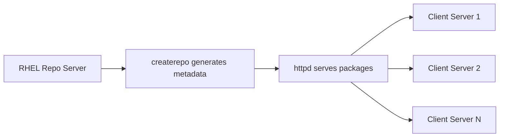

# How to Create a Local DNF Repository on RHEL

Author: [nawazdhandala](https://www.github.com/nawazdhandala)

Tags: RHEL, DNF, Local Repository, Linux, Package Management

Description: Step-by-step instructions for creating a local DNF repository on RHEL, including generating metadata with createrepo, serving packages over HTTP, and mirroring remote repositories with reposync.

---

Running a local DNF repository is one of those things that sounds like overkill until you actually need it. If you manage more than a handful of RHEL servers, or your machines sit behind a restricted firewall, a local repo saves bandwidth, speeds up deployments, and gives you complete control over what packages are available. This guide walks through setting one up from scratch.

## Why Run a Local Repository?

There are several good reasons:

- **Air-gapped environments.** Systems with no internet access still need packages.
- **Bandwidth savings.** Download once, serve to hundreds of machines on the local network.
- **Version control.** Freeze a known-good set of packages and push updates on your schedule.
- **Custom packages.** Distribute in-house RPMs alongside standard RHEL packages.
- **Faster installs.** LAN speeds beat WAN speeds every time.

## Prerequisites

You need a server that will host the repository. Install the required tools:

```bash
# Install createrepo_c for generating repo metadata
sudo dnf install -y createrepo_c

# Install httpd for serving the repo over HTTP
sudo dnf install -y httpd
```

If you plan to mirror remote repos, you will also need the `dnf-utils` package:

```bash
# Install dnf-utils for the reposync command
sudo dnf install -y dnf-utils
```

## Architecture Overview



## Creating a Repository from Local RPMs

### Step 1: Set Up the Directory Structure

Pick a location for your repo. A common choice is under `/var/www/html/` so Apache can serve it directly:

```bash
# Create the repo directory
sudo mkdir -p /var/www/html/repos/custom-el9
```

### Step 2: Add RPM Packages

Copy your RPM files into the directory. These could be packages you built in-house, downloaded from a vendor, or copied from RHEL installation media:

```bash
# Copy RPMs into the repo directory
sudo cp /path/to/your/*.rpm /var/www/html/repos/custom-el9/
```

### Step 3: Generate Repository Metadata

This is where `createrepo_c` comes in. It scans the RPMs and generates the metadata files that DNF needs:

```bash
# Generate repository metadata
sudo createrepo_c /var/www/html/repos/custom-el9/
```

After running this, you will see a `repodata/` directory inside your repo folder containing XML metadata files.

### Step 4: Update Metadata After Adding New Packages

When you add or remove RPMs, regenerate the metadata:

```bash
# Update the metadata (faster than recreating from scratch)
sudo createrepo_c --update /var/www/html/repos/custom-el9/
```

## Serving the Repository with Apache

### Configure Apache

Enable and start httpd:

```bash
# Start and enable Apache
sudo systemctl enable --now httpd
```

By default, Apache serves files from `/var/www/html/`, so your repo is already accessible. You can verify by browsing to `http://your-server-ip/repos/custom-el9/`.

### Open the Firewall

If firewalld is running, allow HTTP traffic:

```bash
# Allow HTTP through the firewall
sudo firewall-cmd --permanent --add-service=http
sudo firewall-cmd --reload
```

### Set SELinux Context

If SELinux is enforcing (and it should be), make sure the repo files have the correct context:

```bash
# Set the correct SELinux context for web content
sudo semanage fcontext -a -t httpd_sys_content_t "/var/www/html/repos(/.*)?"
sudo restorecon -Rv /var/www/html/repos/
```

## Configuring Client Systems

On each client system, create a `.repo` file that points to your local repository:

```bash
# Create the repo configuration file on client machines
sudo tee /etc/yum.repos.d/custom-local.repo << 'EOF'
[custom-el9]
name=Custom Local Repository for RHEL
baseurl=http://repo-server.example.com/repos/custom-el9/
enabled=1
gpgcheck=0
EOF
```

If you have signed your packages with a GPG key (recommended for production), set `gpgcheck=1` and add the `gpgkey` parameter pointing to your public key.

Test that the client can see the repo:

```bash
# Verify the repo is accessible and has packages
dnf repolist
dnf repo-pkgs custom-el9 list
```

## Mirroring Remote Repositories with Reposync

Instead of building a repo from scratch, you can mirror an existing RHEL repository. This is common for managing update rollouts or providing packages in air-gapped environments.

### Mirror the BaseOS Repository

```bash
# Create a directory for the mirror
sudo mkdir -p /var/www/html/repos/rhel9-baseos

# Sync packages from the BaseOS repo
sudo reposync --repoid=rhel-9-for-x86_64-baseos-rpms \
  --download-metadata \
  --downloaddir=/var/www/html/repos/rhel9-baseos
```

The `--download-metadata` flag pulls the original repository metadata, so you may not need to run `createrepo_c` separately.

### Mirror the AppStream Repository

```bash
# Mirror AppStream packages
sudo mkdir -p /var/www/html/repos/rhel9-appstream

sudo reposync --repoid=rhel-9-for-x86_64-appstream-rpms \
  --download-metadata \
  --downloaddir=/var/www/html/repos/rhel9-appstream
```

### Mirror Only the Latest Versions

By default, reposync downloads all versions of every package. To save space, download only the latest:

```bash
# Sync only the newest versions of each package
sudo reposync --repoid=rhel-9-for-x86_64-baseos-rpms \
  --newest-only \
  --downloaddir=/var/www/html/repos/rhel9-baseos
```

After syncing with `--newest-only`, you need to generate metadata yourself:

```bash
# Generate metadata for the synced repo
sudo createrepo_c /var/www/html/repos/rhel9-baseos
```

### Automate with a Cron Job

Set up a cron job to sync daily (or weekly, depending on your update policy):

```bash
# Add a cron job to sync repos nightly at 2 AM
sudo tee /etc/cron.d/reposync << 'EOF'
0 2 * * * root reposync --repoid=rhel-9-for-x86_64-baseos-rpms --newest-only --downloaddir=/var/www/html/repos/rhel9-baseos && createrepo_c --update /var/www/html/repos/rhel9-baseos
EOF
```

## Using the RHEL Installation ISO as a Local Repo

If you have the RHEL installation ISO, you can use it directly as a local repository:

```bash
# Mount the ISO
sudo mkdir -p /mnt/rhel9-iso
sudo mount -o loop /path/to/rhel-9.x-x86_64-dvd.iso /mnt/rhel9-iso

# Create repo file pointing to the mount
sudo tee /etc/yum.repos.d/rhel9-iso.repo << 'EOF'
[rhel9-iso-baseos]
name=RHEL ISO BaseOS
baseurl=file:///mnt/rhel9-iso/BaseOS/
enabled=1
gpgcheck=1
gpgkey=file:///etc/pki/rpm-gpg/RPM-GPG-KEY-redhat-release

[rhel9-iso-appstream]
name=RHEL ISO AppStream
baseurl=file:///mnt/rhel9-iso/AppStream/
enabled=1
gpgcheck=1
gpgkey=file:///etc/pki/rpm-gpg/RPM-GPG-KEY-redhat-release
EOF
```

To make the mount persistent across reboots, add it to `/etc/fstab`:

```bash
# Add the ISO mount to fstab for persistence
echo "/path/to/rhel-9.x-x86_64-dvd.iso /mnt/rhel9-iso iso9660 loop,ro 0 0" | sudo tee -a /etc/fstab
```

## Troubleshooting

### Metadata Errors

If clients report metadata errors, regenerate the repo data:

```bash
# Force a fresh metadata generation
sudo createrepo_c --update /var/www/html/repos/custom-el9/
```

On the client side, clean the cache:

```bash
# Clear stale cached metadata on the client
sudo dnf clean metadata
sudo dnf makecache
```

### Permission Issues

Make sure Apache can read the repo files:

```bash
# Fix ownership and permissions
sudo chown -R root:root /var/www/html/repos/
sudo chmod -R 755 /var/www/html/repos/
```

### SELinux Denials

Check the audit log for SELinux denials:

```bash
# Look for httpd-related SELinux denials
sudo ausearch -m avc -ts recent | grep httpd
```

A local DNF repository is one of those infrastructure building blocks that pays for itself quickly. The setup is straightforward, and once it is running, your fleet gets faster, more predictable package management. Start with a simple custom repo for your in-house packages, and expand to full mirrors as needed.
