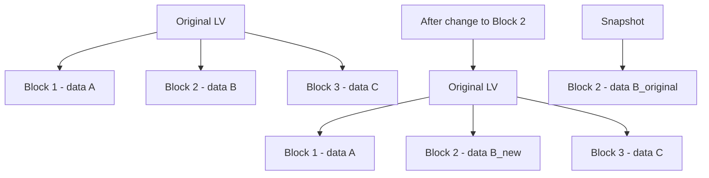

# How to Create LVM Snapshots on RHEL 9

Author: [nawazdhandala](https://www.github.com/nawazdhandala)

Tags: RHEL, LVM, Snapshots, Storage, Linux

Description: Learn how to create, manage, and restore LVM snapshots on RHEL 9 for safe backups and rollback capabilities.

---

LVM snapshots capture the state of a logical volume at a point in time. They are useful for creating consistent backups, testing changes with the ability to roll back, and cloning data for development environments.

## How LVM Snapshots Work

LVM snapshots use copy-on-write (COW). When you create a snapshot, it does not copy all the data. Instead, it only stores the original version of blocks that change after the snapshot was created.



## Creating a Snapshot

```bash
# Create a snapshot of the datalv logical volume
# The -L flag sets the snapshot size (space for changed blocks)
sudo lvcreate -s -L 5G -n datalv_snap /dev/datavg/datalv
```

The snapshot size determines how many changes can be tracked. If the snapshot fills up, it becomes invalid. Size it based on expected change rate:
- For quick backups: 10-15% of the original volume
- For long-lived snapshots: 20-50% or more

```bash
# Verify the snapshot was created
sudo lvs

# Detailed snapshot information
sudo lvdisplay /dev/datavg/datalv_snap
```

## Mounting a Snapshot

You can mount a snapshot read-only to access the point-in-time data:

```bash
# Create a mount point
sudo mkdir /mnt/snap

# Mount the snapshot read-only
sudo mount -o ro /dev/datavg/datalv_snap /mnt/snap

# Access the snapshot data
ls /mnt/snap
```

For XFS, if the original is also mounted, you need the `nouuid` option:

```bash
# XFS requires nouuid when both original and snapshot are mounted
sudo mount -o ro,nouuid /dev/datavg/datalv_snap /mnt/snap
```

## Monitoring Snapshot Usage

Watch how full the snapshot is getting:

```bash
# Check snapshot usage percentage
sudo lvs -o lv_name,data_percent,snap_percent

# Detailed view
sudo lvdisplay /dev/datavg/datalv_snap | grep -i "allocated"

# Set up monitoring with a simple script
while true; do
    sudo lvs /dev/datavg/datalv_snap -o snap_percent --noheadings
    sleep 60
done
```

## Restoring from a Snapshot

To revert the original volume to the snapshot state:

```bash
# Unmount both the snapshot and the original
sudo umount /mnt/snap
sudo umount /data

# Merge the snapshot back into the original volume
sudo lvconvert --merge /dev/datavg/datalv_snap

# The merge happens on next activation
# Reactivate the volume
sudo lvchange -an /dev/datavg/datalv
sudo lvchange -ay /dev/datavg/datalv

# Remount the original (now restored to snapshot state)
sudo mount /dev/datavg/datalv /data
```

## Removing a Snapshot

When you no longer need a snapshot:

```bash
# Unmount the snapshot first
sudo umount /mnt/snap

# Remove the snapshot
sudo lvremove /dev/datavg/datalv_snap
```

## Using Snapshots for Consistent Backups

```bash
#!/bin/bash
# Backup script using LVM snapshots

VOLUME="/dev/datavg/datalv"
SNAP_NAME="datalv_backup_snap"
SNAP_SIZE="5G"
SNAP_MOUNT="/mnt/backup_snap"
BACKUP_DIR="/backup"

# Create the snapshot
sudo lvcreate -s -L "$SNAP_SIZE" -n "$SNAP_NAME" "$VOLUME"

# Mount the snapshot
sudo mkdir -p "$SNAP_MOUNT"
sudo mount -o ro,nouuid "/dev/datavg/$SNAP_NAME" "$SNAP_MOUNT"

# Perform the backup from the snapshot
sudo tar czf "$BACKUP_DIR/data-$(date +%Y%m%d).tar.gz" -C "$SNAP_MOUNT" .

# Clean up
sudo umount "$SNAP_MOUNT"
sudo lvremove -f "/dev/datavg/$SNAP_NAME"

echo "Backup complete"
```

## Summary

LVM snapshots on RHEL 9 provide a lightweight way to capture volume state at a point in time using copy-on-write. They are invaluable for backups, testing, and providing rollback capability. Always monitor snapshot usage to prevent them from filling up, and remove snapshots you no longer need to free the allocated space.

