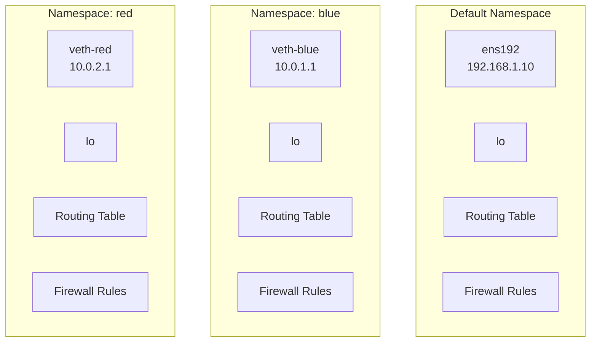

# How to Create and Manage Network Namespaces with ip netns on RHEL 9

Author: [nawazdhandala](https://www.github.com/nawazdhandala)

Tags: RHEL, Network Namespaces, ip netns, Linux

Description: A hands-on guide to creating and managing network namespaces on RHEL 9 using ip netns, providing isolated network environments for testing, security, and understanding container networking.

---

Network namespaces give you completely isolated network stacks within a single Linux system. Each namespace has its own interfaces, routing table, firewall rules, and socket space. This is the foundation of how containers work, and it's a powerful tool for testing and isolation even without containers.

## What Is a Network Namespace?

Think of it as a virtual machine's network stack, without the virtual machine. A process running inside a network namespace can't see or interact with interfaces in another namespace.



## Creating a Network Namespace

```bash
# Create a namespace called "blue"
sudo ip netns add blue

# List all namespaces
ip netns list

# The namespace is stored as a file
ls -la /var/run/netns/
```

## Running Commands Inside a Namespace

```bash
# Run a command in the namespace
sudo ip netns exec blue ip addr show

# You'll see only a loopback interface (and it's DOWN)

# Bring up loopback inside the namespace
sudo ip netns exec blue ip link set lo up

# Verify
sudo ip netns exec blue ip addr show lo
```

## Opening a Shell in a Namespace

```bash
# Start a bash shell inside the namespace
sudo ip netns exec blue bash

# Now everything you run is in the "blue" namespace
ip addr show
ip route show
# Type 'exit' to leave
```

## Adding Interfaces to a Namespace

Physical interfaces can be moved into a namespace, but more commonly you create virtual interfaces (veth pairs).

```bash
# Create a veth pair
sudo ip link add veth-default type veth peer name veth-blue

# Move one end into the namespace
sudo ip link set veth-blue netns blue

# Configure the default side
sudo ip addr add 10.0.1.1/24 dev veth-default
sudo ip link set veth-default up

# Configure the namespace side
sudo ip netns exec blue ip addr add 10.0.1.2/24 dev veth-blue
sudo ip netns exec blue ip link set veth-blue up

# Test connectivity
ping -c 4 10.0.1.2
sudo ip netns exec blue ping -c 4 10.0.1.1
```

## Namespace-Specific Routing

Each namespace has its own routing table.

```bash
# Show routes inside the namespace
sudo ip netns exec blue ip route show

# Add a default route inside the namespace
sudo ip netns exec blue ip route add default via 10.0.1.1

# Now the namespace can reach outside (if forwarding is enabled)
```

## Namespace-Specific DNS

Namespaces don't inherit /etc/resolv.conf. You need to configure it.

```bash
# Create the namespace's resolv.conf
sudo mkdir -p /etc/netns/blue
echo "nameserver 8.8.8.8" | sudo tee /etc/netns/blue/resolv.conf

# This file is automatically bind-mounted as /etc/resolv.conf inside the namespace
```

## Listing and Monitoring Namespaces

```bash
# List all namespaces
ip netns list

# List all namespaces with their IDs
ip netns list-id

# Monitor namespace events
ip netns monitor
```

## Namespace Identification

```bash
# Check which namespace a process is in
sudo ip netns identify $$

# Check which namespace you're currently in
sudo ip netns identify 1
```

## Running Services in a Namespace

You can run network services in isolated namespaces.

```bash
# Start a web server in the "blue" namespace
sudo ip netns exec blue python3 -m http.server 8080 &

# Access it through the veth interface
curl http://10.0.1.2:8080
```

## Deleting a Namespace

```bash
# Delete a namespace (this also removes any interfaces inside it)
sudo ip netns del blue

# Verify
ip netns list
```

## Practical Example: Isolated Testing Environment

Create a namespace with internet access for testing:

```bash
# Create namespace
sudo ip netns add testenv

# Create veth pair
sudo ip link add veth0 type veth peer name veth1
sudo ip link set veth1 netns testenv

# Configure interfaces
sudo ip addr add 10.200.0.1/24 dev veth0
sudo ip link set veth0 up
sudo ip netns exec testenv ip addr add 10.200.0.2/24 dev veth1
sudo ip netns exec testenv ip link set veth1 up
sudo ip netns exec testenv ip link set lo up

# Add default route in namespace
sudo ip netns exec testenv ip route add default via 10.200.0.1

# Enable forwarding and NAT on the host
sudo sysctl -w net.ipv4.ip_forward=1
sudo iptables -t nat -A POSTROUTING -s 10.200.0.0/24 -j MASQUERADE

# Set up DNS
sudo mkdir -p /etc/netns/testenv
echo "nameserver 8.8.8.8" | sudo tee /etc/netns/testenv/resolv.conf

# Test internet access from the namespace
sudo ip netns exec testenv ping -c 4 8.8.8.8
sudo ip netns exec testenv curl -s ifconfig.me
```

## Wrapping Up

Network namespaces on RHEL 9 are a fundamental building block for network isolation. They're how containers get their own network stacks, but they're also useful on their own for testing, security isolation, and learning. The workflow is: create the namespace, create veth pairs to connect it, configure addresses and routes, and optionally enable NAT for internet access. Everything inside a namespace is completely isolated from the rest of the system.
