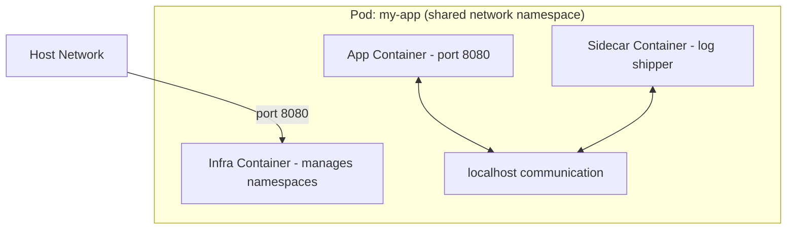

# How to Create and Manage Pods with Podman on RHEL

Author: [nawazdhandala](https://www.github.com/nawazdhandala)

Tags: RHEL, Podman, Pods, Linux

Description: A practical guide to creating and managing Podman pods on RHEL, grouping containers that share network namespaces, storage, and lifecycle management.

---

If you have worked with Kubernetes, you know what a pod is - a group of containers that share network and other namespaces. Podman brings this concept to standalone container management. Pods let you run tightly coupled containers that need to communicate over localhost, share storage, and be managed as a unit.

I use pods whenever I have a main application container plus sidecar containers like log shippers or monitoring agents.

## What is a Pod?

A Podman pod is a group of one or more containers that share:
- Network namespace (same IP, same ports, same localhost)
- IPC namespace
- PID namespace (optionally)



Every pod gets an "infra" container that holds the namespaces. Your application containers join those namespaces.

## Creating a Pod

# Create a basic pod
```bash
podman pod create --name my-pod
```

# Create a pod with published ports
```bash
podman pod create --name web-pod -p 8080:80 -p 8443:443
```

Port mappings are defined on the pod, not on individual containers. This makes sense because all containers in the pod share the same network.

# Create a pod with a hostname
```bash
podman pod create --name my-pod --hostname myapp
```

## Adding Containers to a Pod

# Run a container inside the pod
```bash
podman run -d --pod my-pod --name app registry.access.redhat.com/ubi9/ubi-minimal sleep infinity
```

# Add another container to the same pod
```bash
podman run -d --pod my-pod --name sidecar registry.access.redhat.com/ubi9/ubi-minimal sleep infinity
```

Both containers share the same network namespace, so they can communicate over localhost:

# Test localhost communication between containers in the pod
```bash
podman exec app curl -s http://localhost:80
```

## Practical Example: Web App with Database

Let us set up a realistic pod with nginx and a database:

# Create a pod with the web port exposed
```bash
podman pod create --name webapp-pod -p 8080:80
```

# Run the database container in the pod
```bash
podman run -d --pod webapp-pod --name db \
  -e MYSQL_ROOT_PASSWORD=secret \
  -e MYSQL_DATABASE=myapp \
  -v dbdata:/var/lib/mysql \
  docker.io/library/mariadb:latest
```

# Run the web server in the pod
```bash
podman run -d --pod webapp-pod --name web \
  docker.io/library/nginx:latest
```

The web container can reach the database on `localhost:3306` since they share the network namespace.

## Managing Pod Lifecycle

# List all pods
```bash
podman pod ls
```

# Check pod details
```bash
podman pod inspect my-pod
```

# View containers in a pod
```bash
podman pod ps
```

# Stop all containers in a pod
```bash
podman pod stop my-pod
```

# Start all containers in a pod
```bash
podman pod start my-pod
```

# Restart a pod
```bash
podman pod restart my-pod
```

# Pause and unpause a pod
```bash
podman pod pause my-pod
podman pod unpause my-pod
```

## Pod Resource Monitoring

# View resource usage for all containers in a pod
```bash
podman pod stats my-pod
```

# View logs from a specific container in the pod
```bash
podman logs web
```

## Removing Pods

# Remove a stopped pod and all its containers
```bash
podman pod rm my-pod
```

# Force remove a running pod
```bash
podman pod rm -f my-pod
```

# Remove all pods
```bash
podman pod rm --all
```

## Creating Pods from YAML

You can define pods using Kubernetes-compatible YAML:

```bash
cat > my-pod.yaml << 'EOF'
apiVersion: v1
kind: Pod
metadata:
  name: webapp
  labels:
    app: webapp
spec:
  containers:
  - name: web
    image: docker.io/library/nginx:latest
    ports:
    - containerPort: 80
      hostPort: 8080
  - name: log-agent
    image: registry.access.redhat.com/ubi9/ubi-minimal
    command: ["sleep", "infinity"]
EOF
```

# Create the pod from YAML
```bash
podman kube play my-pod.yaml
```

# Stop and remove the pod created from YAML
```bash
podman kube down my-pod.yaml
```

## Generating YAML from Existing Pods

Export your running pod configuration to YAML:

# Generate Kubernetes YAML from a running pod
```bash
podman kube generate my-pod > exported-pod.yaml
```

This is great for prototyping on your local machine and then deploying to Kubernetes or OpenShift.

## Pod Networking Details

All containers in a pod share one IP address:

# Check the pod's IP address
```bash
podman inspect --format '{{.NetworkSettings.IPAddress}}' $(podman pod inspect my-pod --format '{{.InfraContainerID}}')
```

Since containers share the network, be careful about port conflicts. Two containers in the same pod cannot both listen on port 80.

## Sharing PID Namespace

By default, containers in a pod share the network but have separate PID namespaces. You can share the PID namespace too:

# Create a pod with shared PID namespace
```bash
podman pod create --name shared-pid --share pid,net --infra
```

# Now containers can see each other's processes
```bash
podman run -d --pod shared-pid --name app1 registry.access.redhat.com/ubi9/ubi-minimal sleep infinity
podman run -d --pod shared-pid --name app2 registry.access.redhat.com/ubi9/ubi-minimal sleep infinity

podman exec app1 ps aux
```

## Pod Volumes

Share volumes between containers in a pod:

# Create a pod
```bash
podman pod create --name vol-pod
```

# Both containers mount the same volume
```bash
podman run -d --pod vol-pod --name writer \
  -v shared-data:/data \
  registry.access.redhat.com/ubi9/ubi-minimal \
  /bin/bash -c 'while true; do date >> /data/log.txt; sleep 5; done'

podman run -d --pod vol-pod --name reader \
  -v shared-data:/data:ro \
  registry.access.redhat.com/ubi9/ubi-minimal \
  tail -f /data/log.txt
```

## Summary

Pods in Podman group tightly coupled containers that need to share network namespaces and communicate over localhost. They mirror the Kubernetes pod concept, which makes local development and testing much easier. Define your pods, prototype locally with Podman, and when ready, generate the YAML and deploy to Kubernetes or OpenShift.
