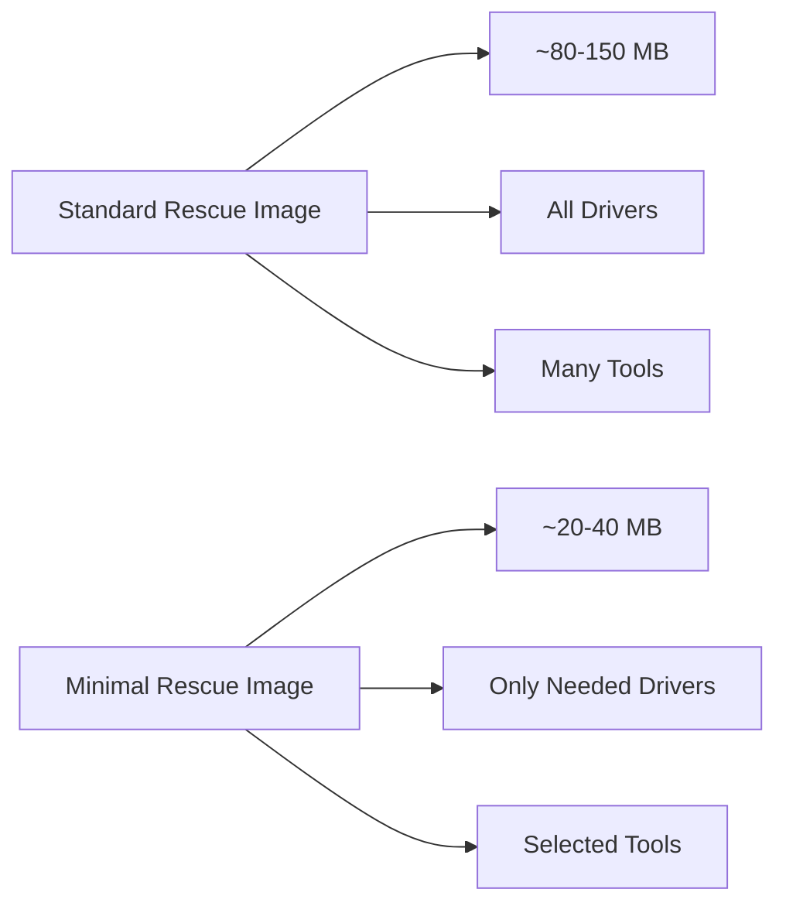

# How to Create a Minimal Rescue Image with dracut on RHEL

Author: [nawazdhandala](https://www.github.com/nawazdhandala)

Tags: RHEL, dracut, Rescue, initramfs, Boot, Linux

Description: Learn how to create a minimal, self-contained rescue initramfs image with dracut on RHEL that can boot into a usable emergency environment.

---

A rescue initramfs is a self-contained boot image that gives you a working environment even when the root filesystem is completely destroyed. RHEL generates one automatically during installation, but you can build custom rescue images tailored to your hardware and needs using dracut. A minimal image boots faster and fits on smaller media.

## Standard vs Minimal Rescue Image



## Building a Minimal Rescue Image

```bash
# Create a rescue image with only the drivers for the current hardware
# The --hostonly flag strips out drivers for hardware not present
sudo dracut --force \
    --hostonly \
    --no-hostonly-cmdline \
    --compress zstd \
    --add "rescue" \
    --omit "plymouth multipath iscsi fcoe nfs" \
    /boot/initramfs-rescue-minimal.img \
    $(uname -r)

# Check the size
ls -lh /boot/initramfs-rescue-minimal.img

# Compare with the standard rescue image
ls -lh /boot/initramfs-0-rescue-*.img
```

## Adding Essential Rescue Tools

A rescue image is only useful if it contains the tools you need. Configure what gets included:

```bash
# Create a dracut config for the rescue image
cat <<'EOF' | sudo tee /etc/dracut.conf.d/rescue-tools.conf
# Tools to include in the rescue initramfs
install_items+=" /usr/sbin/fsck /usr/sbin/fsck.xfs /usr/sbin/xfs_repair "
install_items+=" /usr/sbin/lvm /usr/sbin/pvs /usr/sbin/vgs /usr/sbin/lvs "
install_items+=" /usr/sbin/blkid /usr/bin/lsblk "
install_items+=" /usr/bin/vi /usr/bin/less /usr/bin/grep "
install_items+=" /usr/sbin/ip /usr/bin/ss /usr/bin/ping "
install_items+=" /usr/sbin/fdisk /usr/sbin/gdisk /usr/sbin/parted "
install_items+=" /usr/bin/tar /usr/bin/gzip "
install_items+=" /usr/sbin/mdadm "
install_items+=" /usr/bin/rsync "
install_items+=" /usr/sbin/cryptsetup "
EOF

# Rebuild the rescue image with these tools
sudo dracut --force \
    --hostonly \
    --compress zstd \
    --add "rescue" \
    --include /etc/dracut.conf.d/rescue-tools.conf /etc/dracut.conf.d/rescue-tools.conf \
    /boot/initramfs-rescue-custom.img \
    $(uname -r)

# Verify the tools are included
lsinitrd /boot/initramfs-rescue-custom.img | grep -E "fsck|lvm|vi|ip$"
```

## Creating a Network-Capable Rescue Image

If you need network access from the rescue environment:

```bash
# Build a rescue image with network support
sudo dracut --force \
    --hostonly \
    --compress zstd \
    --add "rescue network" \
    --install "curl wget scp ssh" \
    /boot/initramfs-rescue-network.img \
    $(uname -r)

# To use networking in the rescue environment, add to kernel cmdline:
# rd.neednet=1 ip=dhcp
```

## Adding the Rescue Image to GRUB

```bash
# Create a GRUB menu entry for the rescue image
sudo grubby --add-kernel=/boot/vmlinuz-$(uname -r) \
    --initrd=/boot/initramfs-rescue-custom.img \
    --title="RHEL Custom Rescue" \
    --args="rd.break emergency" \
    --copy-default

# List all GRUB entries to verify
sudo grubby --info=ALL | grep -E "title|initrd"
```

## Creating a Standalone Rescue USB

```bash
# Build a rescue image that works on any similar hardware
# Remove --hostonly to include all common drivers
sudo dracut --force \
    --no-hostonly \
    --compress zstd \
    --add "rescue" \
    --install "vi less grep fsck xfs_repair lvm blkid lsblk ip ss fdisk parted tar gzip rsync cryptsetup" \
    /tmp/rescue-standalone.img \
    $(uname -r)

# Create a bootable USB (replace /dev/sdX with your USB device)
# WARNING: this will erase the USB drive
# sudo dd if=/boot/vmlinuz-$(uname -r) of=/dev/sdX bs=4M
# Then set up the USB with the kernel and initramfs using a bootloader

# A simpler approach: copy to an existing bootable USB
sudo mount /dev/sdX1 /mnt
sudo cp /boot/vmlinuz-$(uname -r) /mnt/
sudo cp /tmp/rescue-standalone.img /mnt/initramfs-rescue.img
sudo umount /mnt
```

## Testing the Rescue Image

```bash
# Test the rescue image contents without rebooting
lsinitrd /boot/initramfs-rescue-custom.img

# Check that essential tools are present
lsinitrd /boot/initramfs-rescue-custom.img | grep -c "\.ko"
echo "kernel modules included"

lsinitrd /boot/initramfs-rescue-custom.img | grep -E "bin/(vi|grep|lvm|fsck)"
echo "essential tools present"

# Check total size
ls -lh /boot/initramfs-rescue-custom.img
```

## Conclusion

A custom minimal rescue image is valuable insurance for RHEL systems. By tailoring the image to your specific hardware and including only the tools you actually need, you get a fast-booting rescue environment that fits on minimal media. The key decisions are whether to use hostonly mode (smaller but hardware-specific) or a generic build (larger but works on any similar hardware), and which tools to include. Keep the rescue image updated when you change hardware or update kernels.
