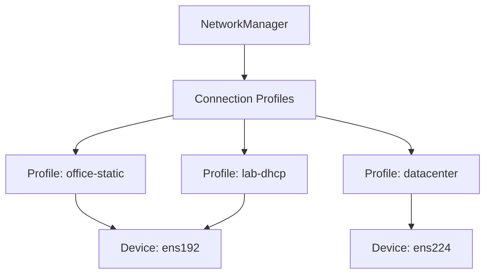

# How to Create and Modify NetworkManager Connection Profiles on RHEL 9

Author: [nawazdhandala](https://www.github.com/nawazdhandala)

Tags: RHEL, NetworkManager, Connection Profiles, Linux

Description: Learn how to create, modify, clone, and manage NetworkManager connection profiles on RHEL 9, including keyfile format details and best practices for profile management.

---

NetworkManager on RHEL 9 uses connection profiles to define how network interfaces should be configured. Each profile is a set of properties that describe an IP configuration, DNS settings, security parameters, and more. Understanding how to create and manage these profiles is fundamental to RHEL 9 networking.

## What is a Connection Profile?

A connection profile is a collection of settings that NetworkManager applies to a network interface when the profile is activated. Profiles are stored as keyfiles (`.nmconnection` files) in `/etc/NetworkManager/system-connections/`.

Key things to understand:

- A single device (like `ens192`) can have multiple connection profiles
- Only one profile per device can be active at a time
- Profiles persist across reboots
- Profiles are independent of the device they are configured for



## Creating Connection Profiles

### Using nmcli

The most common way to create profiles from the command line:

```bash
# Create a basic ethernet profile with DHCP
nmcli connection add \
  con-name "office-dhcp" \
  ifname ens192 \
  type ethernet

# Create a profile with static IP configuration
nmcli connection add \
  con-name "office-static" \
  ifname ens192 \
  type ethernet \
  ipv4.method manual \
  ipv4.addresses 10.0.1.50/24 \
  ipv4.gateway 10.0.1.1 \
  ipv4.dns "10.0.1.2"

# Create a profile without binding to a specific interface
nmcli connection add \
  con-name "portable-config" \
  type ethernet \
  ipv4.method auto
```

The last example creates a profile that is not tied to any specific interface name. This is useful for configurations that might be applied to different hardware.

### By Writing a Keyfile Directly

You can also create connection profiles by writing keyfiles directly. This is useful for templating and configuration management:

```bash
# Create a keyfile manually
cat > /etc/NetworkManager/system-connections/datacenter.nmconnection << 'EOF'
[connection]
id=datacenter
type=ethernet
interface-name=ens192
autoconnect=true
autoconnect-priority=10

[ipv4]
method=manual
address1=10.10.0.50/24,10.10.0.1
dns=10.10.0.2;10.10.0.3;
dns-search=dc.example.com;

[ipv6]
method=disabled

[proxy]
EOF

# Set proper permissions (required for NetworkManager to read the file)
chmod 600 /etc/NetworkManager/system-connections/datacenter.nmconnection

# Tell NetworkManager to load the new profile
nmcli connection load /etc/NetworkManager/system-connections/datacenter.nmconnection
```

The file permissions must be 600 (owner read/write only). NetworkManager will refuse to load files with more permissive settings because they may contain sensitive data like Wi-Fi passwords or 802.1X credentials.

## Modifying Connection Profiles

### Changing Properties with nmcli

```bash
# Change the IP address
nmcli connection modify office-static ipv4.addresses 10.0.1.51/24

# Change the gateway
nmcli connection modify office-static ipv4.gateway 10.0.1.254

# Add a DNS server to the existing list
nmcli connection modify office-static +ipv4.dns "10.0.1.3"

# Remove a DNS server from the list
nmcli connection modify office-static -ipv4.dns "10.0.1.2"

# Change multiple properties at once
nmcli connection modify office-static \
  ipv4.addresses 10.0.1.52/24 \
  ipv4.gateway 10.0.1.254 \
  ipv4.dns "10.0.1.2,10.0.1.3" \
  connection.autoconnect yes
```

Remember that modifications are saved to disk immediately but are not applied to the running configuration until you reactivate the connection:

```bash
# Apply changes by reactivating the connection
nmcli connection up office-static
```

### Editing Keyfiles Directly

You can edit the `.nmconnection` file with any text editor:

```bash
# Edit the keyfile
vi /etc/NetworkManager/system-connections/office-static.nmconnection

# After editing, reload the profile
nmcli connection reload

# Or reload a specific file
nmcli connection load /etc/NetworkManager/system-connections/office-static.nmconnection
```

## Cloning Connection Profiles

Sometimes you want to create a new profile based on an existing one. nmcli makes this easy:

```bash
# Clone an existing connection profile
nmcli connection clone office-static office-static-backup

# The clone gets a new UUID but keeps all other settings
nmcli connection show office-static-backup
```

This is useful for creating backup configurations before making changes, or for creating variants of a base configuration.

## Managing Multiple Profiles per Interface

Having multiple profiles for the same interface lets you switch between configurations without retyping everything:

```bash
# Create two profiles for the same interface
nmcli connection add con-name "prod-network" ifname ens192 type ethernet \
  ipv4.method manual ipv4.addresses 10.0.1.50/24 ipv4.gateway 10.0.1.1

nmcli connection add con-name "mgmt-network" ifname ens192 type ethernet \
  ipv4.method manual ipv4.addresses 172.16.0.50/24 ipv4.gateway 172.16.0.1

# Switch between them
nmcli connection up prod-network
# ... later ...
nmcli connection up mgmt-network
```

### Setting Profile Priority

When multiple profiles exist for a device, the autoconnect-priority determines which one NetworkManager activates automatically:

```bash
# Set prod-network as the preferred auto-connect profile
nmcli connection modify prod-network connection.autoconnect-priority 100
nmcli connection modify mgmt-network connection.autoconnect-priority 50
```

Higher numbers mean higher priority.

## Inspecting Connection Profiles

### Listing All Properties

```bash
# Show all properties of a connection
nmcli connection show office-static

# Show only IPv4-related properties
nmcli -f ipv4 connection show office-static

# Show connection in terse format for scripting
nmcli -t -f ipv4.addresses,ipv4.gateway connection show office-static
```

### Comparing Profiles

To compare two connection profiles:

```bash
# Export both profiles and diff them
diff <(nmcli connection show prod-network) <(nmcli connection show mgmt-network)
```

## Renaming Connection Profiles

```bash
# Rename a connection profile
nmcli connection modify office-static connection.id "production-static"

# Verify the rename
nmcli connection show production-static
```

Note that renaming the connection only changes the `id` field. The filename on disk does not change automatically. If you want the filename to match, you need to rename the file and reload:

```bash
# Rename the file to match the new connection name
mv /etc/NetworkManager/system-connections/office-static.nmconnection \
   /etc/NetworkManager/system-connections/production-static.nmconnection

# Reload the profile
nmcli connection reload
```

## Connection Profile Sections

A keyfile has several sections, each controlling a different aspect of the connection:

```ini
[connection]
# General connection settings: name, type, autoconnect behavior
id=my-connection
type=ethernet
interface-name=ens192
autoconnect=true

[ipv4]
# IPv4 addressing: method, addresses, routes, DNS
method=manual
address1=10.0.1.50/24,10.0.1.1
dns=10.0.1.2;

[ipv6]
# IPv6 addressing configuration
method=auto

[ethernet]
# Ethernet-specific settings: MTU, MAC address, wake-on-LAN
mtu=9000

[proxy]
# Proxy settings (usually empty)
```

## Best Practices

**Use descriptive connection names.** Names like "ens192" tell you nothing about the purpose. Use names like "prod-app-network" or "mgmt-oob" instead.

**Set autoconnect-priority on all profiles.** If a device has multiple profiles without priorities, NetworkManager picks one based on internal heuristics. Explicit priorities prevent surprises.

**Back up profiles before changes.** Clone the profile or copy the keyfile before modifying it on production systems.

**Use `connection.zone` for firewall integration.** If you use firewalld, set the zone in the connection profile so the right rules are applied automatically:

```bash
# Assign a firewall zone to the connection
nmcli connection modify prod-network connection.zone internal
```

## Wrapping Up

Connection profiles are the building blocks of RHEL 9 networking. Whether you create them with nmcli, write them as keyfiles, or use nmtui, the result is the same: a `.nmconnection` file that NetworkManager uses to configure your interfaces. Mastering profile management gives you the flexibility to maintain multiple configurations, switch between them easily, and keep your network settings version-controlled and reproducible.
