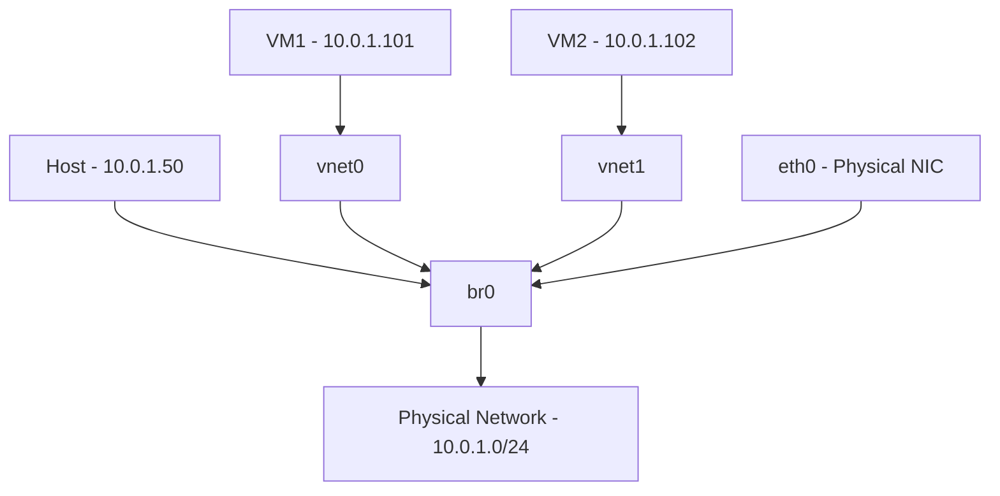

# How to Create a Network Bridge for KVM Virtual Machines on RHEL

Author: [nawazdhandala](https://www.github.com/nawazdhandala)

Tags: RHEL, Network Bridge, KVM, Virtualization, Linux

Description: Step-by-step guide to creating a network bridge on RHEL that lets KVM virtual machines appear directly on your physical network with their own IP addresses.

---

By default, KVM virtual machines use NAT networking through the virbr0 bridge that libvirt creates. This works fine for testing, but in production you usually want VMs to have their own IP addresses on the physical network, accessible from other machines on the LAN. For that, you need a network bridge attached to your physical NIC.

## How Bridged Networking Works



The bridge acts like a virtual switch. Your physical NIC and the virtual NICs from KVM VMs all connect to it. Traffic from VMs reaches the physical network directly, and the VMs get IP addresses from the same DHCP server (or static assignments) as physical machines.

## Prerequisites

- RHEL with KVM installed (qemu-kvm, libvirt)
- At least one physical NIC
- Root or sudo access
- Console access (recommended, since you are modifying the network config of the interface you are likely connected through)

```bash
# Verify KVM is installed
rpm -q qemu-kvm libvirt
systemctl status libvirtd
```

## Step 1: Identify Your Physical Interface

```bash
# List network devices
nmcli device status
```

Note the interface name (e.g., eth0, ens192, enp3s0) and its current IP configuration:

```bash
# Get the current IP, gateway, and DNS
nmcli connection show "Wired connection 1" | grep -E "ipv4.addresses|ipv4.gateway|ipv4.dns"
```

## Step 2: Create the Bridge

```bash
# Create a bridge interface
nmcli connection add type bridge con-name br0 ifname br0
```

## Step 3: Configure IP on the Bridge

Move the IP configuration from your physical NIC to the bridge:

```bash
# Set static IP on the bridge (use your actual values)
nmcli connection modify br0 ipv4.addresses 10.0.1.50/24
nmcli connection modify br0 ipv4.gateway 10.0.1.1
nmcli connection modify br0 ipv4.dns "10.0.1.1"
nmcli connection modify br0 ipv4.method manual
```

## Step 4: Add Physical NIC as Bridge Slave

```bash
# Add your physical NIC to the bridge
nmcli connection add type ethernet con-name br0-slave ifname eth0 master br0
```

## Step 5: Bring Up the Bridge

This is the step where your network will briefly disconnect if you are doing this over SSH. Have console access ready.

```bash
# Deactivate the old connection on the physical NIC
nmcli connection down "Wired connection 1"

# Optionally delete the old connection to avoid conflicts
nmcli connection delete "Wired connection 1"

# Bring up the bridge
nmcli connection up br0
```

## Step 6: Verify

```bash
# Check bridge status
nmcli device status

# Verify bridge has the correct IP
ip addr show br0

# Check bridge details
bridge link show

# Test connectivity
ping -c 4 10.0.1.1
```

## Step 7: Configure libvirt to Use the Bridge

Create a libvirt network definition that uses your bridge:

```bash
# Create a network XML definition
cat > /tmp/bridge-network.xml << 'XMLEOF'
<network>
  <name>br0-network</name>
  <forward mode="bridge"/>
  <bridge name="br0"/>
</network>
XMLEOF

# Define and start the network in libvirt
virsh net-define /tmp/bridge-network.xml
virsh net-start br0-network
virsh net-autostart br0-network
```

## Step 8: Launch a VM with Bridged Networking

When creating a VM, specify the bridge network:

```bash
# Using virt-install with the bridge
virt-install \
  --name testvm \
  --ram 2048 \
  --vcpus 2 \
  --disk path=/var/lib/libvirt/images/testvm.qcow2,size=20 \
  --os-variant rhel9.0 \
  --network bridge=br0 \
  --cdrom /path/to/rhel9.iso \
  --graphics vnc
```

Or modify an existing VM to use the bridge:

```bash
# Edit VM configuration
virsh edit testvm
```

Change the network interface section to:

```xml
<interface type='bridge'>
  <source bridge='br0'/>
  <model type='virtio'/>
</interface>
```

## Verify VM Networking

After the VM boots:

```bash
# Check that the VM's vnet interface is attached to the bridge
bridge link show

# From inside the VM, verify it has an IP on the physical network
# The VM should get a 10.0.1.x address from DHCP or you set one manually
```

## Firewall Considerations

If firewalld is running, you may need to allow bridge traffic:

```bash
# Add the bridge to the trusted zone to allow VM traffic
firewall-cmd --zone=trusted --change-interface=br0 --permanent
firewall-cmd --reload
```

Alternatively, if you want to filter VM traffic, keep the bridge in a zone with appropriate rules.

## Bridge with Multiple VMs

Each VM automatically gets a vnet interface attached to the bridge. No additional bridge configuration is needed per VM:

```bash
# After starting several VMs, check the bridge ports
bridge link show

# You should see vnet0, vnet1, etc. alongside your physical NIC
```

## Troubleshooting

**VMs cannot reach the network**: Check that the physical NIC is properly enslaved to the bridge:

```bash
bridge link show | grep eth0
```

**VMs cannot get DHCP**: Some switches block DHCP from unknown MAC addresses (port security). Check switch configuration.

**Host loses connectivity after creating bridge**: Make sure you moved the IP to the bridge and did not leave it on the physical NIC.

## Summary

Creating a network bridge for KVM on RHEL involves making a bridge interface, moving your IP config to it, enslaving your physical NIC, and telling libvirt about the new bridge. Once set up, every VM connected to the bridge gets direct access to your physical network. Plan for a brief network interruption during setup, and always have console access when modifying the network config of your management interface.
