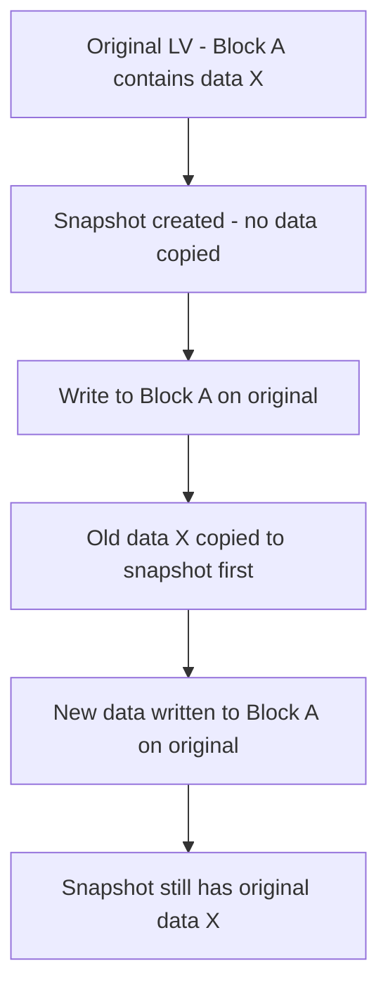

# How to Create and Restore LVM Snapshots on RHEL

Author: [nawazdhandala](https://www.github.com/nawazdhandala)

Tags: RHEL, LVM, Snapshots, Storage, Linux

Description: Learn how to create, manage, and restore LVM snapshots on RHEL for quick backups, safe upgrades, and easy rollbacks.

---

LVM snapshots are one of the most useful features for sysadmins who need a quick point-in-time copy before making risky changes. Upgrading an application? Take a snapshot first. Running a database migration? Snapshot. Testing a new kernel? Snapshot. If things go wrong, you can roll back in seconds.

## How LVM Snapshots Work

A traditional (thick) LVM snapshot uses copy-on-write (COW). When you create a snapshot, no data is copied initially. As the original volume changes, the old data is copied to the snapshot before being overwritten.



The snapshot only grows as the original volume changes. This makes creation instant and space-efficient.

## Prerequisites

Check your volume group for free space:

```bash
# Show volume groups with free space
vgs
```

You need free space in the VG for the snapshot. The amount depends on how much data will change while the snapshot exists.

## Creating a Snapshot

### Basic Snapshot

```bash
# Create a 5 GB snapshot of the data LV
lvcreate -L 5G -s -n data_snap /dev/vg_data/lv_data
```

The flags:
- `-L 5G` - allocate 5 GB for the snapshot
- `-s` - this is a snapshot
- `-n data_snap` - name it data_snap
- The last argument is the origin volume

### Verify the Snapshot

```bash
# Show snapshot details
lvs -o lv_name,lv_size,origin,snap_percent vg_data
```

The `snap_percent` column shows how full the snapshot is. If it reaches 100%, the snapshot becomes invalid and must be removed.

## Sizing the Snapshot

The snapshot needs to be large enough to hold all the changes made to the origin while the snapshot exists:

- Quick operations (minutes): 5-10% of origin size
- Database backups (hours): 20-50% of origin size
- Multi-day snapshots: 50-100% of origin size

```bash
# Create a snapshot sized at 20% of the origin
ORIGIN_SIZE=$(lvs --noheadings -o lv_size --units g /dev/vg_data/lv_data | tr -d ' ')
SNAP_SIZE=$(echo "$ORIGIN_SIZE * 0.2" | bc)
lvcreate -L "${SNAP_SIZE}G" -s -n data_snap /dev/vg_data/lv_data
```

## Mounting a Snapshot

Snapshots can be mounted read-only or read-write:

```bash
# Mount snapshot read-only to browse or backup from it
mkdir -p /mnt/snapshot
mount -o ro /dev/vg_data/data_snap /mnt/snapshot
```

For XFS, use `nouuid` to avoid UUID conflicts:

```bash
# Mount XFS snapshot (needs nouuid to avoid conflict)
mount -o ro,nouuid /dev/vg_data/data_snap /mnt/snapshot
```

## Backing Up from a Snapshot

This is the classic use case - take a consistent snapshot, then back up from it while the original stays online:

```bash
# Create snapshot
lvcreate -L 10G -s -n backup_snap /dev/vg_data/lv_data

# Mount it
mount -o ro,nouuid /dev/vg_data/backup_snap /mnt/snapshot

# Back up from the snapshot
tar czf /backup/data-$(date +%Y%m%d).tar.gz -C /mnt/snapshot .

# Clean up
umount /mnt/snapshot
lvremove -f /dev/vg_data/backup_snap
```

## Restoring from a Snapshot

### Method 1: Merge the Snapshot Back

This reverts the original volume to the snapshot's point-in-time state:

```bash
# Unmount the original filesystem
umount /data

# Merge the snapshot back into the original
lvconvert --merge /dev/vg_data/data_snap
```

If the origin is the root filesystem or otherwise in use, the merge will happen at the next reboot:

```bash
# For root filesystem, the merge happens on next boot
lvconvert --merge /dev/vg_data/root_snap
reboot
```

After the merge, the snapshot volume is automatically removed.

### Method 2: Copy Files from Snapshot

If you only need to restore specific files:

```bash
# Mount the snapshot
mount -o ro,nouuid /dev/vg_data/data_snap /mnt/snapshot

# Copy specific files back
cp /mnt/snapshot/etc/app.conf /data/etc/app.conf

# Clean up
umount /mnt/snapshot
```

## Monitoring Snapshot Usage

Watch the snapshot fill percentage:

```bash
# Check snapshot usage
lvs -o lv_name,origin,snap_percent,lv_size
```

Set up an alert for snapshots getting full:

```bash
#!/bin/bash
# /usr/local/bin/snapshot-alert.sh
THRESHOLD=80

lvs --noheadings -o lv_name,snap_percent --select 'lv_attr=~[^-]s' 2>/dev/null | while read -r NAME PERCENT; do
    PERCENT_INT=${PERCENT%.*}
    if [ "$PERCENT_INT" -ge "$THRESHOLD" ] 2>/dev/null; then
        logger -p user.crit "SNAPSHOT ALERT: $NAME is ${PERCENT}% full"
    fi
done
```

## Extending a Snapshot

If a snapshot is running out of space:

```bash
# Extend the snapshot by 5 GB
lvextend -L +5G /dev/vg_data/data_snap
```

## Removing a Snapshot

When you no longer need the snapshot:

```bash
# Unmount first if mounted
umount /mnt/snapshot 2>/dev/null

# Remove the snapshot
lvremove /dev/vg_data/data_snap
```

## Practical Workflow: Safe Application Upgrade

```bash
# 1. Take snapshot before upgrade
lvcreate -L 10G -s -n pre_upgrade /dev/vg_data/lv_data

# 2. Perform the upgrade
dnf update myapp

# 3. Test the application
systemctl restart myapp
curl http://localhost:8080/health

# 4a. If everything works, remove the snapshot
lvremove -f /dev/vg_data/pre_upgrade

# 4b. If something is wrong, roll back
systemctl stop myapp
umount /data
lvconvert --merge /dev/vg_data/pre_upgrade
mount /data
systemctl start myapp
```

## Limitations

- Snapshots degrade performance on the origin volume (COW overhead on every write)
- If the snapshot fills up, it becomes invalid and unusable
- Traditional snapshots are "thick" and require upfront space allocation
- For long-lived snapshots, consider thin snapshots instead (covered in another post)

## Summary

LVM snapshots on RHEL give you instant rollback capability. Create them before risky operations, back up from them for consistent copies, and merge them to roll back changes. Size them appropriately (20-50% of origin for most use cases), monitor their fill percentage, and remove them promptly when no longer needed to avoid performance impact.
