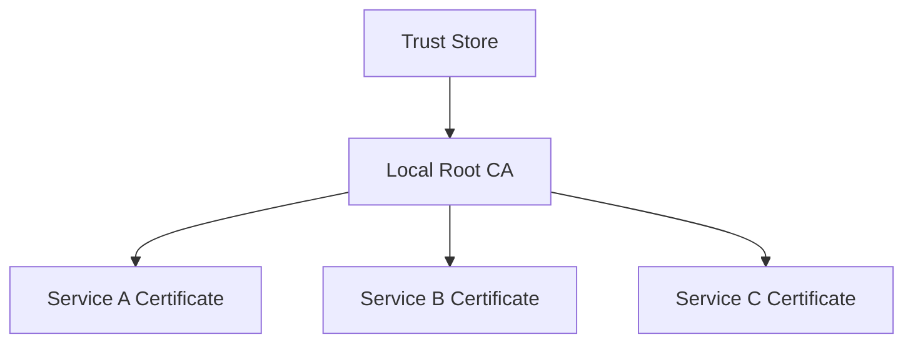

# How to Create Self-Signed SSL Certificates with OpenSSL on RHEL

Author: [nawazdhandala](https://www.github.com/nawazdhandala)

Tags: RHEL, OpenSSL, Self-Signed, SSL, Linux

Description: Step-by-step guide to generating self-signed SSL/TLS certificates using OpenSSL on RHEL for development, testing, and internal services.

---

Not every service needs a publicly trusted certificate. Internal tools, development environments, lab setups, and services behind a VPN are all cases where a self-signed certificate works fine. On RHEL, OpenSSL is already installed, so you can generate certificates in seconds.

This post covers generating self-signed certificates, creating certificates with a local CA, and configuring services to use them.

## When to Use Self-Signed Certificates

Self-signed certificates are appropriate for:

- Development and staging environments
- Internal services that never face the public internet
- Lab and testing setups
- Inter-service communication behind a load balancer that terminates public TLS

They are NOT appropriate for anything public-facing. Browsers will show warnings, and clients will reject them unless you explicitly add the certificate to their trust stores.

## Generating a Basic Self-Signed Certificate

The simplest approach, one command that creates both the private key and certificate:

```bash
# Generate a self-signed certificate valid for 365 days
openssl req -x509 -newkey rsa:4096 -keyout server.key -out server.crt -days 365 -nodes -subj "/C=US/ST=California/L=San Francisco/O=MyOrg/CN=myserver.internal"
```

Breaking down the flags:

- `-x509` tells OpenSSL to output a self-signed certificate instead of a CSR
- `-newkey rsa:4096` generates a new 4096-bit RSA key
- `-keyout server.key` writes the private key to this file
- `-out server.crt` writes the certificate to this file
- `-days 365` sets the validity period
- `-nodes` means no DES encryption on the private key (so services can read it without a passphrase)
- `-subj` sets the subject fields inline so you are not prompted interactively

## Generating with Subject Alternative Names

Modern TLS validation requires Subject Alternative Names (SANs). The Common Name (CN) field alone is not enough for most clients. Here is how to include SANs:

```bash
# Generate a certificate with SANs for multiple hostnames and IPs
openssl req -x509 -newkey rsa:4096 -keyout server.key -out server.crt -days 365 -nodes \
  -subj "/C=US/ST=California/O=MyOrg/CN=myserver.internal" \
  -addext "subjectAltName=DNS:myserver.internal,DNS:myserver.local,IP:192.168.1.100"
```

The `-addext` flag (available in OpenSSL 1.1.1+, which ships with RHEL) lets you add extensions directly on the command line.

## Step-by-Step: Key, CSR, and Certificate Separately

Sometimes you want more control over each step. Here is the full breakdown:

### Step 1: Generate the Private Key

```bash
# Create a 4096-bit RSA private key
openssl genrsa -out server.key 4096
```

### Step 2: Create a Certificate Signing Request

```bash
# Generate a CSR from the private key
openssl req -new -key server.key -out server.csr -subj "/C=US/ST=California/O=MyOrg/CN=myserver.internal"
```

### Step 3: Self-Sign the CSR

```bash
# Sign the CSR to produce a self-signed certificate
openssl x509 -req -in server.csr -signkey server.key -out server.crt -days 365 \
  -extfile <(echo "subjectAltName=DNS:myserver.internal,IP:192.168.1.100")
```

## Creating a Local Certificate Authority

For environments with multiple internal services, creating your own CA is better than giving each service its own self-signed cert. You distribute the CA certificate once, and every certificate signed by it is trusted.



### Create the CA Key and Certificate

```bash
# Generate the CA private key
openssl genrsa -out ca.key 4096

# Create the CA certificate, valid for 10 years
openssl req -x509 -new -key ca.key -out ca.crt -days 3650 -subj "/C=US/ST=California/O=MyOrg/CN=MyOrg Internal CA"
```

### Sign a Server Certificate with Your CA

```bash
# Generate a key and CSR for the server
openssl genrsa -out webapp.key 4096
openssl req -new -key webapp.key -out webapp.csr -subj "/C=US/O=MyOrg/CN=webapp.internal"

# Sign the CSR with the CA, including SANs
openssl x509 -req -in webapp.csr -CA ca.crt -CAkey ca.key -CAcreateserial \
  -out webapp.crt -days 365 \
  -extfile <(echo "subjectAltName=DNS:webapp.internal,DNS:webapp.local")
```

The `-CAcreateserial` flag creates a serial number file on first use.

## Inspecting Certificates

Always verify what you generated:

```bash
# View the certificate details
openssl x509 -in server.crt -noout -text
```

Check just the dates:

```bash
# Show the validity period
openssl x509 -in server.crt -noout -dates
```

Check the SANs:

```bash
# Display Subject Alternative Names
openssl x509 -in server.crt -noout -ext subjectAltName
```

Verify a certificate against a CA:

```bash
# Verify that the server cert was signed by the CA
openssl verify -CAfile ca.crt webapp.crt
```

## Using Self-Signed Certificates with Apache

```bash
# Install mod_ssl if not already present
sudo dnf install mod_ssl
```

Copy the certificate files:

```bash
# Place cert files in standard locations
sudo cp server.crt /etc/pki/tls/certs/server.crt
sudo cp server.key /etc/pki/tls/private/server.key
sudo chmod 600 /etc/pki/tls/private/server.key
```

Edit the SSL configuration:

```bash
# Update the SSL paths in the Apache SSL config
sudo vi /etc/httpd/conf.d/ssl.conf
```

Set these directives:

```apache
SSLCertificateFile /etc/pki/tls/certs/server.crt
SSLCertificateKeyFile /etc/pki/tls/private/server.key
```

Restart Apache:

```bash
# Apply the new SSL configuration
sudo systemctl restart httpd
```

## Using Self-Signed Certificates with Nginx

```nginx
server {
    listen 443 ssl;
    server_name myserver.internal;

    ssl_certificate /etc/pki/tls/certs/server.crt;
    ssl_certificate_key /etc/pki/tls/private/server.key;

    # Strong TLS settings
    ssl_protocols TLSv1.2 TLSv1.3;
    ssl_prefer_server_ciphers on;
}
```

```bash
# Test and reload Nginx
sudo nginx -t && sudo systemctl reload nginx
```

## SELinux Considerations

RHEL runs SELinux in enforcing mode by default. Your certificate files need the right context:

```bash
# Restore SELinux contexts on certificate files
sudo restorecon -Rv /etc/pki/tls/certs/
sudo restorecon -Rv /etc/pki/tls/private/
```

If you store certificates in a non-standard path, set the correct SELinux type:

```bash
# Set the cert_t context for a custom certificate location
sudo semanage fcontext -a -t cert_t "/opt/certs(/.*)?"
sudo restorecon -Rv /opt/certs/
```

## Elliptic Curve Keys (Faster Alternative to RSA)

If you want smaller keys with equivalent security, use ECDSA:

```bash
# Generate a self-signed certificate with an ECDSA key
openssl req -x509 -newkey ec -pkeyopt ec_paramgen_curve:P-256 \
  -keyout server-ec.key -out server-ec.crt -days 365 -nodes \
  -subj "/C=US/O=MyOrg/CN=myserver.internal" \
  -addext "subjectAltName=DNS:myserver.internal"
```

A P-256 ECDSA key provides roughly the same security as a 3072-bit RSA key but with faster handshakes.

## Wrapping Up

Self-signed certificates are a perfectly valid tool when used appropriately. Generate them with proper SANs, use a local CA if you have more than a couple of services, and never use them for anything the public touches. Keep your private keys locked down and your SELinux contexts correct, and you will have no trouble.
