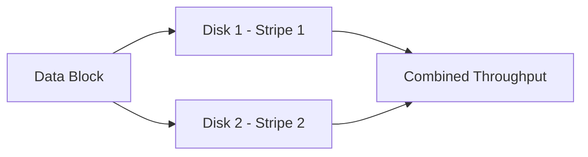

# How to Create a Software RAID 0 (Stripe) Array with mdadm on RHEL

Author: [nawazdhandala](https://www.github.com/nawazdhandala)

Tags: RHEL, RAID 0, mdadm, Storage, Linux

Description: Learn how to set up a software RAID 0 striped array using mdadm on RHEL for maximum disk throughput when redundancy is not required.

---

## Why RAID 0?

RAID 0 stripes data across multiple disks without any redundancy. Every read and write gets spread across all drives in the array, which gives you roughly linear performance scaling. The catch is obvious: if any single disk fails, you lose everything. I use RAID 0 for scratch space, temporary build directories, and workloads where the data can be regenerated easily.

On RHEL, mdadm is still the go-to tool for software RAID. It ships in the base repositories and integrates well with systemd and the initramfs tooling.

## Prerequisites

- RHEL with a valid subscription or local repo configured
- At least two unused block devices (e.g., /dev/sdb, /dev/sdc)
- Root or sudo access

## Step 1 - Install mdadm

Install the mdadm package if it is not already present.

```bash
# Install mdadm from the base RHEL repos
sudo dnf install -y mdadm
```

## Step 2 - Identify Your Disks

Before touching anything, verify which disks are free. Never assume disk names stay the same across reboots.

```bash
# List all block devices with their sizes and mount points
lsblk -o NAME,SIZE,TYPE,MOUNTPOINT
```

Make sure the disks you plan to use have no existing partitions or data you care about. You can also check with:

```bash
# Show partition tables for the target disks
sudo fdisk -l /dev/sdb /dev/sdc
```

## Step 3 - Wipe Existing Signatures

If the disks were previously used, clear any leftover filesystem or RAID signatures.

```bash
# Remove all filesystem and RAID superblock signatures
sudo wipefs -a /dev/sdb
sudo wipefs -a /dev/sdc
```

## Step 4 - Create the RAID 0 Array

Now create the striped array. The `-l 0` flag specifies RAID level 0, and `-n 2` tells mdadm there are two devices.

```bash
# Create a RAID 0 array named /dev/md0 with two disks
sudo mdadm --create /dev/md0 --level=0 --raid-devices=2 /dev/sdb /dev/sdc
```

mdadm will ask for confirmation. Type `y` to proceed. You should see output confirming the array was started.

Verify the array is active:

```bash
# Check the status of the new RAID array
cat /proc/mdstat
```

You should see something like:

```
md0 : active raid0 sdc[1] sdb[0]
      2093056 blocks super 1.2 512k chunks
```

## Step 5 - Create a Filesystem

The array is now a single block device at /dev/md0. Format it with xfs, which is the default filesystem on RHEL.

```bash
# Create an XFS filesystem on the RAID 0 array
sudo mkfs.xfs /dev/md0
```

## Step 6 - Mount the Array

Create a mount point and mount it.

```bash
# Create the mount point directory
sudo mkdir -p /mnt/raid0

# Mount the array
sudo mount /dev/md0 /mnt/raid0

# Verify the mount
df -h /mnt/raid0
```

## Step 7 - Save the RAID Configuration

This is the step people forget. Without saving the configuration, the array may not reassemble automatically on reboot.

```bash
# Scan for active arrays and append to mdadm.conf
sudo mdadm --detail --scan | sudo tee -a /etc/mdadm.conf
```

Then rebuild the initramfs so the array gets assembled during early boot:

```bash
# Regenerate the initramfs to include RAID config
sudo dracut --regenerate-all --force
```

## Step 8 - Add a Persistent fstab Entry

Use the UUID rather than the device name for reliability.

```bash
# Get the UUID of the RAID array
sudo blkid /dev/md0
```

Add the entry to /etc/fstab:

```bash
# Append the mount entry using the array UUID
echo "UUID=<your-uuid-here>  /mnt/raid0  xfs  defaults  0 0" | sudo tee -a /etc/fstab
```

Test the fstab entry without rebooting:

```bash
# Unmount and remount using fstab to verify
sudo umount /mnt/raid0
sudo mount -a
df -h /mnt/raid0
```

## Understanding RAID 0 Chunk Size

The default chunk size for mdadm RAID 0 is 512K. You can customize it at creation time with the `--chunk` option.

```bash
# Example: create RAID 0 with 256K chunk size
sudo mdadm --create /dev/md0 --level=0 --raid-devices=2 --chunk=256 /dev/sdb /dev/sdc
```

Smaller chunks spread small I/O across more disks, which can help with random read workloads. Larger chunks reduce overhead for sequential I/O. For most general-purpose workloads, the default 512K is fine.

## Verifying Array Details

You can inspect the full array configuration at any time:

```bash
# Show detailed information about the RAID array
sudo mdadm --detail /dev/md0
```

This shows the RAID level, chunk size, array size, state, and the member devices with their roles.

## Performance Considerations

RAID 0 throughput scales roughly with the number of disks. Two disks give you about 2x the throughput of a single disk for sequential operations. However, keep in mind:

- IOPS improvement depends on the workload pattern and chunk size
- The failure probability increases with each additional disk
- There is no rebuild capability, so backups are essential



## Removing the Array

If you need to tear down the RAID 0 array later:

```bash
# Unmount the array
sudo umount /mnt/raid0

# Stop the array
sudo mdadm --stop /dev/md0

# Zero the superblocks on each member disk
sudo mdadm --zero-superblock /dev/sdb
sudo mdadm --zero-superblock /dev/sdc
```

Remember to also remove the corresponding entries from /etc/mdadm.conf and /etc/fstab.

## Wrap-Up

RAID 0 with mdadm on RHEL is straightforward. Create the array, format it, save the config, and add it to fstab. Just remember that you are trading all redundancy for speed, so keep backups of anything important. For production data, look at RAID 1, RAID 5, or RAID 10 instead.
