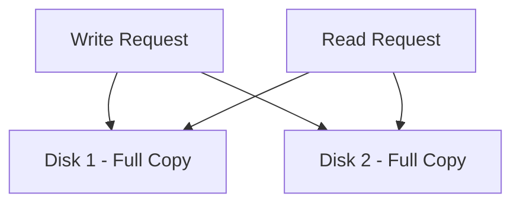

# How to Create a Software RAID 1 (Mirror) Array with mdadm on RHEL

Author: [nawazdhandala](https://www.github.com/nawazdhandala)

Tags: RHEL, RAID 1, Mdadm, Storage, Linux

Description: A hands-on guide to creating a software RAID 1 mirror with mdadm on RHEL, giving you real-time disk redundancy for critical data.

---

## What RAID 1 Does

RAID 1 mirrors data across two or more disks. Every write goes to all member drives simultaneously, so if one disk dies, the other has a complete copy. Read performance can improve since the kernel can read from either drive, but write performance stays roughly the same as a single disk because both drives must complete every write.

This is the simplest form of redundancy and works well for boot drives, small database volumes, and any scenario where you want a straightforward safety net.

## Prerequisites

- RHEL with root or sudo access
- At least two unused disks of equal (or near-equal) size
- mdadm installed

## Step 1 - Install mdadm

```bash
# Install the mdadm package
sudo dnf install -y mdadm
```

## Step 2 - Prepare the Disks

Identify your target disks and clear any old signatures.

```bash
# List block devices to identify unused disks
lsblk -o NAME,SIZE,TYPE,FSTYPE,MOUNTPOINT

# Wipe existing signatures on both disks
sudo wipefs -a /dev/sdb
sudo wipefs -a /dev/sdc
```

## Step 3 - Create the RAID 1 Array

The `-l 1` flag sets the RAID level to 1 (mirror).

```bash
# Create a two-disk RAID 1 mirror
sudo mdadm --create /dev/md1 --level=1 --raid-devices=2 /dev/sdb /dev/sdc
```

Confirm when prompted. Then check the sync status:

```bash
# Watch the initial sync progress
cat /proc/mdstat
```

The initial resync can take a while depending on disk size. You can still use the array while it syncs, but performance will be lower until it finishes.

```bash
# Get detailed array info including sync progress
sudo mdadm --detail /dev/md1
```

## Step 4 - Create a Filesystem and Mount

```bash
# Format the mirror with XFS
sudo mkfs.xfs /dev/md1

# Create mount point and mount
sudo mkdir -p /mnt/raid1
sudo mount /dev/md1 /mnt/raid1

# Verify
df -h /mnt/raid1
```

## Step 5 - Persist the Configuration

Save the array definition so it survives reboots.

```bash
# Save RAID config to mdadm.conf
sudo mdadm --detail --scan | sudo tee -a /etc/mdadm.conf

# Rebuild initramfs with RAID support
sudo dracut --regenerate-all --force
```

Add an fstab entry for automatic mounting:

```bash
# Get the UUID
sudo blkid /dev/md1

# Add to fstab (replace <uuid> with actual UUID)
echo "UUID=<uuid>  /mnt/raid1  xfs  defaults  0 0" | sudo tee -a /etc/fstab
```

## How Mirroring Works



Both disks hold identical data. The kernel's RAID 1 driver can distribute reads across both disks, giving a modest read speed boost. Writes go to both, so write speed matches the slower of the two drives.

## Simulating a Disk Failure

It is good practice to test failure scenarios before you actually need the array to save you.

```bash
# Mark a disk as faulty (simulates a failure)
sudo mdadm --manage /dev/md1 --fail /dev/sdc

# Check the degraded state
cat /proc/mdstat
sudo mdadm --detail /dev/md1
```

The array will continue running in degraded mode with one disk.

## Recovering from a Failure

After replacing the failed physical disk, add the new disk to the array.

```bash
# Remove the failed disk from the array
sudo mdadm --manage /dev/md1 --remove /dev/sdc

# Add the replacement disk
sudo mdadm --manage /dev/md1 --add /dev/sdc

# Watch the rebuild progress
watch cat /proc/mdstat
```

The array will automatically start resyncing the new disk.

## RAID 1 with More Than Two Disks

mdadm supports RAID 1 with three or more disks. This gives you extra redundancy at the cost of more storage.

```bash
# Create a three-disk RAID 1 (can survive two disk failures)
sudo mdadm --create /dev/md1 --level=1 --raid-devices=3 /dev/sdb /dev/sdc /dev/sdd
```

## Monitoring the Array

Set up a quick check with mdadm's built-in monitor:

```bash
# Check array status
sudo mdadm --detail /dev/md1 | grep -E "State|Devices"
```

For ongoing monitoring, see the dedicated monitoring post in this series.

## Performance Notes

RAID 1 is not about speed, it is about safety. Some real-world observations:

- Sequential reads can approach 2x single-disk speed because both disks serve data
- Write throughput is limited to the speed of the slower drive
- Random read IOPS can improve since requests get distributed
- Usable capacity is the size of one disk regardless of how many mirrors you have

## Removing the Array

```bash
# Unmount
sudo umount /mnt/raid1

# Stop the array
sudo mdadm --stop /dev/md1

# Clear superblocks
sudo mdadm --zero-superblock /dev/sdb
sudo mdadm --zero-superblock /dev/sdc
```

Clean up /etc/mdadm.conf and /etc/fstab as well.

## Wrap-Up

RAID 1 is the easiest way to protect against single-disk failure on RHEL. The setup is simple, recovery is straightforward, and the performance trade-off is minimal for most workloads. For anything storing data you cannot afford to lose, a mirror is the minimum level of protection you should have, ideally combined with regular off-site backups.
