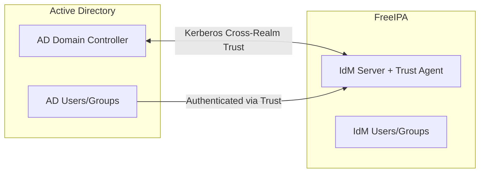

# How to Configure Cross-Realm Kerberos Trust Between FreeIPA and Active Directory

Author: [nawazdhandala](https://www.github.com/nawazdhandala)

Tags: RHEL, Kerberos, FreeIPA, Active Directory, Trust, Linux

Description: A comprehensive guide to establishing a cross-realm Kerberos trust between FreeIPA (IdM) and Active Directory, enabling AD users to access Linux resources without separate accounts.

---

A cross-realm trust between FreeIPA and Active Directory lets AD users access Linux resources managed by IdM without needing separate Linux accounts. The trust is built on Kerberos cross-realm authentication and uses Samba components on the FreeIPA side to communicate with AD. Once established, AD users and groups can be referenced in IdM HBAC rules, sudo rules, and file permissions.

## Trust Architecture



## Prerequisites

Before setting up the trust, verify these requirements:

- FreeIPA server with integrated DNS and CA
- Active Directory domain functional level of Windows Server 2012 or later
- Unique NetBIOS names for both domains
- Non-overlapping IP ranges and DNS namespaces
- DNS forwarding between IdM and AD DNS
- Ports 88, 464, 389, 636, 135, 138, 139, 445, 1024-1300 open between IdM and AD

## Step 1 - Prepare DNS

Both sides need to resolve each other's domains. Set up DNS forwarding.

On the FreeIPA server (if using IdM-integrated DNS):

```bash
# Add a DNS forward zone for the AD domain
ipa dnsforwardzone-add ad.example.com \
  --forwarder=10.0.0.10 \
  --forward-policy=only

# Verify forward resolution works
dig dc1.ad.example.com
```

On the AD DNS server, add a conditional forwarder for the IdM domain pointing to the IdM server's IP.

Verify bidirectional DNS resolution:

```bash
# From IdM server, resolve AD
host dc1.ad.example.com

# Verify SRV records for AD
dig _ldap._tcp.ad.example.com SRV

# Verify IdM SRV records resolve from AD (test from an AD-joined machine)
# nslookup _ldap._tcp.ipa.example.com
```

## Step 2 - Install Trust Packages on the IdM Server

```bash
# Install the trust components
sudo dnf install ipa-server-trust-ad -y

# Run the trust preparation
sudo ipa-adtrust-install
```

The `ipa-adtrust-install` command will:
- Configure Samba services on the IdM server
- Set the NetBIOS name for the IdM domain
- Generate the SID for the IdM domain
- Configure the necessary DNS SRV records

You will be prompted for the IdM Directory Manager password and the NetBIOS name.

## Step 3 - Establish the Trust

```bash
# Create a one-way trust (AD trusts IdM, but not the reverse)
# This means AD users can access IdM resources
ipa trust-add --type=ad ad.example.com --admin=Administrator --password

# Or create a two-way trust
ipa trust-add --type=ad ad.example.com \
  --admin=Administrator \
  --password \
  --two-way=true
```

You will be prompted for the AD Administrator password.

Verify the trust:

```bash
# List established trusts
ipa trust-find

# Show trust details
ipa trust-show ad.example.com

# Verify the trust from the IdM side
ipa trustdomain-find ad.example.com
```

## Step 4 - Verify AD User Resolution

After the trust is established, AD users should be resolvable on IdM-enrolled clients.

```bash
# Look up an AD user from an IdM client
id aduser@ad.example.com

# Look up an AD group
getent group "Domain Users@ad.example.com"
```

## Step 5 - Create ID Ranges

IdM maps AD SIDs to POSIX UIDs/GIDs using ID ranges. The default range is created automatically, but you can customize it.

```bash
# View existing ID ranges
ipa idrange-find

# Show the AD trust range details
ipa idrange-show "AD.EXAMPLE.COM_id_range"
```

If you need to adjust the range (for example, to avoid UID collisions):

```bash
# Modify the ID range
ipa idrange-mod "AD.EXAMPLE.COM_id_range" \
  --base-id=200000 \
  --range-size=200000
```

## Step 6 - Configure Access Control for AD Users

Use HBAC (Host-Based Access Control) rules to control which AD users can log into which IdM-enrolled machines.

```bash
# Create an external group that references an AD group
ipa group-add ad_linux_admins --external

# Add the AD group to the external group
ipa group-add-member ad_linux_admins \
  --external="Linux Admins@ad.example.com"

# Create an IdM POSIX group and nest the external group
ipa group-add linux_admins
ipa group-add-member linux_admins --groups=ad_linux_admins

# Create an HBAC rule
ipa hbacrule-add allow_ad_admins
ipa hbacrule-add-user allow_ad_admins --groups=linux_admins
ipa hbacrule-add-host allow_ad_admins --hostgroups=linux_servers
ipa hbacrule-add-service allow_ad_admins --hbacsvcs=sshd --hbacsvcs=login
```

## Step 7 - Configure Sudo for AD Users

```bash
# Create a sudo rule for the AD admin group
ipa sudorule-add ad_admin_sudo
ipa sudorule-add-user ad_admin_sudo --groups=linux_admins
ipa sudorule-mod ad_admin_sudo --cmdcat=all
ipa sudorule-add-host ad_admin_sudo --hostgroups=linux_servers
```

## Troubleshooting

### Trust Establishment Fails

```bash
# Check Samba services
sudo systemctl status smb
sudo systemctl status winbind

# Verify DNS resolution
dig _ldap._tcp.ad.example.com SRV
dig _kerberos._tcp.ad.example.com SRV

# Check the Samba log
sudo tail -f /var/log/samba/log.smbd
```

### AD Users Not Resolving

```bash
# Clear SSSD cache on the client
sudo sss_cache -E
sudo systemctl restart sssd

# Test with higher debug level
sudo sssctl debug-level 6
id aduser@ad.example.com
sudo journalctl -u sssd -f
```

### SID-to-UID Mapping Issues

```bash
# Check the ID range
ipa idrange-find

# Verify a specific user's mapping
ipa trust-resolve --sids=S-1-5-21-xxxx-yyyy-zzzz-1234
```

Cross-realm trusts are the cleanest way to integrate FreeIPA and Active Directory. They let you manage Linux access centrally through IdM while leveraging existing AD identities. The setup requires careful DNS planning, but once the trust is established, it is low maintenance.
