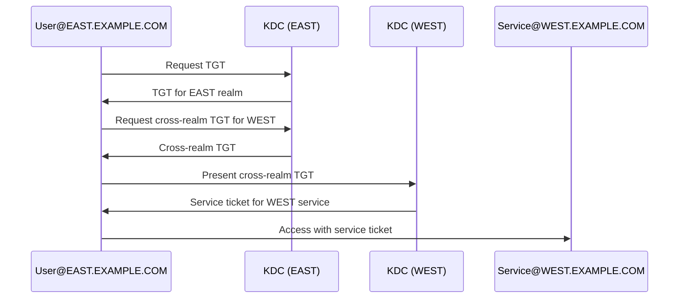

# How to Set Up Cross-Realm Kerberos Trust on RHEL 9

Author: [nawazdhandala](https://www.github.com/nawazdhandala)

Tags: RHEL, Kerberos, Cross-Realm Trust, Authentication, Linux

Description: A step-by-step guide to establishing Kerberos cross-realm trust between two Kerberos realms on RHEL 9 for seamless authentication.

---

When your organization has multiple Kerberos realms, users in one realm may need to access services in another. Cross-realm trust lets this happen without requiring separate accounts in each realm. This guide covers setting up both one-way and two-way trust between Kerberos realms on RHEL 9.

## How Cross-Realm Trust Works



Two realms trust each other by sharing a common key for a special cross-realm principal (called `krbtgt`).

## Prerequisites

You need:
- Two functioning Kerberos KDCs, one for each realm
- Administrative access to both KDCs
- Network connectivity between the KDCs and all clients

For this guide, the two realms are `EAST.EXAMPLE.COM` and `WEST.EXAMPLE.COM`.

## Creating Cross-Realm Principals

On both KDCs, create the cross-realm trust principals. These are `krbtgt` principals that encode the trust relationship.

On the EAST KDC:

```bash
sudo kadmin.local

# Create the trust principal for EAST to WEST
addprinc -requires_preauth krbtgt/WEST.EXAMPLE.COM@EAST.EXAMPLE.COM

# Enter a strong shared password when prompted
# This password must be IDENTICAL on both KDCs

# For two-way trust, also create the reverse
addprinc -requires_preauth krbtgt/EAST.EXAMPLE.COM@WEST.EXAMPLE.COM

quit
```

On the WEST KDC:

```bash
sudo kadmin.local

# Create the matching trust principal
addprinc -requires_preauth krbtgt/WEST.EXAMPLE.COM@EAST.EXAMPLE.COM

# Use the SAME password as on the EAST KDC

# For two-way trust
addprinc -requires_preauth krbtgt/EAST.EXAMPLE.COM@WEST.EXAMPLE.COM

quit
```

The passwords must match exactly on both sides. If they do not match, the trust will not work.

## Configuring krb5.conf on Clients

Update `/etc/krb5.conf` on all client machines to know about both realms:

```ini
[libdefaults]
    default_realm = EAST.EXAMPLE.COM
    dns_lookup_realm = false
    dns_lookup_kdc = false

[realms]
    EAST.EXAMPLE.COM = {
        kdc = kdc-east.example.com
        admin_server = kdc-east.example.com
    }
    WEST.EXAMPLE.COM = {
        kdc = kdc-west.example.com
        admin_server = kdc-west.example.com
    }

[domain_realm]
    .east.example.com = EAST.EXAMPLE.COM
    east.example.com = EAST.EXAMPLE.COM
    .west.example.com = WEST.EXAMPLE.COM
    west.example.com = WEST.EXAMPLE.COM

[capaths]
    EAST.EXAMPLE.COM = {
        WEST.EXAMPLE.COM = .
    }
    WEST.EXAMPLE.COM = {
        EAST.EXAMPLE.COM = .
    }
```

The `[capaths]` section tells clients the direct trust path between realms. The `.` means direct trust (no intermediate realms).

## Testing the Trust

From a machine in the EAST realm, authenticate and then access a service in the WEST realm:

```bash
# Get a ticket in the EAST realm
kinit user1@EAST.EXAMPLE.COM

# Request a service ticket for a service in WEST
kvno HTTP/webserver.west.example.com@WEST.EXAMPLE.COM

# Check your tickets - you should see a cross-realm TGT
klist
```

The output should show a `krbtgt/WEST.EXAMPLE.COM@EAST.EXAMPLE.COM` ticket along with the service ticket.

## One-Way Trust

If you only need users from EAST to access services in WEST (but not the reverse), create only the `krbtgt/WEST.EXAMPLE.COM@EAST.EXAMPLE.COM` principal on both KDCs. Skip the reverse principal.

## Troubleshooting

```bash
# Enable Kerberos debug logging
export KRB5_TRACE=/dev/stderr

# Try getting a cross-realm ticket with debug output
kinit user1@EAST.EXAMPLE.COM
kvno HTTP/webserver.west.example.com@WEST.EXAMPLE.COM

# Common issues:
# "KDC has no support for encryption type" - ensure both KDCs 
#   support the same encryption types
# "Server not found in Kerberos database" - check that the 
#   krbtgt principals exist on both KDCs
# "Preauthentication failed" - the shared passwords don't match
```

To verify encryption type compatibility:

```bash
# List supported encryption types on each KDC
kadmin.local -q "getprinc krbtgt/WEST.EXAMPLE.COM@EAST.EXAMPLE.COM"
```

## Summary

Cross-realm Kerberos trust allows users in one realm to transparently access services in another. The key steps are creating matching `krbtgt` principals with identical passwords on both KDCs and configuring clients to know about both realms. For production environments, consider using strong, randomly generated passwords for the cross-realm principals and rotating them periodically.

