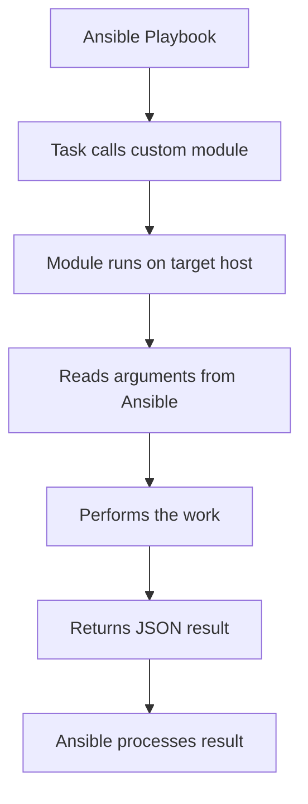

# How to Create Custom Ansible Modules for RHEL Administration

Author: [nawazdhandala](https://www.github.com/nawazdhandala)

Tags: RHEL, Ansible, Custom Modules, Python, Automation, Linux

Description: Build custom Ansible modules in Python for RHEL-specific administration tasks that built-in modules do not cover.

---

Ansible's built-in modules cover a lot of ground, but sometimes you need something specific to your RHEL environment. Maybe you need to interact with a custom API, parse a specific configuration format, or enforce a company-specific policy. Writing a custom module is straightforward if you know some Python.

## Module Structure



## Where to Put Custom Modules

Custom modules go in a `library/` directory next to your playbook or in a role's `library/` directory:

```
project/
  playbook.yml
  library/
    rhel_subscription_check.py
    rhel_kernel_params.py
  roles/
    myrole/
      library/
        role_specific_module.py
```

## A Simple Custom Module

Let us build a module that checks RHEL subscription status:

```python
#!/usr/bin/python
# library/rhel_subscription_check.py
# Custom module to check RHEL subscription status

from ansible.module_utils.basic import AnsibleModule
import subprocess
import json


def get_subscription_status():
    """Get the current subscription-manager status."""
    try:
        result = subprocess.run(
            ["subscription-manager", "status"],
            capture_output=True,
            text=True,
            timeout=30
        )
        return result.stdout, result.returncode
    except FileNotFoundError:
        return "subscription-manager not found", 1
    except subprocess.TimeoutExpired:
        return "Command timed out", 1


def get_consumed_subscriptions():
    """Get list of consumed subscriptions."""
    try:
        result = subprocess.run(
            ["subscription-manager", "list", "--consumed"],
            capture_output=True,
            text=True,
            timeout=30
        )
        return result.stdout
    except (FileNotFoundError, subprocess.TimeoutExpired):
        return ""


def main():
    # Define module arguments
    module = AnsibleModule(
        argument_spec=dict(
            # Whether to fail if not subscribed
            fail_on_unsubscribed=dict(type="bool", default=False),
        ),
        supports_check_mode=True,
    )

    fail_on_unsubscribed = module.params["fail_on_unsubscribed"]

    # Get subscription status
    status_output, rc = get_subscription_status()
    subscribed = rc == 0

    # Get consumed subscriptions
    consumed = get_consumed_subscriptions()

    # Build result
    result = dict(
        changed=False,
        subscribed=subscribed,
        status_output=status_output.strip(),
        consumed_subscriptions=consumed.strip(),
    )

    if not subscribed and fail_on_unsubscribed:
        module.fail_json(
            msg="System is not subscribed to Red Hat",
            **result
        )

    module.exit_json(**result)


if __name__ == "__main__":
    main()
```

Use it in a playbook:

```yaml
# playbook-check-subscription.yml
---
- name: Check RHEL subscriptions
  hosts: all
  become: true

  tasks:
    - name: Verify subscription status
      rhel_subscription_check:
        fail_on_unsubscribed: true
      register: sub_status

    - name: Show subscription info
      ansible.builtin.debug:
        msg: "Subscribed: {{ sub_status.subscribed }}"
```

## A Module That Makes Changes

Here is a module that manages kernel parameters in `/etc/sysctl.d/`:

```python
#!/usr/bin/python
# library/rhel_kernel_params.py
# Custom module to manage kernel parameters via sysctl.d

from ansible.module_utils.basic import AnsibleModule
import os


def read_current_params(filepath):
    """Read existing sysctl parameters from a file."""
    params = {}
    if os.path.exists(filepath):
        with open(filepath, "r") as f:
            for line in f:
                line = line.strip()
                # Skip comments and empty lines
                if not line or line.startswith("#"):
                    continue
                if "=" in line:
                    key, value = line.split("=", 1)
                    params[key.strip()] = value.strip()
    return params


def write_params(filepath, params, header):
    """Write sysctl parameters to a file."""
    with open(filepath, "w") as f:
        f.write("# {}\n".format(header))
        f.write("# Managed by Ansible custom module\n\n")
        for key in sorted(params.keys()):
            f.write("{} = {}\n".format(key, params[key]))


def apply_params(module):
    """Apply sysctl parameters."""
    rc, stdout, stderr = module.run_command(["sysctl", "--system"])
    return rc, stdout, stderr


def main():
    module = AnsibleModule(
        argument_spec=dict(
            # Name for the config file in /etc/sysctl.d/
            name=dict(type="str", required=True),
            # Dictionary of kernel parameters
            params=dict(type="dict", required=True),
            # Whether to apply immediately
            apply=dict(type="bool", default=True),
            # State: present or absent
            state=dict(type="str", default="present",
                       choices=["present", "absent"]),
        ),
        supports_check_mode=True,
    )

    name = module.params["name"]
    params = module.params["params"]
    apply_now = module.params["apply"]
    state = module.params["state"]

    # Build the file path
    filepath = "/etc/sysctl.d/99-{}.conf".format(name)
    header = "Kernel parameters for {}".format(name)

    changed = False

    if state == "absent":
        if os.path.exists(filepath):
            changed = True
            if not module.check_mode:
                os.remove(filepath)
                if apply_now:
                    apply_params(module)
    else:
        current = read_current_params(filepath)
        if current != params:
            changed = True
            if not module.check_mode:
                write_params(filepath, params, header)
                if apply_now:
                    apply_params(module)

    module.exit_json(
        changed=changed,
        filepath=filepath,
        params=params,
    )


if __name__ == "__main__":
    main()
```

Use it:

```yaml
# playbook-kernel-params.yml
---
- name: Configure kernel parameters
  hosts: all
  become: true

  tasks:
    - name: Set web server kernel tuning
      rhel_kernel_params:
        name: webserver-tuning
        params:
          net.core.somaxconn: "65535"
          net.ipv4.tcp_max_syn_backlog: "65535"
          net.ipv4.ip_local_port_range: "1024 65535"
          vm.swappiness: "10"
        apply: true
```

## Module with Idempotency

Good modules are idempotent. They only make changes when the current state differs from the desired state:

```python
#!/usr/bin/python
# library/rhel_motd.py
# Manage the RHEL message of the day with system info

from ansible.module_utils.basic import AnsibleModule
import os
import platform


def build_motd(hostname, rhel_version, custom_message):
    """Build the MOTD content."""
    lines = [
        "=" * 60,
        "  Hostname: {}".format(hostname),
        "  RHEL Version: {}".format(rhel_version),
        "  {}".format(custom_message) if custom_message else "",
        "=" * 60,
        "",
    ]
    return "\n".join(line for line in lines if line is not None)


def main():
    module = AnsibleModule(
        argument_spec=dict(
            custom_message=dict(type="str", default=""),
            motd_file=dict(type="str", default="/etc/motd"),
        ),
        supports_check_mode=True,
    )

    custom_message = module.params["custom_message"]
    motd_file = module.params["motd_file"]

    # Gather system info
    hostname = platform.node()
    # Read RHEL version
    rhel_version = "Unknown"
    if os.path.exists("/etc/redhat-release"):
        with open("/etc/redhat-release", "r") as f:
            rhel_version = f.read().strip()

    desired_content = build_motd(hostname, rhel_version, custom_message)

    # Check current content
    current_content = ""
    if os.path.exists(motd_file):
        with open(motd_file, "r") as f:
            current_content = f.read()

    changed = current_content != desired_content

    if changed and not module.check_mode:
        with open(motd_file, "w") as f:
            f.write(desired_content)

    module.exit_json(
        changed=changed,
        content=desired_content,
    )


if __name__ == "__main__":
    main()
```

## Testing Your Module Locally

You can test a module without Ansible:

```bash
# Create a test arguments file
cat > /tmp/test_args.json << ARGS
{
    "ANSIBLE_MODULE_ARGS": {
        "name": "test",
        "params": {
            "vm.swappiness": "10"
        },
        "apply": false
    }
}
ARGS

# Run the module directly
python3 library/rhel_kernel_params.py < /tmp/test_args.json
```

## Wrapping Up

Custom Ansible modules fill the gaps between what built-in modules offer and what your RHEL environment needs. The key principles are: accept arguments through AnsibleModule, be idempotent, support check mode, and return clear JSON results. Start simple, test locally, and grow the module as your needs evolve. Most custom modules end up being under 100 lines of Python.
