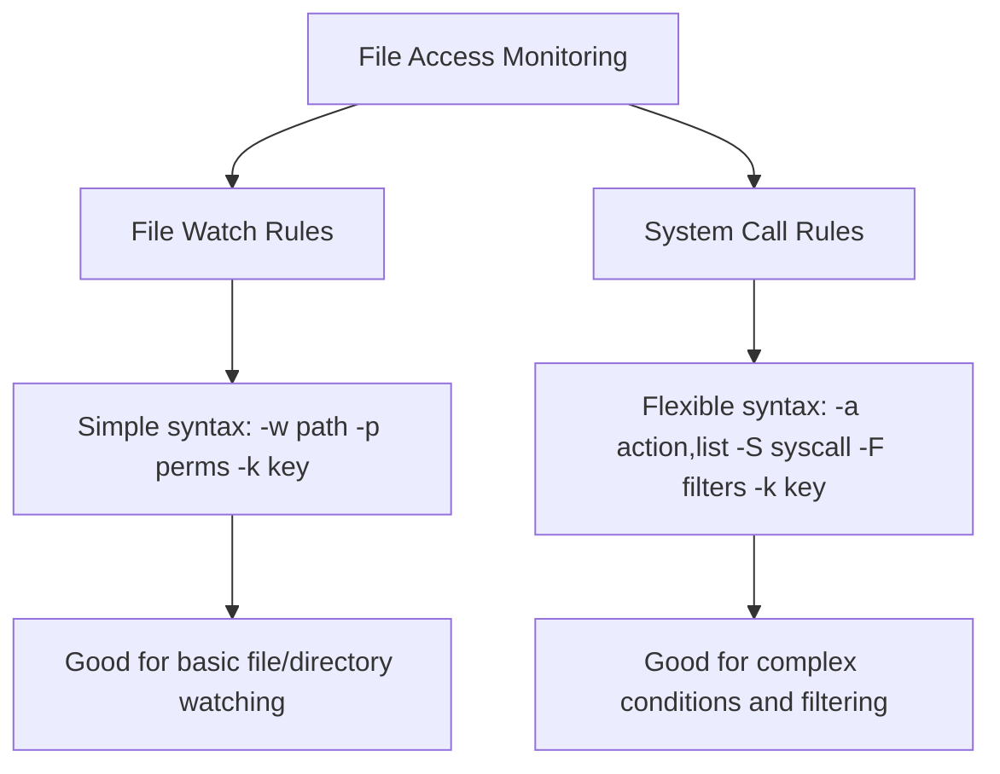

# How to Write Custom Audit Rules for File Access Monitoring on RHEL

Author: [nawazdhandala](https://www.github.com/nawazdhandala)

Tags: RHEL, auditd, Audit Rules, File Monitoring, Security, Linux

Description: Write custom auditd rules on RHEL to monitor file access, track changes to sensitive files, and create an audit trail for compliance.

---

File access monitoring is one of the most important uses of the Linux audit system. By writing custom audit rules, you can track who reads, modifies, or deletes sensitive files on your RHEL system. This guide covers the syntax, best practices, and practical examples for file access monitoring rules.

## Audit Rule Types

There are two ways to monitor file access with auditd:



## File Watch Rule Syntax

File watch rules are the simplest way to monitor file access:

```bash
-w <path> -p <permissions> -k <key_name>
```

- `-w` specifies the file or directory path to watch
- `-p` specifies which access types to monitor
- `-k` assigns a key name for easy searching later

### Permission Flags

| Flag | Meaning | Description |
|------|---------|-------------|
| `r` | Read | File was opened for reading |
| `w` | Write | File was opened for writing |
| `x` | Execute | File was executed |
| `a` | Attribute change | File attributes were changed (chmod, chown, etc.) |

## Practical File Watch Examples

### Monitoring Configuration Files

```bash
# Create a rules file for configuration monitoring
sudo tee /etc/audit/rules.d/10-file-access.rules << 'EOF'
## Monitor critical system configuration files

# User and group management files
-w /etc/passwd -p wa -k user_management
-w /etc/shadow -p wa -k user_management
-w /etc/group -p wa -k group_management
-w /etc/gshadow -p wa -k group_management

# Network configuration
-w /etc/hosts -p wa -k network_config
-w /etc/hostname -p wa -k network_config
-w /etc/NetworkManager/ -p wa -k network_config
-w /etc/resolv.conf -p wa -k network_config

# Authentication configuration
-w /etc/pam.d/ -p wa -k pam_config
-w /etc/nsswitch.conf -p wa -k auth_config
-w /etc/login.defs -p wa -k auth_config

# SSH configuration
-w /etc/ssh/sshd_config -p wa -k ssh_config
-w /etc/ssh/sshd_config.d/ -p wa -k ssh_config

# Firewall rules
-w /etc/firewalld/ -p wa -k firewall_config

# Systemd service files
-w /etc/systemd/system/ -p wa -k systemd_config
-w /usr/lib/systemd/system/ -p wa -k systemd_config

# Kernel parameters
-w /etc/sysctl.conf -p wa -k sysctl_config
-w /etc/sysctl.d/ -p wa -k sysctl_config
EOF
```

### Monitoring Sensitive Data Files

```bash
# Create rules for sensitive data monitoring
sudo tee /etc/audit/rules.d/20-sensitive-data.rules << 'EOF'
## Monitor access to sensitive data directories

# Database files
-w /var/lib/mysql/ -p rwa -k database_access
-w /var/lib/pgsql/ -p rwa -k database_access

# Application secrets
-w /etc/pki/ -p rwa -k certificate_access
-w /etc/ssl/ -p rwa -k certificate_access

# Backup directories
-w /var/backups/ -p rwa -k backup_access

# Custom application data
-w /opt/app/config/ -p rwa -k app_config_access
-w /opt/app/data/ -p rwa -k app_data_access
EOF
```

## System Call Rules for Advanced Monitoring

For more granular control, use system call rules. These let you filter by user, process, or other conditions.

### Syntax

```bash
-a <action>,<list> -F arch=<architecture> -S <syscall> -F <field>=<value> -k <key>
```

### Monitoring File Deletions

```bash
# Monitor all file deletions
sudo tee /etc/audit/rules.d/30-file-delete.rules << 'EOF'
## Track file deletions

# Monitor unlink and rename system calls on 64-bit systems
-a always,exit -F arch=b64 -S unlink -S unlinkat -S rename -S renameat -k file_delete

# Monitor unlink and rename system calls on 32-bit systems
-a always,exit -F arch=b32 -S unlink -S unlinkat -S rename -S renameat -k file_delete
EOF
```

### Monitoring File Permission Changes

```bash
# Track permission and ownership changes
sudo tee /etc/audit/rules.d/31-permission-changes.rules << 'EOF'
## Track permission and ownership changes

# chmod operations
-a always,exit -F arch=b64 -S chmod -S fchmod -S fchmodat -k permission_change

# chown operations
-a always,exit -F arch=b64 -S chown -S fchown -S lchown -S fchownat -k ownership_change

# setxattr operations (extended attributes)
-a always,exit -F arch=b64 -S setxattr -S lsetxattr -S fsetxattr -k xattr_change
-a always,exit -F arch=b64 -S removexattr -S lremovexattr -S fremovexattr -k xattr_change
EOF
```

### Monitoring Access by Specific Users

```bash
# Monitor all file operations by a specific user (UID 1001)
-a always,exit -F arch=b64 -S open -S openat -F auid=1001 -k user1001_file_access

# Monitor file operations by users who are not root
-a always,exit -F arch=b64 -S open -S openat -F auid>=1000 -F auid!=4294967295 -k user_file_access
```

The `auid` field is the audit user ID (the original login UID), which persists even when a user uses `sudo` or `su`.

## Loading and Verifying Rules

```bash
# Load all rules from rules.d/
sudo augenrules --load

# List all currently loaded rules
sudo auditctl -l

# Check for syntax errors
sudo augenrules --check
```

## Searching Audit Logs for File Access Events

Once your rules are in place, you can search for events:

```bash
# Search by key name
sudo ausearch -k user_management

# Search for events on a specific file
sudo ausearch -f /etc/passwd

# Search for events by a specific user
sudo ausearch -ua 1001

# Search for events in a time range
sudo ausearch -k file_delete -ts today -te now

# Generate a file access report
sudo aureport --file --summary
```

## Understanding Audit Log Entries

A typical file access audit log entry looks like this:

```bash
type=SYSCALL msg=audit(1709568000.123:456): arch=c000003e syscall=257
success=yes exit=3 a0=ffffff9c a1=7f8a3c002000 a2=241 a3=1b6
items=2 ppid=1234 pid=5678 auid=1000 uid=0 gid=0 euid=0
comm="vim" exe="/usr/bin/vim" key="ssh_config"
```

Key fields:
- `auid=1000` - the original login user ID
- `uid=0` - the effective user ID (root, because sudo was used)
- `comm="vim"` - the command that triggered the event
- `key="ssh_config"` - the rule key that matched

## Best Practices

1. **Use meaningful key names** so you can easily search and filter events later.
2. **Be selective** about what you monitor. Watching too many files generates excessive log data.
3. **Use `wa` permissions** for most configuration files. Adding `r` generates a lot more events.
4. **Test rules** in a development environment before deploying to production.
5. **Number your rule files** (10-file-access.rules, 20-sensitive-data.rules) to control loading order.
6. **Monitor the audit log size** to ensure you are not filling up the disk.

## Summary

Custom audit rules for file access monitoring on RHEL let you track exactly who accesses or modifies sensitive files. Use file watch rules for simple monitoring and system call rules for more complex filtering. Organize your rules in numbered files under `/etc/audit/rules.d/`, use descriptive key names, and regularly review the audit logs with `ausearch` and `aureport`.
