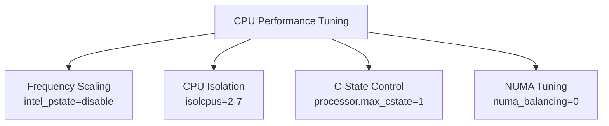

# How to Add Custom Kernel Parameters for Performance Tuning via GRUB2 on RHEL 9

Author: [nawazdhandala](https://www.github.com/nawazdhandala)

Tags: RHEL, Kernel, GRUB2, Performance, Linux

Description: A practical guide to adding performance-oriented kernel command-line parameters via GRUB2 on RHEL 9, covering CPU, memory, NUMA, I/O, and network optimizations.

---

## Why Set Performance Parameters at Boot?

Some kernel tuning parameters can only be set at boot time through the kernel command line. Unlike sysctl parameters that you can change at runtime, these options affect how the kernel initializes hardware, allocates memory, and sets up core subsystems. Setting them right from the start is the only option.

On RHEL 9, you add these parameters through GRUB2 using the `grubby` command.

## How to Add and Remove Parameters

```bash
# Add a parameter to all kernels
sudo grubby --update-kernel=ALL --args="parameter=value"

# Remove a parameter
sudo grubby --update-kernel=ALL --remove-args="parameter"

# Verify the change
sudo grubby --info=DEFAULT | grep args
```

## CPU Performance Parameters

### Disabling CPU Frequency Scaling

For workloads that need consistent CPU performance (databases, real-time applications):

```bash
# Disable Intel P-state driver (use acpi-cpufreq instead for manual control)
sudo grubby --update-kernel=ALL --args="intel_pstate=disable"

# Or force performance mode
sudo grubby --update-kernel=ALL --args="intel_pstate=active"
```

### CPU Isolation for Dedicated Workloads

```bash
# Isolate CPUs 2-7 from the scheduler (reserve for specific applications)
sudo grubby --update-kernel=ALL --args="isolcpus=2-7"

# Prevent kernel threads from running on isolated CPUs
sudo grubby --update-kernel=ALL --args="isolcpus=2-7 nohz_full=2-7 rcu_nocbs=2-7"
```

### Disabling C-States for Low Latency

```bash
# Limit processor idle states to prevent latency from deep sleep
sudo grubby --update-kernel=ALL --args="processor.max_cstate=1 intel_idle.max_cstate=0"
```



## Memory Performance Parameters

### Huge Pages

```bash
# Pre-allocate 2MB huge pages at boot (before memory fragments)
sudo grubby --update-kernel=ALL --args="hugepagesz=2M hugepages=4096"

# Pre-allocate 1GB huge pages (must be set at boot)
sudo grubby --update-kernel=ALL --args="hugepagesz=1G hugepages=16 default_hugepagesz=1G"
```

### Transparent Huge Pages

```bash
# Disable THP for database workloads
sudo grubby --update-kernel=ALL --args="transparent_hugepage=never"

# Enable THP with madvise only (applications must opt in)
sudo grubby --update-kernel=ALL --args="transparent_hugepage=madvise"
```

### NUMA Configuration

```bash
# Disable automatic NUMA balancing (for manually pinned workloads)
sudo grubby --update-kernel=ALL --args="numa_balancing=0"
```

## I/O Performance Parameters

### IOMMU Configuration

```bash
# Enable Intel IOMMU for device passthrough (KVM, SR-IOV)
sudo grubby --update-kernel=ALL --args="intel_iommu=on iommu=pt"

# Enable AMD IOMMU
sudo grubby --update-kernel=ALL --args="amd_iommu=on iommu=pt"
```

### I/O Scheduler Hints

```bash
# Set the default I/O scheduler (none/mq-deadline/bfq/kyber)
# For NVMe devices, 'none' is usually best
sudo grubby --update-kernel=ALL --args="elevator=none"
```

## Network Performance Parameters

```bash
# Disable predictable interface names for simpler configuration
sudo grubby --update-kernel=ALL --args="net.ifnames=0 biosdevname=0"

# Disable IPv6 at the kernel level if not needed
sudo grubby --update-kernel=ALL --args="ipv6.disable=1"
```

## Security-Related Performance Parameters

```bash
# Disable Spectre/Meltdown mitigations for maximum performance
# WARNING: Only do this on trusted, isolated environments
sudo grubby --update-kernel=ALL --args="mitigations=off"

# Or selectively disable specific mitigations
sudo grubby --update-kernel=ALL --args="nospectre_v2 nopti"
```

The `mitigations=off` parameter disables all CPU vulnerability mitigations. This gives measurable performance improvements (5-15% depending on workload) but leaves the system vulnerable to speculative execution attacks. Only use this on systems that are not exposed to untrusted code.

## Kdump and Crash Kernel

```bash
# Configure crash kernel memory reservation
sudo grubby --update-kernel=ALL --args="crashkernel=256M"

# For large-memory systems, use a scaled reservation
sudo grubby --update-kernel=ALL --args="crashkernel=1G-4G:192M,4G-64G:256M,64G-:512M"
```

## Combining Multiple Parameters

```bash
# Apply a complete performance profile for a database server
sudo grubby --update-kernel=ALL --args="transparent_hugepage=never hugepagesz=2M hugepages=4096 numa_balancing=0 processor.max_cstate=1 intel_idle.max_cstate=0"

# Verify all parameters
sudo grubby --info=DEFAULT
```

## Making Parameters Apply to Future Kernels

Parameters set with `grubby --update-kernel=ALL` apply to all currently installed kernels but not to future kernel installations. To cover future kernels, also update `/etc/default/grub`:

```bash
# Edit the defaults file
sudo vi /etc/default/grub

# Add your parameters to GRUB_CMDLINE_LINUX
GRUB_CMDLINE_LINUX="crashkernel=256M transparent_hugepage=never hugepages=4096 numa_balancing=0"

# Regenerate GRUB config
# BIOS:
sudo grub2-mkconfig -o /boot/grub2/grub.cfg
# UEFI:
sudo grub2-mkconfig -o /boot/efi/EFI/redhat/grub.cfg
```

## Verifying Parameters After Reboot

```bash
# Check the active kernel command line
cat /proc/cmdline

# Verify specific settings took effect
cat /sys/kernel/mm/transparent_hugepage/enabled
grep HugePages_Total /proc/meminfo
cat /proc/sys/kernel/numa_balancing
```

## Wrapping Up

Kernel command-line parameters are the first layer of performance tuning on RHEL 9. They handle things that cannot be changed after boot: huge page allocation, CPU isolation, IOMMU setup, and hardware mitigation controls. Use `grubby` for immediate changes and `/etc/default/grub` for persistence across kernel updates. Always benchmark before and after, and document every parameter you set and the reason behind it. A server with unexplained custom parameters is a maintenance nightmare for whoever comes after you.
