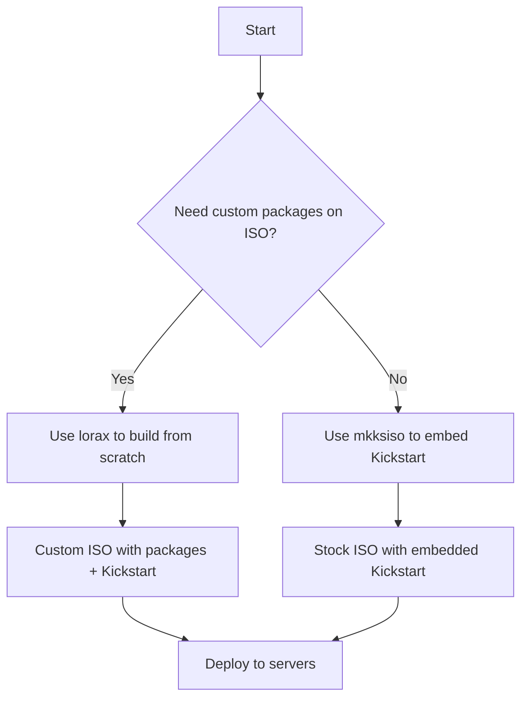

# How to Create a Custom RHEL 9 Installation ISO Using Lorax and Kickstart

Author: [nawazdhandala](https://www.github.com/nawazdhandala)

Tags: RHEL, ISO, Lorax, Kickstart, Custom Installation, Linux

Description: Learn how to build custom RHEL 9 installation ISOs with embedded Kickstart files and tailored package sets using lorax and mkksiso, enabling fully automated and reproducible server deployments.

---

The stock RHEL 9 ISO works fine for one-off installations, but when you are deploying dozens or hundreds of servers with the same configuration, you want a custom ISO that automates everything. Boot it, walk away, come back to a fully configured system. That is what Kickstart gives you, and tools like `lorax` and `mkksiso` let you bake that Kickstart file right into the ISO.

This guide covers the full process of creating a custom RHEL 9 ISO, from writing the Kickstart file to building the ISO and testing it.

## The Tools

### lorax

`lorax` is Red Hat's tool for creating the installation image tree. It downloads packages from repositories, builds the installer image, and produces a bootable ISO. It is the same tool Red Hat uses internally to build the official RHEL installer images.

### mkksiso

`mkksiso` is a simpler tool (included with the `lorax` package) that takes an existing RHEL ISO and injects a Kickstart file into it. If you do not need to change the package set on the ISO itself and just want to embed a Kickstart, `mkksiso` is the faster path.



## Prerequisites

You need a RHEL 9 system (or a build server) with the following:

```bash
# Install lorax and its dependencies
sudo dnf install -y lorax

# Verify mkksiso is available (included with lorax)
which mkksiso
```

You also need access to RHEL 9 repositories, either through a registered subscription or a local mirror.

```bash
# Verify your system is registered and repos are enabled
sudo subscription-manager repos --list-enabled | grep rhel-9
```

## Step 1: Write the Kickstart File

The Kickstart file defines your entire installation. Here is a solid starting point for a server deployment:

```bash
# Save this as /root/ks.cfg
# RHEL 9 Kickstart - Automated server installation

# Use graphical or text installer
text

# Set the installation source (will use the ISO media)
cdrom

# System language and keyboard
lang en_US.UTF-8
keyboard us

# Network configuration - adjust for your environment
network --bootproto=dhcp --device=link --activate --onboot=yes
network --hostname=rhel9-server.example.com

# Root password (generate hash with: python3 -c 'import crypt; print(crypt.crypt("yourpassword", crypt.mksalt(crypt.METHOD_SHA512)))')
rootpw --iscrypted $6$rounds=4096$randomsalthere$hashedpasswordgoeshere

# Create a regular user
user --name=admin --groups=wheel --iscrypted --password=$6$rounds=4096$anothersalt$anotherhashedpassword

# System timezone
timezone America/New_York --utc

# Partitioning
clearpart --all --initlabel
part /boot/efi --fstype="efi" --size=600
part /boot --fstype="xfs" --size=1024
part pv.01 --fstype="lvmpv" --size=1 --grow
volgroup rhel pv.01
logvol / --fstype="xfs" --vgname=rhel --name=root --size=30720
logvol /var --fstype="xfs" --vgname=rhel --name=var --size=20480
logvol /home --fstype="xfs" --vgname=rhel --name=home --size=10240
logvol /tmp --fstype="xfs" --vgname=rhel --name=tmp --size=5120
logvol swap --fstype="swap" --vgname=rhel --name=swap --size=4096

# Bootloader configuration
bootloader --append="crashkernel=1G-4G:192M,4G-64G:256M,64G-:512M"

# Enable SELinux
selinux --enforcing

# Enable firewall
firewall --enabled --ssh

# Disable initial setup agent on first boot
firstboot --disable

# Reboot after installation
reboot --eject

# Package selection
%packages
@^minimal-environment
@standard
vim-enhanced
tmux
bash-completion
chrony
firewalld
policycoreutils-python-utils
%end

# Post-installation script
%post --log=/root/ks-post.log
# Enable automatic security updates via dnf-automatic
dnf install -y dnf-automatic
systemctl enable dnf-automatic-install.timer

# Harden SSH - disable root login, disable password auth
sed -i 's/^#PermitRootLogin.*/PermitRootLogin no/' /etc/ssh/sshd_config
sed -i 's/^#PasswordAuthentication.*/PasswordAuthentication no/' /etc/ssh/sshd_config

# Set up admin user SSH key (replace with your actual public key)
mkdir -p /home/admin/.ssh
chmod 700 /home/admin/.ssh
echo "ssh-ed25519 AAAA... your-key-comment" > /home/admin/.ssh/authorized_keys
chmod 600 /home/admin/.ssh/authorized_keys
chown -R admin:admin /home/admin/.ssh
%end
```

### Validating the Kickstart File

Before building an ISO, validate your Kickstart syntax:

```bash
# Install the Kickstart validation tool
sudo dnf install -y pykickstart

# Validate the Kickstart file
ksvalidator /root/ks.cfg
```

If `ksvalidator` exits silently with return code 0, your file is syntactically correct. If there are errors, it will tell you exactly which line has the problem.

## Step 2a: Embed Kickstart into an Existing ISO with mkksiso

This is the simplest approach. Take the stock RHEL 9 ISO and inject your Kickstart file.

```bash
# Embed the Kickstart file into the existing ISO
# This modifies the boot configuration to auto-load the Kickstart
sudo mkksiso --ks /root/ks.cfg /path/to/rhel-9.4-x86_64-dvd.iso /root/rhel9-custom.iso
```

`mkksiso` does the following behind the scenes:

1. Extracts the ISO contents to a temporary directory
2. Copies your Kickstart file into the ISO root
3. Modifies the GRUB and isolinux boot configuration to add `inst.ks=cdrom:/ks.cfg`
4. Rebuilds the ISO with the correct checksum and boot records

You can also add extra kernel boot parameters:

```bash
# Add custom kernel parameters along with the Kickstart
sudo mkksiso --ks /root/ks.cfg --cmdline "inst.text console=ttyS0,115200" /path/to/rhel-9.4-x86_64-dvd.iso /root/rhel9-custom.iso
```

## Step 2b: Build a Completely Custom ISO with lorax

If you need to change which packages are on the ISO itself (not just what gets installed, but what is available on the media), use `lorax`.

First, set up a local repository or make sure you have access to the RHEL 9 repos:

```bash
# Create the installation tree and ISO using lorax
# This pulls packages from configured repos and builds a bootable image
sudo lorax -p "Red Hat Enterprise Linux" \
    -v "9.4" \
    -r "9.4" \
    --repo=/etc/yum.repos.d/redhat.repo \
    --isfinal \
    --buildarch=x86_64 \
    --volid="RHEL-9-Custom" \
    /root/rhel9-lorax-output/
```

The `lorax` command creates an installer tree in the output directory. This tree contains the kernel, initramfs, installer images, and a repository with packages.

After lorax finishes, you need to create the ISO from the output tree:

```bash
# Create an ISO from the lorax output
# mkisofs/genisoimage builds the final bootable ISO
genisoimage -o /root/rhel9-lorax-custom.iso \
    -b isolinux/isolinux.bin \
    -c isolinux/boot.cat \
    -no-emul-boot \
    -boot-load-size 4 \
    -boot-info-table \
    -eltorito-alt-boot \
    -e images/efiboot.img \
    -no-emul-boot \
    -R -J -V "RHEL-9-Custom" \
    /root/rhel9-lorax-output/

# Make the ISO bootable on UEFI systems
isohybrid --uefi /root/rhel9-lorax-custom.iso

# Implant an MD5 checksum for media verification
implantisomd5 /root/rhel9-lorax-custom.iso
```

Then embed your Kickstart into this custom ISO:

```bash
# Embed Kickstart into the lorax-built ISO
sudo mkksiso --ks /root/ks.cfg /root/rhel9-lorax-custom.iso /root/rhel9-final.iso
```

## Step 3: Adding Custom Packages to the ISO

If you need packages on the ISO that are not in the standard RHEL repos (internal tools, third-party agents, etc.), create a custom repository and include it.

```bash
# Create a directory for your custom packages
mkdir -p /root/custom-rpms

# Copy your RPMs into it
cp /path/to/your-custom-package.rpm /root/custom-rpms/

# Generate repository metadata
createrepo /root/custom-rpms/
```

Then reference this repo in your lorax build or copy it into the ISO tree before rebuilding.

For the simpler `mkksiso` approach, you can reference an external repo in your Kickstart file:

```bash
# Add to your Kickstart file to pull packages from an HTTP repo
repo --name=custom --baseurl=http://repo.example.com/custom-rpms/
```

## Step 4: Testing the Custom ISO

Before deploying to real hardware, test in a virtual machine:

```bash
# Create a test VM with virt-install using the custom ISO
sudo virt-install \
    --name rhel9-test \
    --ram 4096 \
    --vcpus 2 \
    --disk size=50 \
    --os-variant rhel9.4 \
    --cdrom /root/rhel9-custom.iso \
    --network network=default \
    --graphics vnc \
    --noautoconsole

# Connect to the VM console to watch the installation
sudo virsh console rhel9-test
```

If your Kickstart is correct, the installation should proceed automatically without any prompts. Watch the console output for errors, especially during the `%post` script execution.

## Step 5: Deploying to Physical Servers

Once tested, you can deploy the custom ISO in several ways:

```bash
# Write the ISO to a USB drive
sudo dd if=/root/rhel9-custom.iso of=/dev/sdX bs=4M status=progress oflag=sync
```

Or serve it over HTTP for PXE/network installations:

```bash
# Mount the ISO and serve it via a web server
sudo mkdir -p /var/www/html/rhel9
sudo mount -o loop /root/rhel9-custom.iso /var/www/html/rhel9

# Clients can then use this as an installation source
# In the boot parameters: inst.repo=http://buildserver.example.com/rhel9
```

## Maintaining Multiple Custom ISOs

In larger environments, you might maintain different ISOs for different server roles (web server, database server, container host). A good approach is to keep a base Kickstart with common settings and include role-specific configurations:

```bash
# In your base Kickstart, include a role-specific file
%include /tmp/role.cfg
```

Then use a `%pre` script to select the role based on hardware characteristics:

```bash
# Pre-installation script to detect hardware and set role
%pre
# Check if the system has more than 64 GB RAM (likely a database server)
MEM_KB=$(grep MemTotal /proc/meminfo | awk '{print $2}')
if [ "$MEM_KB" -gt 67108864 ]; then
    echo "logvol /var/lib/pgsql --fstype=xfs --vgname=rhel --name=pgdata --size=102400" > /tmp/role.cfg
else
    echo "# Standard server - no extra volumes" > /tmp/role.cfg
fi
%end
```

## Wrapping Up

Building custom RHEL 9 ISOs is one of those investments that pays for itself quickly. The first time takes an hour or two to get the Kickstart right and build the ISO. After that, every server deployment drops from a 30-minute manual process to a boot-and-walk-away operation. Use `mkksiso` when you just need to embed a Kickstart into the stock ISO, and reach for `lorax` when you need full control over what packages and images are on the media. Either way, always test in a VM before deploying to production hardware.
