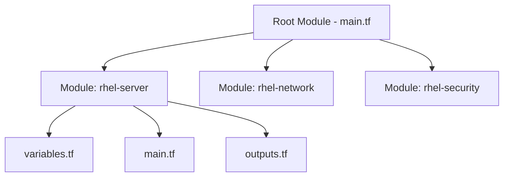

# How to Write Custom Terraform Modules for RHEL Infrastructure

Author: [nawazdhandala](https://www.github.com/nawazdhandala)

Tags: RHEL, Terraform, Modules, IaC, Infrastructure, Linux

Description: Learn how to create reusable Terraform modules for deploying and managing RHEL infrastructure across multiple environments.

---

When your Terraform configurations grow, copying and pasting blocks of HCL gets messy. Modules let you package reusable infrastructure components and call them with different parameters. This guide shows you how to build custom modules tailored to RHEL deployments.

## Module Structure



A well-organized Terraform project with modules looks like this:

```bash
terraform-rhel/
  main.tf              # Root module - calls child modules
  variables.tf         # Root-level variables
  outputs.tf           # Root-level outputs
  modules/
    rhel-server/
      main.tf          # Server resource definitions
      variables.tf     # Server module inputs
      outputs.tf       # Server module outputs
    rhel-network/
      main.tf          # Network resource definitions
      variables.tf     # Network module inputs
      outputs.tf       # Network module outputs
```

## Create a RHEL Server Module

Start with a module that creates a standardized RHEL server:

```hcl
# modules/rhel-server/variables.tf - Module inputs

variable "server_name" {
  description = "Name of the RHEL server"
  type        = string
}

variable "memory" {
  description = "Memory in MB"
  type        = number
  default     = 2048
}

variable "vcpus" {
  description = "Number of virtual CPUs"
  type        = number
  default     = 2
}

variable "disk_size" {
  description = "Disk size in bytes"
  type        = number
  default     = 21474836480  # 20 GB
}

variable "base_volume_id" {
  description = "ID of the base RHEL volume"
  type        = string
}

variable "pool_name" {
  description = "Name of the storage pool"
  type        = string
}

variable "network_name" {
  description = "Name of the libvirt network"
  type        = string
  default     = "default"
}

variable "ssh_public_key" {
  description = "SSH public key for the admin user"
  type        = string
}
```

```hcl
# modules/rhel-server/main.tf - Server resources

# Create the disk from the base image
resource "libvirt_volume" "disk" {
  name           = "${var.server_name}.qcow2"
  pool           = var.pool_name
  base_volume_id = var.base_volume_id
  size           = var.disk_size
}

# Cloud-init configuration
resource "libvirt_cloudinit_disk" "init" {
  name = "${var.server_name}-init.iso"
  pool = var.pool_name

  user_data = <<-EOF
    #cloud-config
    hostname: ${var.server_name}
    users:
      - name: admin
        sudo: ALL=(ALL) NOPASSWD:ALL
        shell: /bin/bash
        ssh_authorized_keys:
          - ${var.ssh_public_key}
    package_update: true
    packages:
      - vim
      - curl
  EOF
}

# Create the virtual machine
resource "libvirt_domain" "server" {
  name   = var.server_name
  memory = var.memory
  vcpu   = var.vcpus

  cloudinit = libvirt_cloudinit_disk.init.id

  disk {
    volume_id = libvirt_volume.disk.id
  }

  network_interface {
    network_name   = var.network_name
    wait_for_lease = true
  }

  console {
    type        = "pty"
    target_port = "0"
    target_type = "serial"
  }
}
```

```hcl
# modules/rhel-server/outputs.tf - Module outputs

output "server_id" {
  description = "ID of the created VM"
  value       = libvirt_domain.server.id
}

output "server_name" {
  description = "Name of the VM"
  value       = libvirt_domain.server.name
}

output "ip_addresses" {
  description = "IP addresses assigned to the VM"
  value       = libvirt_domain.server.network_interface[0].addresses
}
```

## Use the Module in Your Root Configuration

```hcl
# main.tf - Root module calling the rhel-server module

terraform {
  required_providers {
    libvirt = {
      source  = "dmacvicar/libvirt"
      version = "~> 0.7"
    }
  }
}

provider "libvirt" {
  uri = "qemu:///system"
}

# Shared base image
resource "libvirt_volume" "rhel9_base" {
  name   = "rhel9-base.qcow2"
  pool   = "default"
  source = "/var/lib/libvirt/images/rhel-9-base.qcow2"
  format = "qcow2"
}

# Read the SSH public key
locals {
  ssh_key = file("~/.ssh/id_rsa.pub")
}

# Create a web server using the module
module "web_server" {
  source = "./modules/rhel-server"

  server_name    = "web-server-01"
  memory         = 4096
  vcpus          = 4
  base_volume_id = libvirt_volume.rhel9_base.id
  pool_name      = "default"
  ssh_public_key = local.ssh_key
}

# Create a database server using the same module
module "db_server" {
  source = "./modules/rhel-server"

  server_name    = "db-server-01"
  memory         = 8192
  vcpus          = 4
  disk_size      = 107374182400  # 100 GB for database storage
  base_volume_id = libvirt_volume.rhel9_base.id
  pool_name      = "default"
  ssh_public_key = local.ssh_key
}
```

## Use for_each with Modules

For deploying multiple servers from a map of configurations:

```hcl
# Define servers as a map
variable "servers" {
  description = "Map of server configurations"
  type = map(object({
    memory = number
    vcpus  = number
    disk   = number
  }))
  default = {
    "app-01" = { memory = 4096, vcpus = 2, disk = 21474836480 }
    "app-02" = { memory = 4096, vcpus = 2, disk = 21474836480 }
    "db-01"  = { memory = 8192, vcpus = 4, disk = 107374182400 }
  }
}

# Create a server for each entry in the map
module "servers" {
  source   = "./modules/rhel-server"
  for_each = var.servers

  server_name    = each.key
  memory         = each.value.memory
  vcpus          = each.value.vcpus
  disk_size      = each.value.disk
  base_volume_id = libvirt_volume.rhel9_base.id
  pool_name      = "default"
  ssh_public_key = local.ssh_key
}

# Output all server IPs
output "server_ips" {
  value = {
    for name, server in module.servers : name => server.ip_addresses
  }
}
```

## Module Validation

Add validation rules to catch bad inputs early:

```hcl
# In modules/rhel-server/variables.tf

variable "memory" {
  description = "Memory in MB"
  type        = number
  default     = 2048

  # Enforce a minimum of 1 GB
  validation {
    condition     = var.memory >= 1024
    error_message = "Memory must be at least 1024 MB (1 GB)."
  }
}

variable "server_name" {
  description = "Name of the server"
  type        = string

  # Enforce naming convention
  validation {
    condition     = can(regex("^[a-z][a-z0-9-]+$", var.server_name))
    error_message = "Server name must start with a letter and contain only lowercase letters, numbers, and hyphens."
  }
}
```

## Deploy

```bash
# Initialize (downloads providers and sets up modules)
terraform init

# Preview all resources
terraform plan

# Apply the configuration
terraform apply -auto-approve
```

Custom Terraform modules are a clean way to standardize RHEL infrastructure deployments. You define your patterns once, then reuse them across projects and environments with different parameters.
