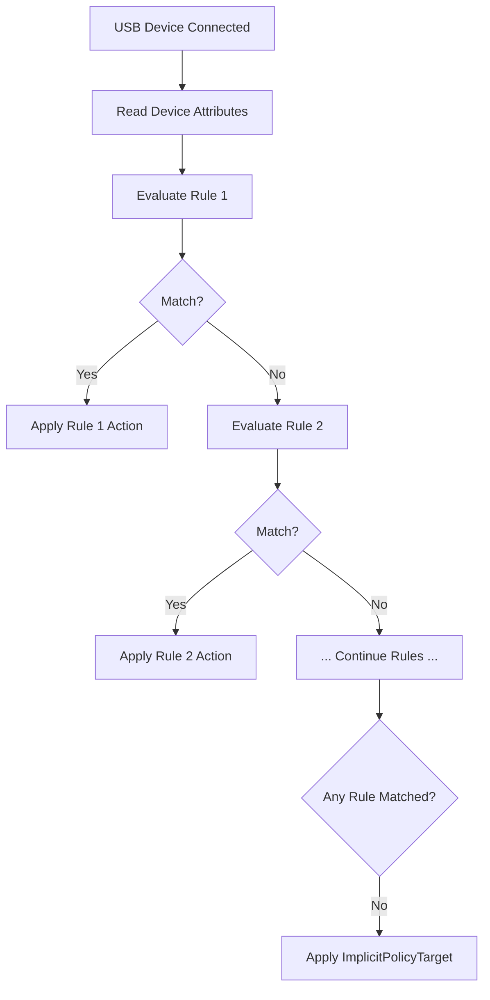

# How to Write Custom USBGuard Rules for USB Device Authorization on RHEL 9

Author: [nawazdhandala](https://www.github.com/nawazdhandala)

Tags: RHEL, USBGuard, Custom Rules, Linux

Description: Write advanced USBGuard rules on RHEL 9 using conditions, device attributes, and interface matching to create precise USB device authorization policies.

---

The auto-generated USBGuard policy is a good start, but real-world deployments need custom rules. Maybe you want to allow all keyboards from a specific vendor, block all mass storage devices regardless of brand, or create time-based access policies. This guide digs into the rule language so you can write exactly the policy you need.

## Rule Syntax Overview

Every USBGuard rule follows this structure:

```
TARGET [DEVICE_SPEC] [CONDITIONS]
```

Where:
- **TARGET** is `allow`, `block`, or `reject`
- **DEVICE_SPEC** includes device attributes like ID, name, hash, etc.
- **CONDITIONS** are optional filters like interface class or connection type

The difference between `block` and `reject`: `block` prevents authorization but keeps the device visible to USBGuard for later manual authorization. `reject` removes the device from the system entirely.

## Matching by Vendor and Product ID

```
# Allow a specific device model
allow id 046d:c52b

# Allow all devices from a vendor (Logitech)
allow id 046d:*

# Block a specific device
block id dead:beef
```

## Matching by Interface Class

USB interface classes describe what type of device it is. This is powerful because it lets you control device categories:

```
# Allow HID boot keyboards
allow with-interface 03:01:01

# Allow HID boot mice
allow with-interface 03:01:02

# Block all mass storage devices
block with-interface 08:*:*

# Allow USB hubs
allow with-interface 09:00:00

# Block wireless controllers (Bluetooth adapters, WiFi dongles)
block with-interface e0:*:*
```

## Matching by Device Name

```
# Allow devices with a specific name
allow name "Cruzer Blade"

# Allow devices matching a name pattern (regex-like)
allow name "Logitech*"
```

## Matching by Serial Number

```
# Allow a device with a specific serial
allow serial "ABC123456789"
```

## Matching by Hash

Hash-based matching is the most precise. It matches the exact physical device:

```
# Allow only this exact device
allow hash "jEP/6WzviqdJ5VSeTUY8PatCNBKeaREvo2OqdplND/o="
```

## Combining Multiple Conditions

You can combine multiple attributes in a single rule for precision:

```
# Allow a specific Logitech keyboard model with a known interface
allow id 046d:c31c name "Logitech Keyboard K120" with-interface 03:01:01

# Allow SanDisk USB drives with mass storage interface
allow id 0781:* with-interface 08:06:50

# Block any device claiming to be a HID from an unknown vendor
block id ffff:* with-interface 03:*:*
```

## Using Multiple Interface Classes

Some devices expose multiple interfaces. For example, a keyboard with a built-in hub:

```
# Allow a device with multiple interfaces
allow id 046d:c52b with-interface { 03:01:01 03:01:02 03:00:00 }

# Block any device that presents both HID and mass storage interfaces
# This catches BadUSB attacks where a "keyboard" also has storage
block with-interface one-of { 03:*:* 08:*:* }
```

## Rule Order and Precedence

Rules are evaluated in order from top to bottom. The first matching rule wins. Place more specific rules before general ones:

```
# Correct ordering - specific rules first
allow id 046d:c52b name "Unifying Receiver"
allow id 046d:c31c name "Logitech Keyboard K120"
block id 046d:*

# This allows only the two specific Logitech devices
# and blocks all other Logitech devices
```

## Practical Policy Examples

### Server Policy - Minimal USB Access

```
# Allow internal USB host controllers only
allow id 1d6b:0002 with-interface 09:00:00 with-connect-type ""
allow id 1d6b:0003 with-interface 09:00:00 with-connect-type ""

# Block everything else (set ImplicitPolicyTarget=block in daemon config)
```

### Workstation Policy - Keyboards, Mice, and Approved Drives

```
# Internal controllers and hubs
allow id 1d6b:* with-interface 09:00:00

# Keyboards (HID boot keyboard protocol)
allow with-interface 03:01:01

# Mice (HID boot mouse protocol)
allow with-interface 03:01:02

# Approved USB storage devices
allow id 0781:5567 with-interface 08:06:50
allow id 0951:1666 with-interface 08:06:50

# Block mass storage from any other vendor
block with-interface 08:*:*

# Block network adapters
block with-interface 02:*:*
block with-interface 0a:*:*
```

### Kiosk Policy - Keyboard Only

```
# Allow only keyboards, nothing else
allow with-interface 03:01:01
allow id 1d6b:* with-interface 09:00:00
reject with-interface all
```

## Rule Evaluation Flow



## Validating Rules

Test rules before making them permanent:

```bash
# Test a rule syntax by appending it temporarily
sudo usbguard append-rule 'allow id 046d:c52b with-interface 03:01:02'

# List rules to verify
sudo usbguard list-rules

# Remove if it is wrong (use the rule number from list-rules)
sudo usbguard remove-rule 10
```

## Editing the Rules File Directly

For bulk changes, edit the rules file directly:

```bash
# Edit the rules file
sudo vi /etc/usbguard/rules.conf

# After editing, restart USBGuard to apply
sudo systemctl restart usbguard

# Verify the new rules loaded
sudo usbguard list-rules
```

## Finding Device Attributes for Rule Writing

When you need to write a rule for a specific device:

```bash
# Plug in the device, then list it with full details
sudo usbguard list-devices -b

# Or use lsusb for vendor:product IDs
lsusb

# Get detailed device info
lsusb -v -d 046d:c52b
```

Use the output to craft a rule with exactly the attributes you want to match. More attributes in the rule means more precise matching, but also more maintenance if devices change.
