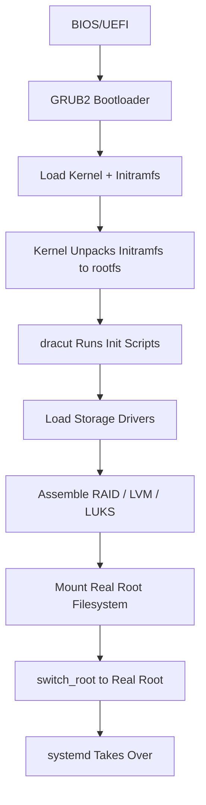

# How to Customize the Initramfs with dracut on RHEL

Author: [nawazdhandala](https://www.github.com/nawazdhandala)

Tags: RHEL, dracut, Initramfs, Boot, Kernel, Linux

Description: A practical guide to customizing the initial RAM filesystem (initramfs) using dracut on RHEL, including adding modules, scripts, and files.

---

The initramfs is a compressed filesystem that the kernel loads into memory during boot before the real root filesystem is available. On RHEL, dracut is the tool that builds and manages the initramfs. Customizing it lets you add drivers for special hardware, include custom scripts that run during boot, or strip it down for faster boot times.

## How the Boot Process Uses the Initramfs



## Understanding dracut's Module System

dracut organizes functionality into modules. Each module is a directory containing scripts that run at different boot stages:

```bash
# List all available dracut modules
dracut --list-modules

# Show which modules are currently included in the initramfs
lsinitrd | head -30

# Show the full contents of the current initramfs
lsinitrd /boot/initramfs-$(uname -r).img | less
```

## Adding Custom Files to the Initramfs

The simplest customization is including extra files. Create a dracut configuration file:

```bash
# Create a custom configuration directory
sudo mkdir -p /etc/dracut.conf.d/

# Add a config file that includes additional files
cat <<'EOF' | sudo tee /etc/dracut.conf.d/custom-files.conf
# Include custom network configuration scripts
install_items+=" /usr/local/bin/early-network-setup.sh "

# Include custom certificates needed during boot
install_items+=" /etc/pki/custom/boot-cert.pem "

# Include a custom udev rule
install_items+=" /etc/udev/rules.d/99-custom-storage.rules "
EOF

# Rebuild the initramfs with the new configuration
sudo dracut --force
```

## Creating a Custom dracut Module

For more complex customizations, create a proper dracut module:

```bash
# Create the module directory
# Module names are prefixed with a number for ordering
sudo mkdir -p /usr/lib/dracut/modules.d/99mymodule

# Create the module setup script - this tells dracut what to include
cat <<'SETUP' | sudo tee /usr/lib/dracut/modules.d/99mymodule/module-setup.sh
#!/bin/bash
# module-setup.sh - defines what this module provides and needs

# Check if this module should be included
check() {
    # Return 0 to include unconditionally
    # Return 255 to include only when explicitly requested
    return 255
}

# Declare dependencies on other dracut modules
depends() {
    echo "base"
    return 0
}

# Install files into the initramfs
install() {
    # Install a custom script that runs during boot
    inst_hook pre-mount 50 "$moddir/pre-mount-custom.sh"

    # Install binary utilities needed by our scripts
    inst_multiple grep awk

    # Install configuration files
    inst_simple /etc/myapp/boot-config.conf
}
SETUP

# Make the setup script executable
sudo chmod +x /usr/lib/dracut/modules.d/99mymodule/module-setup.sh

# Create the hook script that runs during boot
cat <<'HOOK' | sudo tee /usr/lib/dracut/modules.d/99mymodule/pre-mount-custom.sh
#!/bin/bash
# pre-mount-custom.sh - runs before the root filesystem is mounted

# Log a message to the boot console
echo "Running custom pre-mount script..."

# Example: wait for a specific device to appear
if [ -f /etc/myapp/boot-config.conf ]; then
    source /etc/myapp/boot-config.conf
    # Perform custom initialization
    echo "Custom boot configuration loaded"
fi
HOOK

sudo chmod +x /usr/lib/dracut/modules.d/99mymodule/pre-mount-custom.sh
```

## Including the Custom Module

```bash
# Rebuild initramfs including the custom module
sudo dracut --force --add mymodule

# Or make it permanent in configuration
echo 'add_dracutmodules+=" mymodule "' | \
    sudo tee /etc/dracut.conf.d/mymodule.conf

# Rebuild
sudo dracut --force

# Verify the module is included
lsinitrd /boot/initramfs-$(uname -r).img | grep mymodule
```

## dracut Hook Points

dracut provides several hook points where your scripts can execute:

```bash
# Available hook points in execution order:
# cmdline     - Parse kernel command line parameters
# pre-udev    - Before udev starts
# pre-trigger - Before udev trigger
# initqueue   - Main wait loop for devices
# pre-mount   - Before root filesystem mount
# mount       - Mount the root filesystem
# pre-pivot   - Before switching to real root
# cleanup     - Final cleanup before switch_root
```

## Configuring dracut Options

```bash
# /etc/dracut.conf.d/performance.conf
# Common configuration options

# Only include necessary drivers (hostonly mode)
# This creates a smaller, faster-loading initramfs
hostonly="yes"

# Add specific kernel modules
add_drivers+=" nvme vfio-pci "

# Exclude modules you do not need
omit_dracutmodules+=" plymouth multipath "

# Set compression algorithm (zstd is fastest on RHEL)
compress="zstd"

# Include firmware files
firmware_dir="/lib/firmware"
install_items+=" /lib/firmware/custom-device.fw "
```

```bash
# Rebuild with verbose output to see what is included
sudo dracut --force --verbose 2>&1 | tee /tmp/dracut-build.log

# Check the size of the resulting initramfs
ls -lh /boot/initramfs-$(uname -r).img
```

## Testing Changes Safely

Always test initramfs changes before relying on them:

```bash
# Build a test initramfs without overwriting the current one
sudo dracut --force /tmp/test-initramfs.img $(uname -r)

# Inspect it
lsinitrd /tmp/test-initramfs.img | grep mymodule

# To test boot with the new initramfs, copy it and create a GRUB entry
sudo cp /tmp/test-initramfs.img /boot/initramfs-$(uname -r)-test.img

# Keep the original initramfs as a fallback
# You can select the test entry from the GRUB menu
```

## Conclusion

dracut gives you full control over what runs during the earliest stages of RHEL boot. Whether you need custom hardware drivers, network setup scripts, or specialized storage initialization, the module system provides a clean way to package and maintain your customizations. Always keep a known-good initramfs as a fallback, and test changes thoroughly before deploying to production systems.
