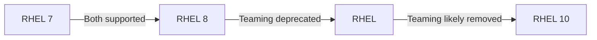

# How to Decide Between Network Bonding and Teaming on RHEL

Author: [nawazdhandala](https://www.github.com/nawazdhandala)

Tags: RHEL, Bonding, Teaming, Networking, Linux

Description: A comparison of network bonding vs teaming on RHEL, covering feature differences, deprecation status, and why bonding is now the recommended approach.

---

If you are reading this, you are probably trying to decide between bonding and teaming for link aggregation on RHEL. The short answer is: use bonding. Red Hat deprecated teaming in RHEL, and bonding is the supported path going forward. But let me explain the full picture so you understand why.

## A Brief History

Network bonding has been part of the Linux kernel since the early 2000s. It lives entirely in kernel space and is configured through sysfs and now nmcli.

Network teaming was introduced in RHEL 7 as a "better alternative" to bonding. It uses a user-space daemon (teamd) with a small kernel module (team) and JSON-based configuration. The idea was that a user-space daemon would be easier to extend and debug.

The reality did not quite work out that way. Bonding continued to improve, and the complexity of teaming's user-space architecture did not bring enough benefits to justify maintaining two solutions.

## Deprecation Status



- **RHEL 7 and 8**: Both bonding and teaming fully supported
- **RHEL**: Teaming deprecated, package still available but not recommended for new deployments
- **Future RHEL releases**: Teaming will likely be removed entirely

## Feature Comparison

| Feature | Bonding | Teaming |
|---|---|---|
| Implementation | Kernel space | User space (teamd) + kernel module |
| Configuration tool | nmcli, sysfs | nmcli, teamdctl, JSON files |
| Active-backup | Yes (mode 1) | Yes (activebackup runner) |
| LACP | Yes (mode 4) | Yes (lacp runner) |
| Round-robin | Yes (mode 0) | Yes (roundrobin runner) |
| Load balancing | Yes (modes 2, 5, 6) | Yes (loadbalance runner) |
| Broadcast | Yes (mode 3) | Yes (broadcast runner) |
| Max interfaces | Unlimited | Unlimited |
| D-Bus interface | No | Yes |
| Link monitoring | MII, ARP | Multiple link watchers (ethtool, ARP, nsna_ping) |
| Hot-plug support | Basic | Better |
| IPv6 NS/NA monitoring | No | Yes |
| RHEL status | Fully supported | Deprecated |
| Kernel overhead | Minimal | Higher (kernel + user space) |

## When Teaming Had Advantages

Teaming did have some genuine advantages:

**Multiple link watchers**: You could combine ethtool and ARP monitoring simultaneously. With bonding, you pick one or the other.

**IPv6 neighbor monitoring**: The `nsna_ping` link watcher could monitor using IPv6 Neighbor Solicitation, which bonding does not support natively.

**D-Bus interface**: Easier programmatic control for orchestration tools.

**JSON configuration**: Some people found it cleaner than bonding's option strings.

However, these advantages were niche. The vast majority of deployments only need basic link monitoring and standard aggregation modes, which bonding handles perfectly well.

## Why Bonding Won

Several factors made bonding the winner:

**Simplicity**: Bonding runs entirely in kernel space. No daemon to manage, no extra failure mode. If teamd crashes, your network goes down. The bonding driver just works.

**Maturity**: Bonding has been stable for over 20 years. It is battle-tested across millions of servers.

**Consistent tooling**: nmcli handles bonding configuration cleanly, and the options map directly to kernel parameters.

**Performance**: Less overhead without a user-space component.

**Industry standard**: 802.3ad bonding with LACP is the same everywhere, Linux or not.

## Migrating from Teaming to Bonding

If you have existing team interfaces, migration is straightforward. Map the team runners to bond modes:

```bash
# Team activebackup -> Bond active-backup
nmcli connection add type bond con-name bond0 ifname bond0 \
  bond.options "mode=active-backup,miimon=100"

# Team lacp -> Bond 802.3ad
nmcli connection add type bond con-name bond0 ifname bond0 \
  bond.options "mode=802.3ad,miimon=100,lacp_rate=fast"

# Team roundrobin -> Bond balance-rr
nmcli connection add type bond con-name bond0 ifname bond0 \
  bond.options "mode=balance-rr,miimon=100"

# Team loadbalance -> Bond balance-xor
nmcli connection add type bond con-name bond0 ifname bond0 \
  bond.options "mode=balance-xor,miimon=100,xmit_hash_policy=layer3+4"
```

## Current Recommendation

For all new RHEL deployments, use bonding. For existing RHEL systems with teaming, plan a migration to bonding during your next maintenance window. Do not wait until teaming is removed and you are forced to migrate under pressure.

For most workloads, these two bonding modes cover everything:

```bash
# For simple redundancy without switch requirements
nmcli connection add type bond con-name bond0 ifname bond0 \
  bond.options "mode=active-backup,miimon=100"

# For redundancy plus throughput with LACP-capable switches
nmcli connection add type bond con-name bond0 ifname bond0 \
  bond.options "mode=802.3ad,miimon=100,lacp_rate=fast,xmit_hash_policy=layer3+4"
```

## Checking If You Have Teaming Installed

```bash
# Check if teamd is installed
rpm -q teamd

# Find any existing team connections
nmcli connection show | grep team

# Check if the team kernel module is loaded
lsmod | grep team
```

If you find team interfaces, start planning the migration.

## Summary

The bonding vs teaming debate is settled. Bonding is the standard, supported approach on RHEL and going forward. Teaming had some nice features, but the complexity of maintaining two parallel solutions was not justified by the marginal benefits. Use bonding for new deployments and migrate existing team interfaces before the package is removed. Active-backup for simple redundancy, 802.3ad for aggregated throughput - those two modes handle the vast majority of production use cases.
