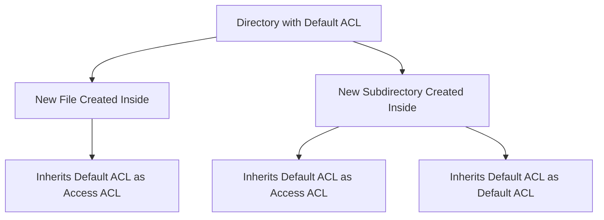

# How to Set Default ACLs on Directories for Shared Access on RHEL

Author: [nawazdhandala](https://www.github.com/nawazdhandala)

Tags: RHEL, ACLs, Default ACLs, Shared Access, Linux

Description: Configure default ACLs on directories in RHEL so that new files and subdirectories automatically inherit the correct permissions for shared team access.

---

Setting ACLs on existing files is only half the solution. If you set up ACLs on a shared directory but new files created inside it do not inherit those ACLs, your access controls break the moment someone creates a new file. Default ACLs solve this by defining the ACL entries that new files and subdirectories will automatically inherit.

## How Default ACLs Work

Default ACLs are set on directories only. They do not affect access to the directory itself - they define what ACL entries new files and subdirectories created inside will receive.



New files get the default ACL as their access ACL. New subdirectories get it as both their access ACL and their own default ACL, ensuring inheritance continues recursively.

## Setting Default ACLs

Use `setfacl -d` to set default ACLs:

```bash
# Create a shared directory
sudo mkdir -p /opt/shared-project

# Set the default ACL for a user
sudo setfacl -d -m u:alice:rwx /opt/shared-project

# Set the default ACL for a group
sudo setfacl -d -m g:developers:rwx /opt/shared-project

# Set the default ACL for others
sudo setfacl -d -m o::r-x /opt/shared-project
```

Verify the defaults:

```bash
getfacl /opt/shared-project
```

Output shows both access and default ACLs:

```
# file: opt/shared-project
# owner: root
# group: root
user::rwx
group::r-x
other::r-x
default:user::rwx
default:user:alice:rwx
default:group::r-x
default:group:developers:rwx
default:mask::rwx
default:other::r-x
```

## Testing Inheritance

```bash
# Create a file in the directory
touch /opt/shared-project/test-file.txt

# Check the inherited ACL
getfacl /opt/shared-project/test-file.txt

# Create a subdirectory
mkdir /opt/shared-project/subdir

# Check that the subdirectory inherits both access and default ACLs
getfacl /opt/shared-project/subdir
```

The new file will have the default ACL entries as its access ACL (minus execute for files, per the umask). The subdirectory will have both the access ACL and the default ACL.

## Practical Example: Team Shared Directory

Set up a shared directory where the development team has full access and the QA team has read-only access:

```bash
# Create the shared directory
sudo mkdir -p /opt/teamwork
sudo chown root:root /opt/teamwork
sudo chmod 2770 /opt/teamwork

# Set access ACLs for the directory itself
sudo setfacl -m g:dev:rwx /opt/teamwork
sudo setfacl -m g:qa:rx /opt/teamwork

# Set default ACLs so new files inherit the same permissions
sudo setfacl -d -m u::rwx /opt/teamwork
sudo setfacl -d -m g::rx /opt/teamwork
sudo setfacl -d -m g:dev:rwx /opt/teamwork
sudo setfacl -d -m g:qa:rx /opt/teamwork
sudo setfacl -d -m o::--- /opt/teamwork

# Verify
getfacl /opt/teamwork
```

Now any file or directory created inside `/opt/teamwork` will automatically have the correct permissions for both teams.

## Setting Both Access and Default ACLs Together

You can set both at once:

```bash
# Set access ACL
sudo setfacl -m g:team:rwx /opt/shared

# Set the same as the default ACL
sudo setfacl -d -m g:team:rwx /opt/shared
```

Or copy the access ACL to the default ACL:

```bash
# Copy current access ACL to default ACL
getfacl --access /opt/shared | setfacl -d --set-file=- /opt/shared
```

## Removing Default ACLs

```bash
# Remove all default ACLs from a directory
sudo setfacl -k /opt/shared-project

# Remove a specific default ACL entry
sudo setfacl -d -x g:qa /opt/shared-project
```

## Default ACLs and umask

The umask does NOT affect files created in directories with default ACLs. The default ACL takes full control of the permissions:

```bash
# Even with umask 077, files inherit the default ACL
umask 077
touch /opt/shared-project/another-file.txt
getfacl /opt/shared-project/another-file.txt
# Permissions come from the default ACL, not umask
```

This is an important distinction. It means default ACLs provide consistent permissions regardless of individual users' umask settings.

## Applying Default ACLs to Existing Content

Default ACLs only affect new files. To apply them to existing content:

```bash
# Apply the same ACLs recursively to existing files
sudo setfacl -R -m g:dev:rwx /opt/teamwork
sudo setfacl -R -m g:qa:rx /opt/teamwork

# Set defaults on all existing subdirectories
sudo find /opt/teamwork -type d -exec setfacl -d -m g:dev:rwx {} \;
sudo find /opt/teamwork -type d -exec setfacl -d -m g:qa:rx {} \;
```

## Backing Up Default ACLs

```bash
# Back up all ACLs including defaults
getfacl -R /opt/teamwork > /root/teamwork-acls.txt

# Restore them
setfacl --restore=/root/teamwork-acls.txt
```

## Common Pitfall: Execute Permission on Files

Default ACLs set with `rwx` will try to give execute permission to new regular files. The kernel's file creation mask removes execute for regular files, so this typically is not a problem. But be aware:

```bash
# Default ACL grants rwx, but new files get rw- (execute stripped)
touch /opt/shared-project/script.sh
ls -l /opt/shared-project/script.sh
# -rw-rw-r--+ ...
```

If you need scripts to be executable, you still need to `chmod +x` them after creation, or use a different mechanism.

Default ACLs are the key to making shared directories work reliably. Without them, every new file becomes a potential access problem. With them, permissions are consistent and automatic.
