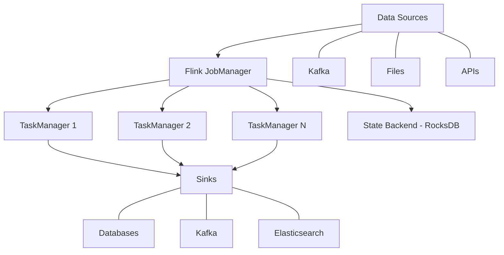

# How to Deploy Apache Flink for Stream Processing on RHEL 9

Author: [nawazdhandala](https://www.github.com/nawazdhandala)

Tags: RHEL, Apache Flink, Stream Processing, Big Data, Real-Time Analytics, Linux

Description: Deploy Apache Flink on RHEL 9 to process data streams in real time with support for event-time processing, exactly-once semantics, and stateful computations.

---

Apache Flink is a distributed stream processing framework designed for high-throughput, low-latency data pipelines. Unlike batch-first frameworks, Flink treats streams as the primary abstraction and can handle both bounded and unbounded data. This guide covers deploying Flink on RHEL 9.

## Prerequisites

- RHEL 9 with at least 4 GB RAM and 2 CPU cores
- Java 11 or later
- Root or sudo access

## Architecture Overview



## Step 1: Install Java

```bash
# Install Java 11 (Flink's recommended runtime)
sudo dnf install -y java-11-openjdk java-11-openjdk-devel

# Set JAVA_HOME
echo 'export JAVA_HOME=/usr/lib/jvm/java-11-openjdk' | sudo tee /etc/profile.d/java.sh
source /etc/profile.d/java.sh
```

## Step 2: Download and Install Flink

```bash
# Create a Flink user
sudo useradd -r -m -s /sbin/nologin flink

# Download Apache Flink
cd /opt
sudo curl -LO https://downloads.apache.org/flink/flink-1.18.1/flink-1.18.1-bin-scala_2.12.tgz
sudo tar xzf flink-1.18.1-bin-scala_2.12.tgz
sudo mv flink-1.18.1 flink
sudo chown -R flink:flink /opt/flink
```

## Step 3: Configure the JobManager

The JobManager coordinates distributed execution and manages checkpoints.

```yaml
# /opt/flink/conf/flink-conf.yaml

# JobManager configuration
jobmanager.rpc.address: localhost
jobmanager.rpc.port: 6123
jobmanager.memory.process.size: 1600m
jobmanager.bind-host: 0.0.0.0

# TaskManager configuration
taskmanager.memory.process.size: 2048m
taskmanager.numberOfTaskSlots: 4
taskmanager.bind-host: 0.0.0.0

# Web UI configuration
rest.address: 0.0.0.0
rest.port: 8081
rest.bind-address: 0.0.0.0

# Parallelism defaults
parallelism.default: 2

# State backend - use RocksDB for large state
state.backend: rocksdb
state.checkpoints.dir: file:///opt/flink/checkpoints
state.savepoints.dir: file:///opt/flink/savepoints

# Checkpointing settings
execution.checkpointing.interval: 60000
execution.checkpointing.mode: EXACTLY_ONCE
execution.checkpointing.min-pause: 500
execution.checkpointing.timeout: 600000

# High availability (for production clusters)
# high-availability: zookeeper
# high-availability.zookeeper.quorum: zk1:2181,zk2:2181,zk3:2181
# high-availability.storageDir: file:///opt/flink/ha

# Logging
env.log.dir: /opt/flink/log
```

## Step 4: Create Required Directories

```bash
# Create directories for checkpoints, savepoints, and logs
sudo mkdir -p /opt/flink/checkpoints /opt/flink/savepoints /opt/flink/log
sudo chown -R flink:flink /opt/flink/checkpoints /opt/flink/savepoints /opt/flink/log
```

## Step 5: Create Systemd Services

```ini
# /etc/systemd/system/flink-jobmanager.service
[Unit]
Description=Apache Flink JobManager
After=network.target

[Service]
Type=forking
User=flink
Group=flink
ExecStart=/opt/flink/bin/jobmanager.sh start
ExecStop=/opt/flink/bin/jobmanager.sh stop
Environment="JAVA_HOME=/usr/lib/jvm/java-11-openjdk"
Restart=on-failure
RestartSec=10

[Install]
WantedBy=multi-user.target
```

```ini
# /etc/systemd/system/flink-taskmanager.service
[Unit]
Description=Apache Flink TaskManager
After=network.target flink-jobmanager.service

[Service]
Type=forking
User=flink
Group=flink
ExecStart=/opt/flink/bin/taskmanager.sh start
ExecStop=/opt/flink/bin/taskmanager.sh stop
Environment="JAVA_HOME=/usr/lib/jvm/java-11-openjdk"
Restart=on-failure
RestartSec=10

[Install]
WantedBy=multi-user.target
```

```bash
# Start Flink services
sudo systemctl daemon-reload
sudo systemctl enable --now flink-jobmanager
sudo systemctl enable --now flink-taskmanager

# Open the web UI port
sudo firewall-cmd --permanent --add-port=8081/tcp
sudo firewall-cmd --reload
```

## Step 6: Verify the Installation

```bash
# Check the Flink web UI
curl -s http://localhost:8081/overview | python3 -m json.tool

# Run the built-in word count example
sudo -u flink /opt/flink/bin/flink run \
    /opt/flink/examples/streaming/WordCount.jar

# Check running jobs
sudo -u flink /opt/flink/bin/flink list
```

Access the web UI at `http://your-server:8081` to see running jobs and cluster status.

## Step 7: Write a Custom Flink Job

Here is a simple stream processing job in Java that reads from Kafka and writes to another topic.

```java
// StreamProcessingJob.java
// Reads events from a Kafka topic, processes them, and writes results

import org.apache.flink.api.common.eventtime.WatermarkStrategy;
import org.apache.flink.api.common.serialization.SimpleStringSchema;
import org.apache.flink.connector.kafka.source.KafkaSource;
import org.apache.flink.connector.kafka.source.enumerator.initializer.OffsetsInitializer;
import org.apache.flink.connector.kafka.sink.KafkaSink;
import org.apache.flink.connector.kafka.sink.KafkaRecordSerializationSchema;
import org.apache.flink.streaming.api.datastream.DataStream;
import org.apache.flink.streaming.api.environment.StreamExecutionEnvironment;

public class StreamProcessingJob {
    public static void main(String[] args) throws Exception {
        // Set up the execution environment
        StreamExecutionEnvironment env = StreamExecutionEnvironment.getExecutionEnvironment();

        // Configure the Kafka source
        KafkaSource<String> source = KafkaSource.<String>builder()
            .setBootstrapServers("localhost:9092")
            .setTopics("input-events")
            .setGroupId("flink-processor")
            .setStartingOffsets(OffsetsInitializer.earliest())
            .setValueOnlyDeserializer(new SimpleStringSchema())
            .build();

        // Read from Kafka
        DataStream<String> stream = env.fromSource(
            source,
            WatermarkStrategy.noWatermarks(),
            "Kafka Source"
        );

        // Process the stream - filter and transform events
        DataStream<String> processed = stream
            .filter(event -> event.contains("important"))
            .map(event -> event.toUpperCase());

        // Configure the Kafka sink
        KafkaSink<String> sink = KafkaSink.<String>builder()
            .setBootstrapServers("localhost:9092")
            .setRecordSerializer(
                KafkaRecordSerializationSchema.builder()
                    .setTopic("processed-events")
                    .setValueSerializationSchema(new SimpleStringSchema())
                    .build()
            )
            .build();

        // Write processed events to the output topic
        processed.sinkTo(sink);

        // Execute the job
        env.execute("Stream Processing Job");
    }
}
```

## Step 8: Submit the Job

```bash
# Build your job JAR (using Maven or Gradle), then submit it
sudo -u flink /opt/flink/bin/flink run \
    -d \
    -p 2 \
    /path/to/your/stream-processing-job.jar

# Check running jobs
sudo -u flink /opt/flink/bin/flink list -r

# Cancel a job if needed
sudo -u flink /opt/flink/bin/flink cancel <job-id>

# Create a savepoint before stopping a job
sudo -u flink /opt/flink/bin/flink savepoint <job-id> /opt/flink/savepoints/
```

## Troubleshooting

```bash
# Check JobManager logs
sudo tail -f /opt/flink/log/flink-flink-standalonesession-*.log

# Check TaskManager logs
sudo tail -f /opt/flink/log/flink-flink-taskexecutor-*.log

# Monitor via the REST API
curl -s http://localhost:8081/jobs | python3 -m json.tool
```

## Conclusion

Apache Flink is now running on your RHEL 9 system, ready to process data streams with exactly-once semantics and stateful computations. The framework handles fault tolerance through checkpointing and can scale by adding more TaskManagers. For production clusters, enable high availability with ZooKeeper, use RocksDB as the state backend for large state, and connect to your Kafka or other messaging systems for real-time data pipelines.
