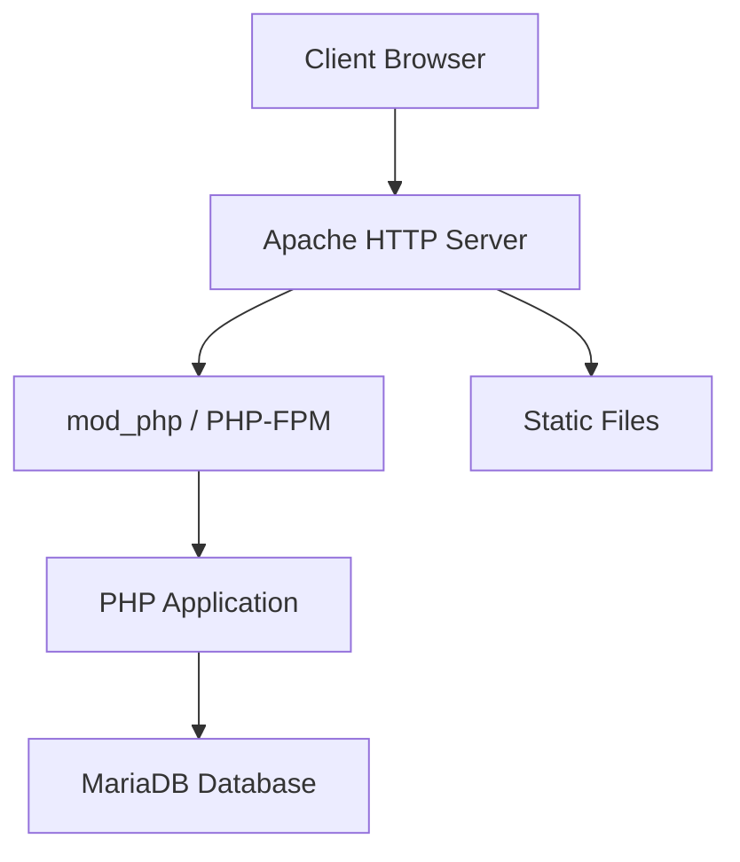

# How to Deploy a LAMP Stack with Ansible on RHEL 9

Author: [nawazdhandala](https://www.github.com/nawazdhandala)

Tags: RHEL, Ansible, LAMP, Apache, MySQL, PHP, Linux

Description: Automate the deployment of a complete LAMP stack (Linux, Apache, MariaDB, PHP) on RHEL 9 using Ansible playbooks.

---

The LAMP stack is still one of the most common web application platforms. Deploying it with Ansible means you can spin up identical environments for development, staging, and production without the manual work and inevitable configuration drift.

## LAMP Architecture



## Complete LAMP Playbook

```yaml
# playbook-lamp.yml
# Deploy a complete LAMP stack on RHEL 9
---
- name: Deploy LAMP stack
  hosts: webservers
  become: true

  vars:
    # MariaDB settings
    mariadb_root_password: "{{ vault_mariadb_root_password }}"
    app_db_name: myapp
    app_db_user: myapp
    app_db_password: "{{ vault_app_db_password }}"

    # Apache settings
    server_name: "{{ ansible_fqdn }}"
    document_root: /var/www/myapp

    # PHP settings
    php_version: "8.1"

  tasks:
    # ---- Apache ----
    - name: Install Apache
      ansible.builtin.dnf:
        name:
          - httpd
          - mod_ssl
        state: present

    - name: Create document root
      ansible.builtin.file:
        path: "{{ document_root }}"
        state: directory
        owner: apache
        group: apache
        mode: "0755"

    - name: Configure Apache virtual host
      ansible.builtin.copy:
        dest: /etc/httpd/conf.d/myapp.conf
        mode: "0644"
        content: |
          <VirtualHost *:80>
              ServerName {{ server_name }}
              DocumentRoot {{ document_root }}

              <Directory {{ document_root }}>
                  AllowOverride All
                  Require all granted
              </Directory>

              # Pass PHP files to PHP-FPM
              <FilesMatch \.php$>
                  SetHandler "proxy:unix:/run/php-fpm/www.sock|fcgi://localhost"
              </FilesMatch>

              ErrorLog /var/log/httpd/myapp-error.log
              CustomLog /var/log/httpd/myapp-access.log combined
          </VirtualHost>
      notify: Restart Apache

    - name: Enable and start Apache
      ansible.builtin.systemd:
        name: httpd
        enabled: true
        state: started

    # ---- PHP ----
    - name: Install PHP and common extensions
      ansible.builtin.dnf:
        name:
          - php
          - php-fpm
          - php-mysqlnd
          - php-json
          - php-mbstring
          - php-xml
          - php-gd
          - php-curl
          - php-zip
          - php-opcache
        state: present

    - name: Configure PHP settings
      ansible.builtin.copy:
        dest: /etc/php.d/99-custom.ini
        mode: "0644"
        content: |
          ; Custom PHP settings for the application
          upload_max_filesize = 64M
          post_max_size = 64M
          memory_limit = 256M
          max_execution_time = 300
          date.timezone = UTC
          expose_php = Off
      notify: Restart PHP-FPM

    - name: Configure PHP-FPM pool
      ansible.builtin.lineinfile:
        path: /etc/php-fpm.d/www.conf
        regexp: "^{{ item.key }}"
        line: "{{ item.key }} = {{ item.value }}"
      loop:
        - { key: "user", value: "apache" }
        - { key: "group", value: "apache" }
        - { key: "listen.owner", value: "apache" }
        - { key: "listen.group", value: "apache" }
      notify: Restart PHP-FPM

    - name: Enable and start PHP-FPM
      ansible.builtin.systemd:
        name: php-fpm
        enabled: true
        state: started

    # ---- MariaDB ----
    - name: Install MariaDB
      ansible.builtin.dnf:
        name:
          - mariadb-server
          - mariadb
          - python3-PyMySQL
        state: present

    - name: Enable and start MariaDB
      ansible.builtin.systemd:
        name: mariadb
        enabled: true
        state: started

    - name: Set MariaDB root password
      community.mysql.mysql_user:
        name: root
        host: localhost
        password: "{{ mariadb_root_password }}"
        login_unix_socket: /var/lib/mysql/mysql.sock
        state: present

    - name: Create .my.cnf for root
      ansible.builtin.copy:
        dest: /root/.my.cnf
        mode: "0600"
        content: |
          [client]
          user=root
          password={{ mariadb_root_password }}

    - name: Remove anonymous users
      community.mysql.mysql_user:
        name: ""
        host_all: true
        state: absent
        login_unix_socket: /var/lib/mysql/mysql.sock

    - name: Remove test database
      community.mysql.mysql_db:
        name: test
        state: absent
        login_unix_socket: /var/lib/mysql/mysql.sock

    - name: Create application database
      community.mysql.mysql_db:
        name: "{{ app_db_name }}"
        state: present
        login_unix_socket: /var/lib/mysql/mysql.sock

    - name: Create application database user
      community.mysql.mysql_user:
        name: "{{ app_db_user }}"
        password: "{{ app_db_password }}"
        priv: "{{ app_db_name }}.*:ALL"
        host: localhost
        state: present
        login_unix_socket: /var/lib/mysql/mysql.sock

    # ---- Firewall ----
    - name: Open HTTP and HTTPS in firewall
      ansible.posix.firewalld:
        service: "{{ item }}"
        permanent: true
        state: enabled
        immediate: true
      loop:
        - http
        - https

    # ---- SELinux ----
    - name: Set SELinux booleans for Apache
      ansible.posix.seboolean:
        name: "{{ item }}"
        state: true
        persistent: true
      loop:
        - httpd_can_network_connect_db
        - httpd_can_sendmail

    # ---- Test Page ----
    - name: Deploy a test PHP page
      ansible.builtin.copy:
        dest: "{{ document_root }}/index.php"
        owner: apache
        group: apache
        mode: "0644"
        content: |
          <?php
          // Test page - remove in production
          echo "<h1>LAMP Stack on " . gethostname() . "</h1>";
          echo "<p>PHP Version: " . phpversion() . "</p>";

          // Test database connection
          try {
              $pdo = new PDO(
                  "mysql:host=localhost;dbname={{ app_db_name }}",
                  "{{ app_db_user }}",
                  "{{ app_db_password }}"
              );
              echo "<p style='color:green'>Database connection: OK</p>";
          } catch (PDOException $e) {
              echo "<p style='color:red'>Database connection: FAILED</p>";
          }
          ?>

  handlers:
    - name: Restart Apache
      ansible.builtin.systemd:
        name: httpd
        state: restarted

    - name: Restart PHP-FPM
      ansible.builtin.systemd:
        name: php-fpm
        state: restarted
```

## Running the Playbook

```bash
# Deploy the LAMP stack
ansible-playbook -i inventory playbook-lamp.yml --ask-vault-pass

# Verify the deployment
curl http://your-server/index.php
```

## Verification Commands

```bash
# Check Apache
sudo systemctl status httpd
curl -I http://localhost

# Check PHP
php -v
php -m

# Check MariaDB
sudo systemctl status mariadb
mysql -u myapp -p -e "SHOW DATABASES;"

# Check PHP-FPM socket
ls -la /run/php-fpm/www.sock
```

## Wrapping Up

A LAMP stack deployed with Ansible is reproducible and consistent. You can spin up the same environment for every developer, every staging server, and every production node. The playbook handles the details that people often forget when doing it manually: SELinux booleans, PHP-FPM socket permissions, firewall rules, and MariaDB hardening. For production, add TLS certificates and remove the test page.
