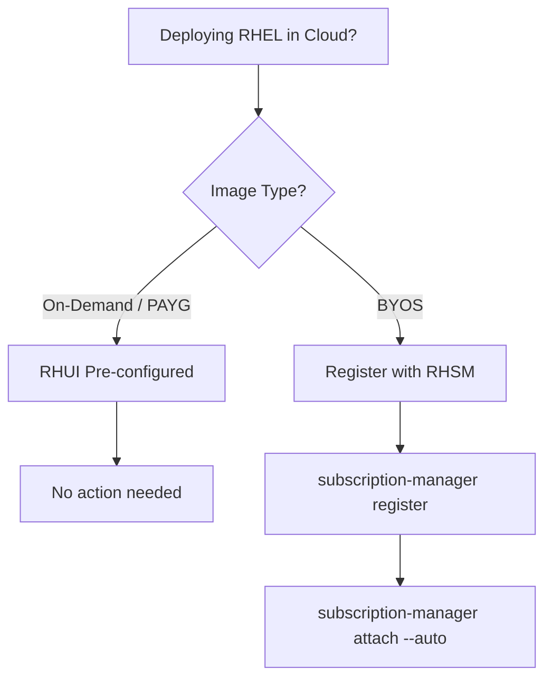

# How to Deploy RHEL on AWS, Azure, and Google Cloud

Author: [nawazdhandala](https://www.github.com/nawazdhandala)

Tags: RHEL, AWS, Azure, Google Cloud, Cloud, Linux, Deployment

Description: A practical guide to deploying Red Hat Enterprise Linux 9 across the three major cloud providers, covering image selection, instance launch, subscription management, and cloud-init configuration.

---

Running RHEL in the cloud is pretty standard these days, but each provider has its own quirks when it comes to image availability, licensing, and post-launch configuration. I have deployed RHEL across all three major clouds more times than I can count, and there are always a few gotchas that trip people up. This guide walks through the process on AWS, Azure, and Google Cloud so you know what to expect.

## Choosing the Right RHEL Image

Each cloud provider offers official Red Hat Enterprise Linux images in their respective marketplaces. These are maintained by Red Hat and come pre-configured for the cloud environment. You will generally find two types of images:

- **On-Demand (PAYG)** - The RHEL subscription cost is baked into the hourly instance price. No separate Red Hat subscription needed.
- **BYOS (Bring Your Own Subscription)** - You use your existing Red Hat subscription. The instance cost covers only the compute resources.

For most teams just getting started, the on-demand images are the path of least resistance. If you already have a Red Hat contract with unused entitlements, BYOS saves real money at scale.

## Deploying on AWS

### Finding the AMI

AWS provides RHEL images through the EC2 AMI catalog. You can search for them in the console or use the CLI.

```bash
# Search for official RHEL AMIs in your region
aws ec2 describe-images \
  --owners 309956199498 \
  --filters "Name=name,Values=RHEL-9*" \
  --query 'Images[*].[ImageId,Name,CreationDate]' \
  --output table \
  --region us-east-1
```

Owner ID `309956199498` is Red Hat's official AWS account. Always use this to avoid picking up community or third-party images.

### Launching an Instance

```bash
# Launch a RHEL instance on AWS
aws ec2 run-instances \
  --image-id ami-0abc12345example \
  --instance-type t3.medium \
  --key-name my-keypair \
  --security-group-ids sg-0abc1234 \
  --subnet-id subnet-0abc1234 \
  --tag-specifications 'ResourceType=instance,Tags=[{Key=Name,Value=rhel9-prod}]' \
  --count 1
```

On AWS, the default user for RHEL images is `ec2-user`. SSH access uses your key pair.

```bash
# Connect to the instance
ssh -i my-keypair.pem ec2-user@<public-ip>
```

### RHUI on AWS

On-demand RHEL instances on AWS use Red Hat Update Infrastructure (RHUI) instead of the standard RHSM (Red Hat Subscription Manager). RHUI is region-specific, meaning your instance pulls packages from RHUI mirrors hosted within AWS. You do not need to run `subscription-manager register` on these instances.

```bash
# Verify RHUI is configured
dnf repolist
```

You should see repos like `rhel-9-baseos-rhui-rpms` and `rhel-9-appstream-rhui-rpms`.

## Deploying on Azure

### Finding the Image

Azure lists RHEL images under the Red Hat publisher in the marketplace.

```bash
# List available RHEL images on Azure
az vm image list \
  --publisher RedHat \
  --offer RHEL \
  --sku 9_3 \
  --all \
  --output table
```

### Launching a VM

```bash
# Create a resource group first
az group create --name rhel-rg --location eastus

# Deploy a RHEL VM
az vm create \
  --resource-group rhel-rg \
  --name rhel9-server \
  --image RedHat:RHEL:9_3:latest \
  --size Standard_B2s \
  --admin-username azureuser \
  --generate-ssh-keys \
  --public-ip-sku Standard
```

The default user on Azure RHEL images is whatever you specify with `--admin-username`. Most people use `azureuser` by convention.

### RHUI on Azure

Azure also uses RHUI for on-demand images. The RHUI infrastructure is managed by Red Hat in partnership with Microsoft, and the repos are served through Azure-internal endpoints.

```bash
# Check the RHUI configuration
cat /etc/yum.repos.d/rh-cloud.repo
```

If you are using BYOS images on Azure, you need to register with RHSM manually.

```bash
# Register a BYOS instance with Red Hat
sudo subscription-manager register --username <rh-username> --password <rh-password>
sudo subscription-manager attach --auto
```

## Deploying on Google Cloud

### Finding the Image

Google Cloud provides RHEL images in the `rhel-cloud` project.

```bash
# List available RHEL images on GCP
gcloud compute images list \
  --project rhel-cloud \
  --filter="name~'rhel-9'" \
  --format="table(name, family, creationTimestamp)"
```

### Launching an Instance

```bash
# Create a RHEL VM on Google Cloud
gcloud compute instances create rhel9-server \
  --zone=us-central1-a \
  --machine-type=e2-medium \
  --image-project=rhel-cloud \
  --image-family=rhel-9 \
  --boot-disk-size=20GB \
  --tags=http-server,https-server
```

The default user on GCP is based on your Google account username. GCP uses OS Login or project-level SSH keys for access.

### RHUI on Google Cloud

Similar to AWS and Azure, on-demand RHEL images on Google Cloud use RHUI. The update infrastructure is hosted within Google's network.

```bash
# Verify repos on GCP
sudo dnf repolist enabled
```

## Cloud-Init Basics

All three clouds support cloud-init for post-launch configuration. RHEL images come with cloud-init pre-installed. You can pass user data scripts to automate the initial setup.

Here is a practical cloud-init configuration that works across all three providers:

```yaml
#cloud-config
# Basic cloud-init config for RHEL post-launch setup

# Update all packages on first boot
package_update: true

# Install additional packages
packages:
  - vim
  - tmux
  - htop
  - bind-utils
  - tcpdump

# Create a non-root admin user
users:
  - name: sysadmin
    groups: wheel
    sudo: ALL=(ALL) NOPASSWD:ALL
    shell: /bin/bash
    ssh_authorized_keys:
      - ssh-rsa AAAA...your-public-key-here

# Set the timezone
timezone: UTC

# Run commands after boot
runcmd:
  - systemctl enable --now firewalld
  - firewall-cmd --permanent --add-service=ssh
  - firewall-cmd --reload
```

### Passing User Data

Each cloud has its own way of passing user data:

```bash
# AWS - pass user data file
aws ec2 run-instances \
  --image-id ami-0abc12345example \
  --instance-type t3.medium \
  --user-data file://cloud-init.yaml \
  ...

# Azure - pass custom data
az vm create \
  --custom-data cloud-init.yaml \
  ...

# GCP - pass metadata
gcloud compute instances create rhel9-server \
  --metadata-from-file user-data=cloud-init.yaml \
  ...
```

## RHUI vs RHSM - When to Use Which

Here is a quick decision flow:



The key thing to remember: do not try to register an on-demand instance with RHSM. It will conflict with RHUI and potentially break your package management. If you need to switch from RHUI to RHSM (say you want to move to your own subscription), Red Hat provides conversion scripts, but it is a one-way process for that instance.

## Post-Deployment Checklist

Once your RHEL instance is running on any cloud, run through these basics:

```bash
# Verify the release
cat /etc/redhat-release

# Check that repos are working
sudo dnf check-update

# Ensure SELinux is enforcing
getenforce

# Verify time synchronization (chronyd is default on RHEL)
chronyc tracking

# Check firewall status
sudo firewall-cmd --state
```

## Cost Considerations

A few things worth noting on the cost side:

- On-demand RHEL instances typically cost 20-30% more than the equivalent instance running a free Linux distribution because of the embedded subscription.
- If you are running more than a handful of instances, BYOS with a Red Hat subscription almost always works out cheaper.
- All three clouds support reserved instances or committed use discounts for RHEL workloads.
- AWS and Azure both offer dedicated host options if you want to use your existing Red Hat licenses under a specific licensing agreement.

## Wrapping Up

Deploying RHEL in the cloud is straightforward once you understand the image types, subscription models, and cloud-init setup for each provider. The biggest source of confusion I see is around RHUI vs RHSM, so make sure you pick the right image type for your licensing situation and do not mix the two. Once the instance is up and the repos are working, everything else is just standard RHEL administration.
